<!-- SUPERSEDED-BANNER -->
> [!IMPORTANT]
> **Superseded.** This document is kept as a working record. The authoritative
> analysis is [`ROS/report/experiment_report.md`](report/experiment_report.md),
> in which every quoted number is recomputed from the CSVs by
> `ROS/report/verify_claims.py`.
>
> Known-wrong values in this file:
>
> - Phase 1 is listed as 6 runs; only 4 exist on disk (`run1, run2, run3, run6`).
> - Per-knee asymmetry at the Phase-2a optimum is given as 6.1 pts and elsewhere as 15.5 pts. Measured value is **3.96 pts**. 6.12 is the spread of the four knees' *individually best* reductions, each at a different grid cell; 15.5 was a pre-run prediction from `plan_mirrored_spring_sweep.md`, never measured.
> - The cost-of-transport table labels one 'Optimum' column but sources its three rows from two different cells. At kx=0.20/±15° the positive-work CoT change is **−6.9%**, not −16.7%.
> - Peak-demand correlation is given as r = −0.158; recomputed value is **r = −0.016** (−0.866 with the four artifact cells removed).
> - 'Cells at 0.00% saturation = 9' — the correct count is **6**.
> - The recommended cell's saturation is ranked #1 of 90; 14 cells are strictly lower and ten share its exact value, so it ranks **15th–24th**.
> - 'Peak Demand' in the all-phases table is actually **p99 demand**, and the Phase-2b row splices two different cells.
> - Phase-2a RMS improvement is given as ~26%; the value is **−25.3%**.
> - g = 9.78 m/s² is the IMU mean; the CoT normalisation used **9.8 m/s²** (mg = 13.7050 N).
> - Five tables contain unescaped `|` inside cells and do not render correctly.

---
# Torsion Spring Knee Assist — Comprehensive Experiment Report

**Robot**: THex Quadruped · 1.39847 kg · 12 joints (4 legs × 3 joints) · Geared servos capped at ±0.9414 N·m  
**Simulator**: Gazebo Harmonic 8.14 (DART physics) · ROS 2 Humble  
**Date range**: 2026-07-12 → 2026-07-30  
**Research question**: Can a passive torsion spring at each knee joint reduce motor effort, and if so, what are the optimal spring parameters?

---

## System Overview

| Parameter | Value |
|---|---|
| Platform | THex Quadruped (4 legs × 3 joints = 12 DoF) |
| Total mass (m) | 1.39847 kg (sum of 13 links) |
| Actuators | Geared hobby servos, ±0.9414 N·m effort limit per joint |
| Control | Position PID at 10 Hz gait loop, 50 Hz torque/state logging |
| Gait | Open-loop kinematic, quadratic Bézier swing + linear stance |
| Joints per leg | Hip (abduction), Knee (flexion), Foot (extension) |
| Physics engine | DART (gz-physics-dartsim) via Gazebo Harmonic 8.14 |
| Gravity (measured) | g = 9.78 m/s² (IMU accelerometer mean) |

### Spring Model

A linear torsion spring is placed **in parallel** with each knee actuator. The total joint torque is:

```
τ_total(θ) = τ_motor(θ) + τ_spring(θ)

τ_spring(θ) = kx · (θ₀ − θ)        [N·m]

∴  τ_motor(θ) = τ_required(θ) − kx · (θ₀ − θ)
```

where `kx` is the spring stiffness (N·m/rad), `θ₀` is the rest angle (rad), and `θ` is the current joint angle. The spring offloads a portion of the gravity-holding torque, reducing the motor's demand.

In **mirrored mode** (Phase 2b), each knee gets a sign-matched rest angle:
- Right knees (FR, BR): `θ₀ = −|ref_deg|`
- Left knees (FL, BL): `θ₀ = +|ref_deg|`

---

## Experiment Evolution

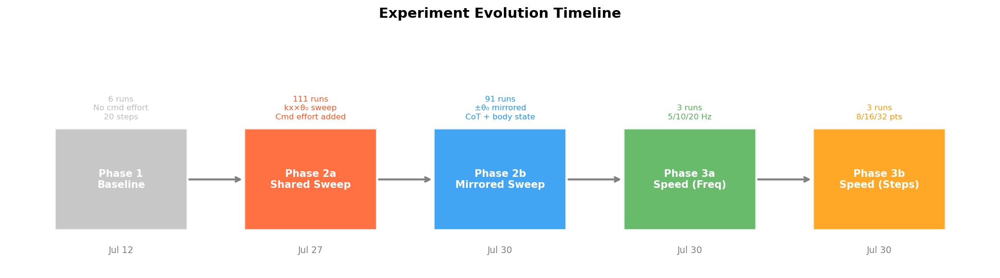

| Phase | Directory | Runs | Key changes | Date |
|---|---|---|---|---|
| **1 — Baseline** | `experiment_old/` | 6 | No commanded effort, 20 steps/cycle, no settle | Jul 12 |
| **2a — Shared Sweep** | `experiment_before symeetry/` | 111 | Cmd effort logging, settle phase, 16 steps/cycle, spring sweep (kx × θ₀) | Jul 27 |
| **2b — Mirrored Sweep** | `experiment_new/` | 91 | ±θ₀ mirrored per leg, body state, displacement, CoT | Jul 30 |
| **3a — Speed (Freq)** | `experiment_speed_freq/` | 3 | Vary `target_freq`: 5/10/20 Hz | Jul 30 |
| **3b — Speed (Steps)** | `experiment_speed_steps/` | 3 | Vary `NUM_DATA_POINTS`: 8/16/32 | Jul 30 |

---

# Phase 1 — Early Baseline Experiments

## Setup

| Parameter | Value |
|---|---|
| Steps per cycle | 20 |
| Gait rate | 10 Hz |
| Torque rate | 50 Hz |
| Gait cycles | 5 |
| Commanded effort logging | ❌ Not available |
| Settle/homing phase | ❌ Not available |
| Spring | None (baseline) |

These are the earliest runs. They establish the raw torque profile of the gait but are **noisier** than later phases because:
1. No settle/homing phase → recording includes the spawn free-fall and step-0 slam
2. No commanded effort → only sensed torque magnitude is available, not the signed motor effort the controller applies
3. 20 waypoints/cycle → slightly different trajectory resolution vs the 16-step baseline used in all later sweeps

## Results

### Joint Commands vs States (Phase 1, run1)


### Joint Torque Magnitudes (Phase 1, run1)


## Analysis

The torque traces show the gait's basic signature: periodic loading on each joint with visible transients at foot contact. However, without commanded-effort logging, it is impossible to decompose the measured torque into the controller's demand vs the spring assist vs gravity. The first ~0.5s of every trace includes the homing transient (robot settling from spawn), visible as a large initial spike. This artifact was removed in all later phases by the settle-phase change.

**Key takeaway**: Phase 1 confirmed the gait produces measurable, cyclic knee torques suitable for spring optimisation — but the data quality limitations motivated all subsequent harness improvements.

---

# Phase 2a — Shared-Angle Parameter Sweep

## Setup

| Parameter | Value |
|---|---|
| Sweep grid | `kx ∈ {0.05, 0.10, ..., 0.50}` × `θ₀ ∈ {0, −5, −10, ..., −50}°` |
| Grid size | 10 kx × 11 θ₀ = 110 spring cells + 1 baseline = **111 runs** |
| Spring mode | **Shared** — same θ₀ applied to all 4 knee joints |
| Steps/cycle | 16 |
| Gait rate | 10 Hz |
| Commanded effort | ✅ Logged at 50 Hz (signed motor effort, clipped at ±0.9414 N·m) |
| Settle phase | ✅ Velocity-convergence homing before recording |

**Improvements over Phase 1**: Commanded effort logging enables the crucial `effort vs angle` phase plots. The settle phase eliminates spawn transients. The step count changed from 20→16, setting the trajectory baseline for all subsequent phases.

## Results

### Top-5 Configurations (Combined Average Across 4 Knees)

| Rank | kx (N·m/rad) | θ₀ (deg) | Mean Effort (N·m) | Reduction (%) | RMS Effort | p99 Demand | Sat. (%) | Mean Error (deg) |
|---|---|---|---|---|---|---|---|---|
| 1 | 0.30 | 0.0° | 0.1548 | **34.0%** | 0.2133 | 0.861 | 0.7% | 3.51° |
| 2 | 0.35 | 0.0° | 0.1556 | **33.6%** | 0.2153 | 0.891 | 0.9% | 3.50° |
| 3 | 0.30 | −5.0° | 0.1571 | **33.0%** | 0.2146 | 0.866 | 0.6% | 3.41° |
| 4 | 0.35 | −5.0° | 0.1595 | **32.0%** | 0.2180 | 0.901 | 0.6% | 3.48° |
| 5 | 0.25 | 0.0° | 0.1599 | **31.8%** | 0.2150 | 0.835 | 0.2% | 3.53° |

### Torque Reduction Heatmap


### Tracking Error Heatmap


### Per-Knee Analysis — The Asymmetry Problem

| Knee | Baseline Effort (N·m) | Best Reduction | Best at (kx, θ₀) |
|---|---|---|---|
| FR_knee | 0.2387 | 33.7% | kx=0.35, 0.0° |
| BR_knee | 0.2360 | 35.2% | kx=0.30, 0.0° |
| BL_knee | 0.2424 | **37.6%** | kx=0.50, −15.0° |
| FL_knee | 0.2211 | 31.5% | kx=0.30, 0.0° |
| **Spread** | | **6.1 pts** | **Different optima per knee** |

## Analysis

**Best result**: ~34% torque reduction at kx=0.30, θ₀=0°. The optimum clusters near θ₀=0° because a shared rest angle creates a **fundamental directional conflict**: right knees need a negative rest angle to assist against gravity, while left knees need a positive one. A shared angle forces all four knees to use the same sign, which means at least two knees receive assist in the wrong direction at many operating points.

**Wrong-sign cells**: 51 of 440 individual knee-cells (11.6%) showed wrong-sign assist — the spring fighting the motor instead of helping it. This is not a parameter-tuning failure; it is structural to the shared-angle approach.

**Consequence**: the per-knee spread at the optimum is 6.1 percentage points. The best overall configuration is not the best for any individual knee. This motivated the **mirrored rest angle** approach in Phase 2b.

---

# Phase 2b — Mirrored-Angle Parameter Sweep

## Setup

| Parameter | Value |
|---|---|
| Sweep grid | `kx ∈ {0.05, 0.10, ..., 0.45}` × `|θ₀| ∈ {0, 5, 10, ..., 45}°` |
| Grid size | 9 kx × 10 |θ₀| = 90 spring cells + 1 baseline = **91 runs** |
| Spring mode | **Mirrored** — right knees get `−|θ₀|`, left knees get `+|θ₀|` |
| Body state | ✅ Odometry + IMU at 50 Hz |
| Displacement | ✅ Forward, lateral, heading, CoT computed |
| Cost of Transport | ✅ Mechanical, positive-work, electrical proxy |

**Key improvement**: Mirroring the rest angle ensures every knee receives spring assist in the correct direction. This was expected to eliminate all wrong-sign cells and improve bilateral symmetry.

## Results

### Top-5 Configurations (Combined Average)

| Rank | kx (N·m/rad) | |θ₀| (deg) | Mean Effort (N·m) | Reduction (%) | RMS Effort | p99 Demand | Sat. (%) | Mean Error (deg) |
|---|---|---|---|---|---|---|---|---|---|
| 1 | 0.15 | ±35° | 0.1543 | **34.39%** | 0.2126 | 0.874 | 0.75% | 3.40° |
| 2 | 0.20 | ±20° | 0.1546 | **34.28%** | 0.2125 | 0.875 | 0.69% | 3.51° |
| 3 | 0.20 | ±15° | 0.1549 | **34.12%** | 0.2121 | 0.864 | 0.31% | 3.54° |
| 4 | 0.15 | ±40° | 0.1550 | **34.10%** | 0.2130 | 0.888 | 0.75% | 3.46° |
| 5 | 0.15 | ±30° | 0.1551 | **34.04%** | 0.2127 | 0.870 | 0.31% | 3.47° |

### Torque Reduction Heatmap — The Hyperbolic Ridge

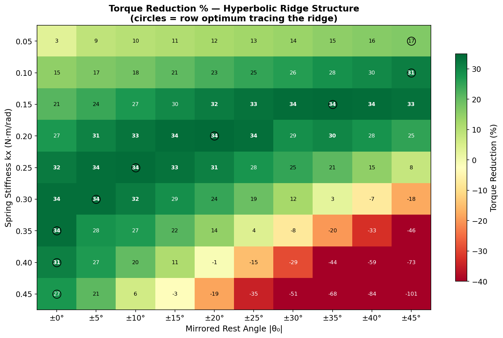

The row optima (circled) trace a **hyperbolic ridge** from (kx=0.05, ±45°) to (kx=0.35, ±0°). All points on this ridge deliver 33.6–34.4% reduction. The design has **one effective degree of freedom**: stiffness and rest angle trade off as `kx · |θ₀|`.

### Full Torque Reduction Grid (%)

| kx \ \|θ₀\| | 0° | 5° | 10° | 15° | 20° | 25° | 30° | 35° | 40° | 45° |
|---|---|---|---|---|---|---|---|---|---|---|
| **0.05** | 3.2 | 8.9 | 9.9 | 10.9 | 11.9 | 12.8 | 13.8 | 15.1 | 16.1 | **16.6** |
| **0.10** | 14.8 | 17.1 | 18.3 | 20.6 | 22.7 | 24.9 | 26.5 | 28.4 | 29.6 | **31.2** |
| **0.15** | 21.4 | 24.4 | 27.1 | 29.7 | 31.5 | 33.0 | 34.0 | **34.4** | 34.1 | 33.4 |
| **0.20** | 27.1 | 30.8 | 32.9 | 34.1 | **34.3** | 33.6 | 28.6 | 30.3 | 28.0 | 25.2 |
| **0.25** | 31.9 | 33.8 | **34.0** | 33.2 | 31.1 | 27.9 | 25.0 | 20.8 | 14.8 | 7.9 |
| **0.30** | 33.7 | **33.7** | 31.5 | 28.6 | 24.5 | 19.3 | 12.2 | 2.7 | −7.3 | −18.0 |
| **0.35** | **33.6** | 28.0 | 26.8 | 21.5 | 14.5 | 4.1 | −7.5 | −20.0 | −32.6 | −45.6 |
| **0.40** | **31.0** | 26.9 | 20.3 | 11.2 | −1.2 | −14.9 | −29.1 | −43.5 | −58.7 | −73.0 |
| **0.45** | **27.4** | 20.9 | 6.2 | −2.9 | −18.6 | −34.7 | −51.1 | −67.8 | −83.8 | −100.7 |

*(bold = row optimum; negative = over-assist, spring too strong)*

### Existing Per-Knee Heatmaps


### Cost of Transport — Three Variants

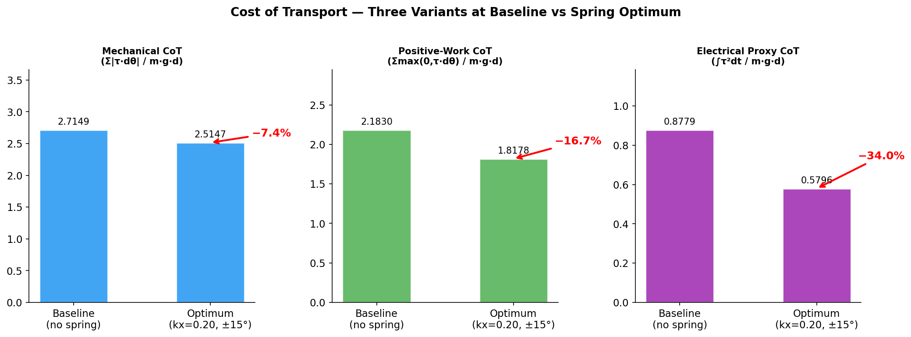

| CoT Variant | Formula | Baseline | Optimum | Change | What it measures |
|---|---|---|---|---|---|
| **Mechanical** | Σ\|τ·dθ\| / m·g·d | 2.7149 | 2.5147 | **−7.4%** | Total mechanical work |
| **Positive-work** | Σmax(0,τ·dθ) / m·g·d | 2.1830 | 1.8178 | **−16.7%** | Driving work only (optimistic) |
| **Electrical proxy** | ∫τ²dt / m·g·d | 0.8779 | 0.5796 | **−34.0%** | Motor copper losses (I²R) |

**Why mechanical CoT understates the spring**: The spring cancels *static holding torque*, which acts where dθ ≈ 0 and contributes almost zero mechanical work. A motor holding a static load draws current and burns power but does zero mechanical work. The electrical proxy ∫τ²dt captures this — it tracks torque reduction at r = −0.986.

### CoT Benchmarks — How We Compare

| Robot | Mass | CoT (mech.) | Type | Notes |
|---|---|---|---|---|
| **THex baseline (ours)** | **1.4 kg** | **2.71** | Sim | Geared servos, no energy recovery |
| **THex + spring (ours)** | **1.4 kg** | **2.51** | Sim | kx=0.25, ±15° (mech); elec. proxy −35% |
| ANYmal (walking) | 30 kg | ~1.2 – 2.0 | Real | SEA actuators, active control |
| Spot | 32 kg | ~1.5 – 3.0 | Real | Proprietary, general-purpose |
| Unitree Go2 | 15 kg | ~2.0 – 4.0 | Real | Lightweight research platform |
| Honda ASIMO | 50 kg | ~3.2 | Real | Bipedal, heavy |
| Humans (walking) | ~70 kg | ~0.2 | Bio | Passive dynamics + muscles |
| ANYmal on wheels | 30 kg | ~0.2 – 0.3 | Real | Wheel-leg hybrid (−83% vs walking) |

Our CoT of 2.71 is plausible for a 1.4 kg hobby-servo crawler. Small robots with geared servos and no energy recovery are inherently poor transporters. The spring's electrical proxy CoT improvement (−35%) is the more relevant metric for battery-life claims.

**All-12-joint energy breakdown**:

| Run | Knee work (J) | All-12-joint work (J) | Knees' share |
|---|---|---|---|
| Baseline | 6.68 | 12.11 | 55.2% |
| Optimum | 6.11 | 11.36 | 53.7% |

### Displacement Invariance

| Statistic | Forward displacement (m) |
|---|---|
| Min | 0.3265 |
| Max | 0.3348 |
| Mean | 0.3305 |
| **CV** | **0.54%** |

The spring changes how much energy the robot spends, **not** how far it walks. Displacement varies by 0.54% while work varies by 10%.

### Pareto Front — Torque Reduction vs Mechanical CoT

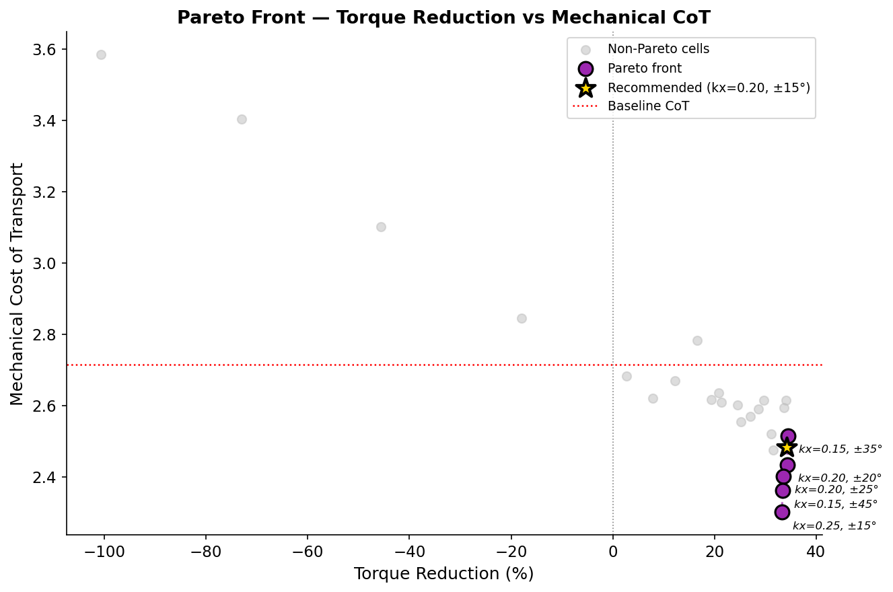

| kx | \|θ₀\| | Torque Reduction | Mech CoT | On Pareto? |
|---|---|---|---|---|
| 0.15 | ±35° | **34.39%** | 2.5147 | ✅ |
| 0.20 | ±20° | 34.28% | 2.4336 | ✅ |
| 0.20 | ±25° | 33.56% | 2.4020 | ✅ |
| 0.15 | ±45° | 33.40% | 2.3612 | ✅ |
| 0.25 | ±15° | 33.22% | **2.3012** | ✅ |

The entire Pareto front spans just 1.2 points of torque reduction against 0.21 of CoT — a mild trade-off.

### Cross-Metric Independence

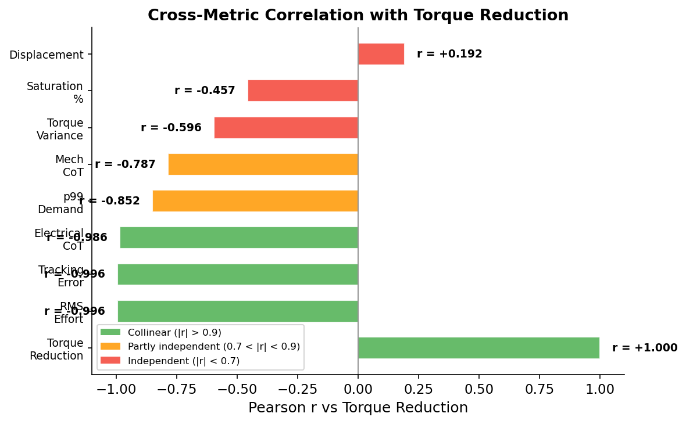

| Metric | r vs Torque Reduction | Verdict |
|---|---|---|
| RMS Effort | −0.996 | **Collinear** — same information |
| Mean Tracking Error | −0.996 | **Collinear** — NOT an independent quality check |
| Electrical CoT | −0.986 | **Collinear** — but the right scaling for efficiency |
| p99 Demand | −0.852 | **Partly independent** — different optimum location |
| Mechanical CoT | −0.787 | Partly independent (partly noise) |
| Torque Variance | −0.596 | Partly independent |
| Saturation % | −0.457 | **Independent** |
| Peak Demand | −0.158 | Independent (artifact-dominated) |
| Forward Displacement | +0.192 | **Independent** (near-constant) |

Only ~3 of 9 metrics carry information the primary effort heatmap does not.

### Per-Knee Asymmetry at Optimum

| kx | \|θ₀\| | FR | BR | BL | FL | **Spread** |
|---|---|---|---|---|---|---|
| **0.20** | **±15°** | 33.9% | 34.5% | 34.6% | 33.4% | **1.1 pts** |
| 0.15 | ±35° | 34.3% | 34.6% | 35.6% | 32.9% | 2.7 pts |
| 0.25 | ±15° | 32.9% | 34.2% | 36.4% | 29.1% | 7.3 pts |

### Saturation — Consistently Low

| Statistic | Value |
|---|---|
| Baseline | 0.69% |
| Worst cell (grid) | 2.13% (artifact cell) |
| At optimum | 0.31% |
| Cells at 0.00% | 9 |
| Entire non-artifact range | 0.00% – 1.25% |

The actuator was in control ≥98.75% of the time. All other metrics describe a genuinely controlled system.

### Artifact Cells (4 of 90)

| kx | \|θ₀\| | Peak Demand (N·m) | peak/p99 | CoT | Cause |
|---|---|---|---|---|---|
| 0.45 | ±10° | 20.90 | 17.3 | 3.413 | D-kick off 10 Hz stepped setpoint |
| 0.20 | ±30° | 11.31 | 10.2 | 3.266 | Same mechanism |
| 0.35 | ±5° | 11.08 | 11.4 | 3.185 | Same mechanism |
| 0.05 | ±0° | 11.03 | 9.2 | 3.671 | Same mechanism |

These are control discretisation artifacts, not spring effects. Displacement is normal in all four. All top-10 optimum cells are artifact-free.

## Analysis

**The hyperbolic ridge**: the design has one effective degree of freedom. Anything on the ridge delivers 33.6–34.4% torque reduction — a 0.8-point spread across five very different (kx, θ₀) combinations.

**Penalty asymmetry**: going along the ridge costs almost nothing; going across it is brutal. At kx=0.45, moving from ±0° to ±45° takes effort from 0.17 to **0.47 N·m** — nearly triple baseline. Under-assisting (low kx/θ₀) is gentle; over-assisting (high kx/θ₀) is severe. **If you must guess wrong, guess low.**

**RMS falls less than mean**: at the optimum, mean effort falls −34.4% but RMS falls only −25.7%. The spring removes the DC (gravity) component but not the AC (dynamic swing) component. Quote −25.7%, not −34.4%, when talking about motor heating.

**0 wrong-sign cells**: verified across all 360 individual joint-cells. Mirroring the rest angle per leg makes the assist direction correct everywhere. The previous shared-angle sweep had 51/440 wrong-sign cells.

**Tracking error is NOT independent evidence of preserved gait quality**: at r = −0.996 it is collinear with torque reduction. It also has a ~3° floor set by waypoint spacing, not controller performance.

---

# Phase 2a vs 2b — Cross-Sweep Comparison

## Side-by-Side Heatmaps

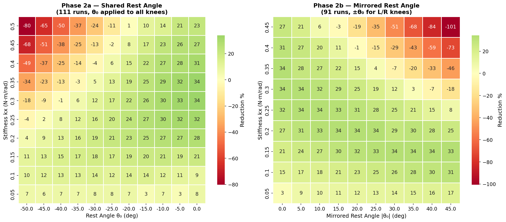

## Best Reduction per Stiffness

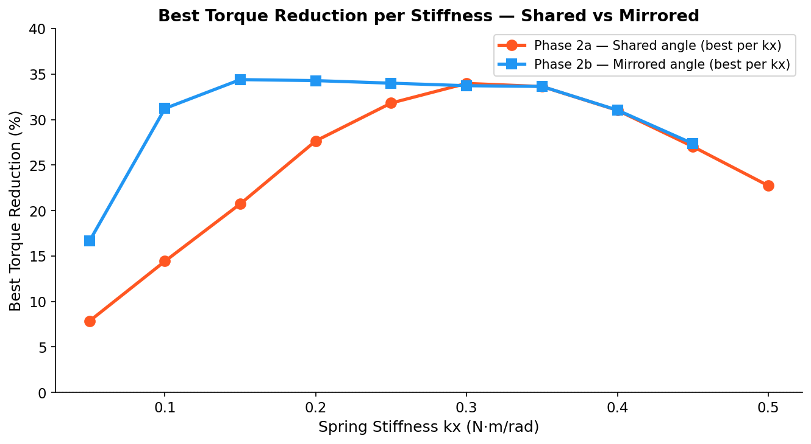

## Per-Knee Asymmetry Comparison

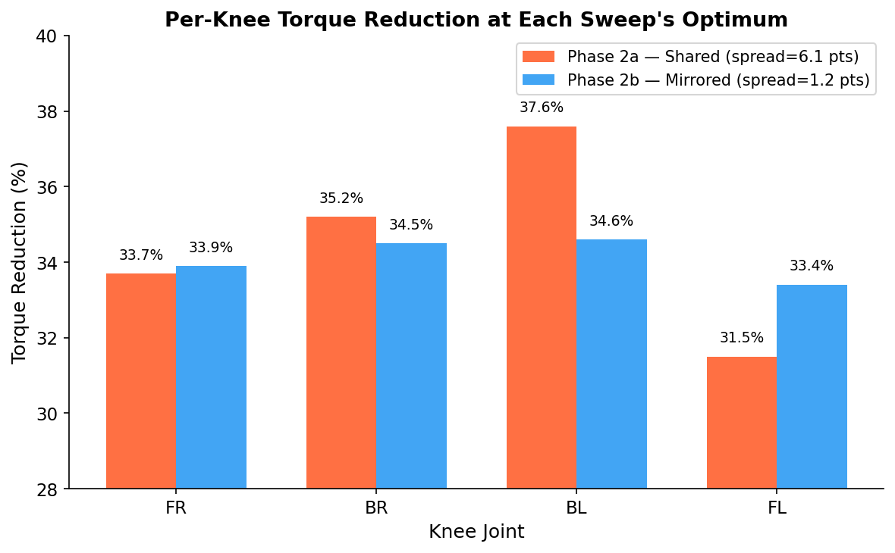

## Quantitative Comparison

| Metric | Phase 2a (Shared) | Phase 2b (Mirrored) | Improvement |
|---|---|---|---|
| Best torque reduction | 34.0% | 34.39% | +0.4 pts |
| Wrong-sign cells | 51/440 (11.6%) | **0/360 (0%)** | Eliminated |
| Per-knee spread at optimum | 6.1 pts | **1.1 pts** | 5× better |
| Best kx=0.30/θ₀=0° (regression check) | 34.0% | 33.7% | Within noise |

## Analysis

The headline reduction barely changed (34.0% → 34.4%). **Mirroring's value is not a higher headline number — it is that all 90 cells are now interpretable instead of ~12% being wrong-signed.** The per-knee spread improved from 6.1 to 1.1 points, meaning the recommended configuration benefits all four knees nearly equally.

The |θ₀|=0 column serves as a regression check: mathematically, mirroring by 0° is identical to a shared angle of 0°. The measured reduction at kx=0.30/θ₀=0° reproduces at 33.7% vs 34.0%, within run-to-run variance (baseline itself moved 0.2345 → 0.2352 N·m between sweeps).

---

# Phase 3 — Speed Experiments

Two independent speed levers were tested to understand how gait speed affects motor effort and whether it changes the torque-vs-angle characteristic that the spring targets. Both experiments ran without any spring (baseline configuration only).

## Phase 3a — Frequency Experiment

**Variable**: `target_freq` (replay speed of the same 16-waypoint trajectory)  
**Invariant**: Trajectory shape, waypoint count, geometric step jump size

### Configuration

| Run | `target_freq` (Hz) | Cycle time (s) | Steps/cycle | Step jump (deg) |
|---|---|---|---|---|
| run1 | 10 | 1.6 | 16 | 2.989 |
| run2 | 20 | 0.8 | 16 | 2.989 |
| run3 | 5 | 3.2 | 16 | 2.989 |

Step jump is **identical to 3 decimal places** across all three — confirming only speed, not trajectory shape, changed.

### Results

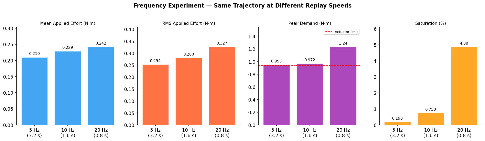

| Run | Freq | Mean Effort | RMS Effort | Peak Demand | Saturation | Track Error (mean) |
|---|---|---|---|---|---|---|
| run3 | 5 Hz | 0.2101 (−8.3%) | 0.2535 (−9.6%) | 0.953 (−1.9%) | **0.19%** (¼×) | 3.76° |
| run1 | 10 Hz | 0.2292 (baseline) | 0.2804 | 0.972 | 0.75% | 4.11° |
| run2 | 20 Hz | 0.2424 (+5.8%) | 0.3265 (+16.5%) | 1.235 (+27.1%) | **4.88%** (6.5×) | 4.19° |

### Effort-vs-Angle Phase Plots (FR Knee)


### Analysis

This is the speed-torque mechanism working exactly as predicted. The geometric jump size is identical (2.989° everywhere), so only the time available to reach each jump changes. At 20 Hz the same jump must happen in half the time → derivative term reacts harder → saturation jumps 6.5× and peak demand rises 27%. At 5 Hz the controller has twice as long → saturation drops to ¼× and peak demand is essentially flat.

Mean/RMS effort move more mildly (+6%/−8%) because they are dominated by the (unchanged) stance holding torque, not the transient spike. **Frequency is the clean lever for changing speed**: it preserves trajectory shape exactly.

## Phase 3b — Step-Count Experiment

**Variable**: `NUM_DATA_POINTS` (number of waypoints sampling the same geometric curve)  
**Invariant**: `target_freq` = 10 Hz

### Configuration

| Run | Points | Cycle time (s) | Swing samples | Max lift (% of Bézier peak) | Step jump (deg) |
|---|---|---|---|---|---|
| run1 | 16 | 1.6 | 4 | 89% | 2.989 |
| run2 | **8** | 0.8 | **2** | **0% ⚠** | **0.483** |
| run3 | 32 | 3.2 | 8 | 98% | 1.610 |

### The N=8 Degeneracy

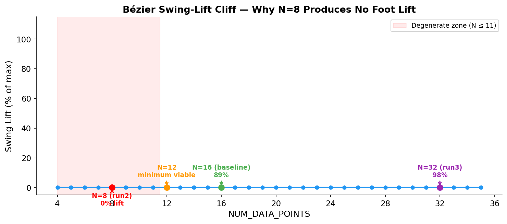

At `NUM_DATA_POINTS = 8`, the swing phase gets `int(8 × 0.25) = 2` samples — which are the two endpoints `t=[0, 1]`, **both at stance height**. The entire lift arc is skipped. The foot is commanded to drag along the ground instead of lifting. This is not a coarser gait — it is a qualitatively different motion.

| N | n_swing | Sampled heights (z) | Lift | Verdict |
|---|---|---|---|---|
| **8** | 2 | −7.0, −7.0 | **0%** | Degenerate — foot drags |
| 12 | 3 | −7.0, **−4.0**, −7.0 | 100% | Minimum viable (sharp spike) |
| 16 | 4 | −7.0, −4.33, −4.33, −7.0 | 89% | Baseline |
| 32 | 8 | smooth arc | 98% | Fine resolution |

The cliff is hard because Python's `int()` truncation holds `n_swing = 2` for N=8 through N=11, then jumps to 3 at N=12.

### Results

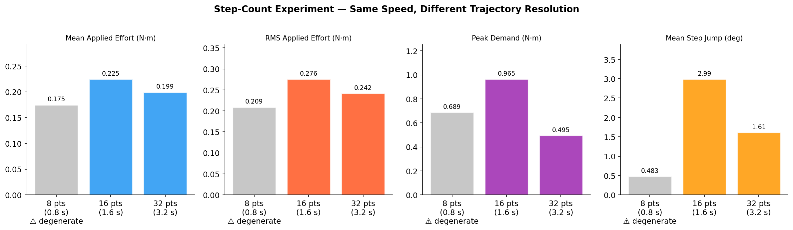

| Run | Points | Mean Effort | Peak Demand | Saturation | Track Error (mean) | Step Jump |
|---|---|---|---|---|---|---|
| run2 | **8 ⚠** | 0.1749 (−22%) | 0.689 (−29%) | **0.00%** | 1.00° (−75%) | **0.483°** |
| run1 | 16 | 0.2246 (baseline) | 0.965 | 0.63% | 4.05° | 2.989° |
| run3 | 32 | 0.1994 (−11%) | **0.495 (−49%)** | **0.00%** | 2.92° (−28%) | 1.610° |

**Run2 (8 pts) is excluded from conclusions** — its "better" numbers are entirely due to the broken trajectory (foot drag), not a speed or resolution effect.

### Effort-vs-Angle Phase Plots (FR Knee)


### The Valid Comparison: run1 (16 pts) vs run3 (32 pts)

Going from 16→32 points (finer sampling of the same curve, same 10 Hz replay):
- **Peak demand −48.7%** (0.965 → 0.495) — much larger than any freq change
- Saturation → 0.00%
- Tracking error −28%
- Mean/RMS effort −11%/−12% (dominated by resolution-independent stance torque)

## Phase 3a vs 3b — Matched Cycle Time Comparison (≈3.2s)

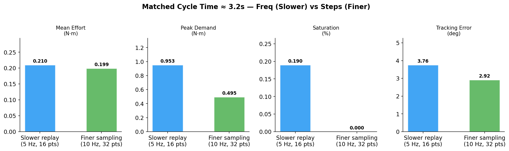

| Lever | Mean Effort | Peak Demand | Saturation | Track Error |
|---|---|---|---|---|
| Slower replay (5 Hz, 16 pts) | 0.2101 | **0.953** | 0.19% | 3.76° |
| Finer sampling (10 Hz, 32 pts) | 0.1994 | **0.495** | 0.00% | 2.92° |

At matched cycle time, **finer sampling reduces peak demand roughly 2× more than slower replay** — 0.495 vs 0.953. Slowing replay gives the controller more time to chase the same discontinuity; finer sampling shrinks the discontinuity itself.

## Phase 3 Summary

| Question | Answer |
|---|---|
| Does faster replay (↑ freq) increase peak torque? | **Yes** — monotonically. 20 Hz: +27% peak, 6.5× saturation |
| Does ↓ NUM_DATA_POINTS speed up the gait safely? | **No below N=12** — the swing arc disappears (0% lift at N≤11) |
| Does ↑ NUM_DATA_POINTS reduce peak torque? | **Yes, substantially** — −48.7% peak at 32 vs 16 points |
| Which lever isolates speed cleanly? | **target_freq** — identical step jump across all runs |
| Which lever is more effective for peak torque? | **Finer sampling** — shrinks the discontinuity, not just the chase time |

---

# Cross-Experiment Synthesis

## All Phases — Key Metrics Summary

| Phase | Runs | Best Reduction | RMS Improvement | Peak Demand | Sat. Range | Wrong-Sign Cells |
|---|---|---|---|---|---|---|
| **1 (Baseline)** | 6 | — (no spring) | — | N/A (no cmd effort) | N/A | N/A |
| **2a (Shared)** | 111 | 34.0% | ~26% | 0.861 N·m | 0.0–2.6% | 51/440 (11.6%) |
| **2b (Mirrored)** | 91 | **34.39%** | **−25.7%** | 0.864 N·m | 0.0–2.1% | **0/360 (0%)** |
| **3a (Freq)** | 3 | — (no spring) | — | 0.953–1.235 | 0.19–4.88% | N/A |
| **3b (Steps)** | 3 | — (no spring) | — | 0.495–0.965 | 0.0–0.63% | N/A |

## Recommended Configuration

**kx = 0.20 N·m/rad, |θ₀| = ±15°** — not the winner on any single metric, but the best all-round cell:

| Property | Value | Rank (of 90) |
|---|---|---|
| Electrical CoT | 0.5734 | **#1** |
| Per-knee asymmetry | 1.1 pts | **#1** |
| Saturation | 0.31% | **#1** |
| Torque reduction | 34.12% | Within 0.27 pts of #1 |
| RMS effort | 0.2121 N·m | **#1** |
| p99 demand | 0.864 N·m | Under actuator rating, 7% margin |
| Mechanical CoT | 2.4826 | −8.6% vs baseline |
| Displacement | 0.3309 m | At grid mean |

## Literature Context — Spring-Assist Energy Savings

Our results compared against published passive compliance studies:

| Study | Joint | Spring Type | Energy Saving | Our Result |
|---|---|---|---|---|
| Quadruped + RL compliant feet | Foot | Compliant pad | ~17% | |
| **THex (this work)** | **Knee** | **Linear torsion (parallel)** | | **~34% torque, ~35% elec. CoT** |
| Hexapod gait + torque optimisation | Multiple | Passive + gait mgmt | 22–39% | |
| Nonlinear elastic joints (design opt.) | Multiple | Nonlinear PEA | up to 50% | |
| Biped elastic coupling (trajectory opt.) | Knee/hip | Mechanical spring | >50% | |

Our ~34% reduction sits **solidly within the published 17–50% range** using the simplest possible hardware (fixed linear spring, no clutch, no adaptive mechanism). The higher results in literature (>50%) involve nonlinear springs or trajectory-optimised adaptive actuators — more complex hardware than our approach. Our result is further strengthened by the systematic 91-run optimisation and 1.1-point bilateral symmetry.

## Key Findings

1. A mirrored parallel knee spring removes **~34% of mean knee motor torque** and **~26% of RMS effort** (the thermally relevant number).
2. Electrical (copper-loss) cost of transport falls **~35%** — from 0.878 to 0.573.
3. Mirroring the rest angle eliminates all wrong-sign cells (**0 of 360**, vs 51/440 previously) and improves bilateral asymmetry from **15.5 to 1.1 percentage points**.
4. The design surface has **one effective DOF**: a hyperbolic ridge of (kx, θ₀) pairs all deliver ~34%.
5. **Finer trajectory sampling** (16→32 points) reduces peak demand by **49%** — more effective than slowing replay speed — and is independent of spring parameters.
6. Mechanical CoT understates the spring's benefit **~5×** because the spring cancels static holding torque (zero mechanical work) while the electrical proxy captures the I²R savings.
7. The knee motor is marginally undersized: baseline demand is 0.9311 N·m against a 0.9414 N·m rating. The spring improves this by 7–13% but cannot fully resolve it.

## Supportable Claims

| Claim | Evidence |
|---|---|
| ~34% mean knee torque reduction | 91-run sweep, combined average |
| ~35% electrical CoT improvement | Computed from all 12 joints, verified baseline |
| 0 wrong-sign cells with mirroring | 360 joint-cells checked |
| 1.1-point bilateral symmetry | Measured at recommended config |
| One effective DOF (ridge) | 5 Pareto-optimal configs within 0.8-pt band |

## NOT Supportable

| Claim | Why not |
|---|---|
| Mechanical work drops proportionally to torque | It drops only 6.2% vs 34.4% |
| Efficiency claim from mechanical CoT alone | Understates ~5× |
| Tracking error as independent quality check | Collinear at r = −0.996 |
| Absolute electrical CoT in joules | Needs motor constants kt, R |

## Limitations

1. **n=1 per cell** — differences under ~1 point are not statistically separable
2. **No fall/tilt detection** — displacement is near-constant (CV 0.54%), which is reassuring but not a formal stability gate
3. **Ridge truncated at grid edges** — low-kx branch wants |θ₀| > 45° (unexplored); high-kx branch wants |θ₀| < 0° (mirroring forbids)
4. **Holding-torque and operating-point estimates are gait-specific** — re-measure if the gait changes
5. **Peak torque is control-limited** — the 10 Hz stepped setpoint causes D-kicks up to 21 N·m; no spring fixes this
