# Passive Knee-Spring Assist on a Quadruped: Simulation Study

**Platform** THex Quadruped · 1.39847 kg · 12 joints (4 legs × 3) ·
geared servos clipped at ±0.9414 N·m
**Simulator** Gazebo Harmonic 8.14 (DART) · ROS 2 Humble
**Campaign** 12–30 July 2026 · 212 simulation runs across 5 phases

---

## Abstract

A linear torsion spring was placed in parallel with each knee actuator of a 1.4 kg
quadruped and its two parameters — stiffness $k_x$ and rest angle $θ_0$ — were swept
exhaustively in simulation. With the rest angle mirrored per leg, the spring removes
**34.39%** of mean knee motor torque (0.2352 → 0.1543 N·m) and **34.7%** of the
electrical (copper-loss) cost of transport. Mechanical cost of transport falls only
**7.4%**; the gap is not a contradiction but a measurement property, because the spring
cancels *static holding* torque, which performs almost no mechanical work.

The optimum is a hyperbolic ridge rather than a peak: the design has one effective
degree of freedom, and a locus of very different $(k_x, θ_0)$ pairs all deliver
33.6–34.4%. Mirroring the rest angle eliminated all wrong-sign assist (0 of 360
knee-cells, against 50 of 440 in the shared-angle sweep) and tightened bilateral
asymmetry from 3.96 to **1.15** percentage points. The recommended configuration,
$k_x$ = 0.20 N·m/rad with $|θ_0|$ = ±15°, gives 34.12% reduction and is the tightest
bilaterally symmetric cell in the sweep.

Two results are independent of the spring. Peak knee demand is limited by the 10 Hz
stepped set-point, not by the actuator or the spring: refining the trajectory from 16 to
32 waypoints cuts peak demand **48.7%** with no spring fitted, roughly twice the benefit
of halving the replay rate at the same cycle time. And baseline peak demand
(0.9831 N·m) already exceeds the 0.9414 N·m actuator rating, so the spring improves
motor sizing margin but does not resolve it.

---

## 1 System and method

### 1.1 Platform

| Parameter | Value | Source |
|---|---|---|
| Platform | THex Quadruped, 4 legs × 3 joints = 12 DoF | `model.sdf` |
| Total mass $m$ | 1.39847 kg (13 links) | summed from `model.sdf` |
| Actuator limit | ±0.9414 N·m per joint | `<effort>` in `model.sdf` |
| Control | position PID, 10 Hz gait loop | `kinematic_gait.py` |
| Logging | 50 Hz, all 12 joints | `kinematic_gait.py` |
| Gait | open-loop kinematic; quadratic Bézier swing + linear stance | `kinematics.py` |
| Physics | DART via Gazebo Harmonic 8.14 | — |
| Gravity (CoT) | 9.8 m/s² → $mg$ = 13.7050 N | Gazebo default |
| Gravity (measured) | 9.7811 m/s² | IMU accelerometer mean |

The two gravity values differ and are used for different purposes. The
cost-of-transport denominator uses Gazebo's nominal 9.8 m/s²; the 9.7811 figure is the
measured IMU mean and serves only as a cross-check that the simulator's gravity is what
we think it is. Earlier drafts of this work quoted 9.78 in the CoT normalisation, which
was wrong — $mg$ = 13.7050 N recovers exactly from the logged data.

### 1.2 Spring model

The spring acts in parallel with the actuator, so whatever holding torque it supplies is
torque the motor no longer has to:

```
τ_total(θ) = τ_motor(θ) + τ_spring(θ)
τ_spring(θ) = k_x · (θ₀ − θ)
⇒  τ_motor(θ) = τ_required(θ) − k_x · (θ₀ − θ)
```

Springs were fitted to the **knees only**; hips and feet carry no spring but still
consume energy, so they are included in every whole-robot energy figure.

In **mirrored** mode (Phase 2b) each knee receives a sign-matched rest angle,
$θ_0 = \mathrm{sign}(\mathrm{HOLD}) · |θ_0|$ — negative for the right knees,
positive for the left. Section 4.3 explains why this is necessary.

### 1.3 Assist ratio, and the two ways a spring can fail

The fraction of the required holding torque that the spring supplies at the stance
operating point is

```
ratio = τ_spring(q_op) / HOLD = k_x · (θ₀ − q_op) / HOLD
```

where $q_{op}$ is the measured mean stance angle and HOLD the measured signed mean
motor effort in a baseline run. This single quantity separates two failure modes that
are easily confused because both appear as a negative reduction:

| Assist ratio | What the spring does | What the motor must do | Outcome |
|---|---|---|---|
| 0 – 100% | lifts part of the load | carries the rest | helpful |
| ≈ 100% | lifts exactly right | carries almost nothing | best case |
| > 200% | lifts too hard | pushes back down | **over-assist** |
| < 0% | pulls the wrong way | carries load *and* fights spring | **wrong sign** |

Over-assist is a tuning error — the direction is right, the magnitude too large.
Wrong-sign assist cannot be tuned away: no stiffness helps when the spring pulls the
wrong way.

### 1.4 Metric definitions

These are used throughout and are easy to misread, so they are defined once here. All
are computed over the four knees and then averaged.

| Metric | Definition | Why it exists |
|---|---|---|
| **Mean applied effort** | mean of $\min(\|τ\|, 0.9414)$ from `joint_effort_vs_angle.csv` | the headline continuous-load metric |
| **RMS applied effort** | $\sqrt{\mathrm{mean}(τ^2)}$ on the same rectified signal | thermally relevant load |
| **Peak demand** | $\max\|τ\|$ from `joint_commanded_effort.csv` (**unclipped**) | motor sizing |
| **p99 demand** | 99th percentile of the same unclipped signal | sizing without single-sample outliers |
| **Saturation %** | fraction of applied samples at $≥ 0.9414 - 10^{-4}$ | how often the actuator lost authority |
| **Torque variance** | variance of the **rectified** effort | load smoothness (note: not of the signed signal) |
| **Mechanical work** | $Σ\|τ · dθ\|$ | energy, charging for braking |

Two subtleties matter. First, applied effort is clipped by the physics engine, so
$\max(\text{applied})$ reads exactly the limit in most runs and carries no
information — which is why peak and p99 are taken from the *commanded* stream instead.
Second, a 10 Hz stepped set-point produces occasional single-sample derivative kicks, so
peak alone is unreliable; a large peak/p99 ratio flags a cell as a control artifact
rather than real demand (Section 5.8).

---

## 2 Data provenance

***Table 1.*** Campaign overview. Each phase fixed a measurement limitation found in the previous one; the effort columns only exist from Phase 2a onward.

| Phase | Runs | Mean knee effort (N·m) | Best reduction | RMS change | Saturation range | Note |
|---|---:|---:|---:|---:|---:|---|
| 1 — Harness | 4 | torque magnitude only | — | — | — | no commanded-effort logging |
| 2a — Shared sweep | 111 | 0.2345 | 33.97% | -25.3% | 0.00–2.56% | 50/440 wrong-sign knee-cells |
| 2b — Mirrored sweep | 91 | 0.2352 | **34.39%** | -25.7% | 0.00–2.12% | 0/360 wrong-sign; CoT available |
| 3a — Frequency | 3 | 0.2101–0.2424 | no spring | — | 0.19–4.88% | peak +27%, saturation 6.5× at 20 Hz |
| 3b — Resolution | 3 | 0.1994–0.2246 | no spring | — | 0.00–0.62% | peak −49% at 32 pts; N=8 degenerate |


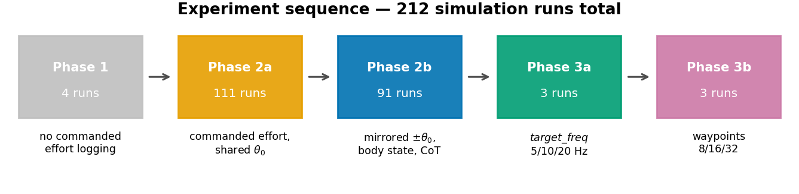

***Figure 1.*** Experiment sequence. Run counts are globbed from disk rather than asserted.


Four provenance facts constrain what this report can compare, and each has caused an
error in earlier drafts of this analysis:

**Phase 1 cannot enter any effort comparison.** It logs only unsigned joint torque
magnitude and position command-vs-state. There is no commanded-effort column of any
kind, so no reduction percentage, no RMS effort and no energy figure can be computed
for it. Phase 1 is reported as a harness change log with torque-magnitude evidence.

**Cost of transport exists only for Phase 2b.** The CoT denominator needs forward
displacement, which comes from `body_state.csv` — present in 91 of 91 Phase-2b runs and
in zero runs of every other phase.

**The two sweeps share no interior grid point.** Phase 2a spans $k_x$ 0.05–0.50 with
$θ_0$ 0…−50°; Phase 2b spans $k_x$ 0.05–0.45 with $|θ_0|$ 0…45°. Only the $θ_0$ = 0°
line is common to both, and the two baselines were re-simulated rather than reused
(0.2345 vs 0.2352 N·m mean knee effort, +0.31%). Every cross-sweep claim in Section 6
rests on that single shared column.

**The `run_dir` column in all 202 sweep rows is stale.** It points at
`ROS/experiment/runN`, a scratch directory renamed after each sweep and no longer
present. Runs are therefore resolved by `run_index` → `<phase_dir>/run<N>`, a mapping
verified 1:1 and gapless for both sweeps. Note also that `run_dir` cannot identify which
phase a row belongs to: rows in two different CSVs claim identical paths.

Two smaller items. Phase 1 has a **numbering gap** — `run1`, `run2`, `run3`, `run6`
exist; runs 4 and 5 were not kept. And Phase 1's `joint_commands_vs_states.csv` carries
one NaN row (the last) in every `_state` column, so all Phase-1 statistics here are
NaN-aware.

Recording in Phases 2–3 begins only after a one-gait-cycle warm-up, so the spawn
transient is excluded by construction. The first *recorded* cycle still runs measurably
hot; Section 10 quantifies the consequence.

---

## 3 Phase 1 — Harness development (4 runs)

### 3.1 What was done

Four exploratory runs established that the gait produces measurable, cyclic knee
torques, and progressively removed artifacts that made the early data unusable for
spring optimisation. This is a change log, not a controlled experiment: the runs differ
in more than one variable.

***Table 2.*** Phase 1 run-by-run change log and start-up transient magnitude. Notes are quoted from each `run_info.txt`; torque statistics are over all 12 joints.

| Run | Waypoints/cycle | Log start (s) | Peak \|τ\|, first 0.5 s | Peak \|τ\|, rest | Early/rest | Mean \|τ\| | Mean err | Change recorded in `run_info.txt` |
|---|---:|---:|---:|---:|---:|---:|---:|---|
| run1 | 20 | 7.420 | 1.9558 | 0.9414 | 2.08× | 0.1894 | 4.62° | A simple run with all the basic configuration no changes (Baseline) |
| run2 | 20 | 5.888 | 0.9611 | 0.9490 | 1.01× | 0.1758 | 4.66° | this is run basically with the dynamics attach in sdf (so friction and dampning |
| run3 | 16 | 2.740 | 1.4784 | 0.9548 | 1.55× | 0.1966 | 5.25° | Removed the two stall phases from the walking trajectory |
| run6 | 16 | 0.000 | 0.4631 | 0.4570 | 1.01× | 0.1104 | 3.52° | so this is no stall and start from home position or gait starting position rather than lating flat on ground |


### 3.2 Results

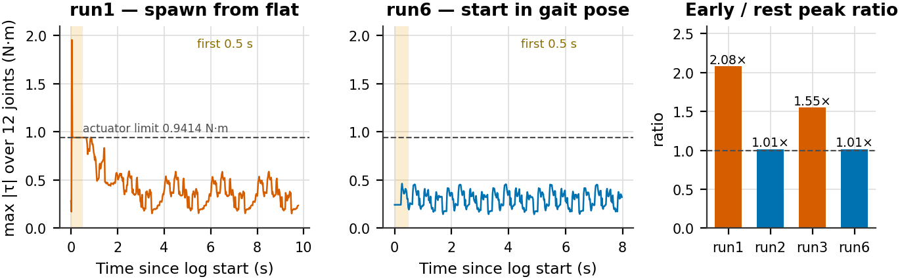

***Figure 2.*** Start-up transient. Left and centre: envelope of peak absolute torque across all 12 joints for run1 (spawned lying flat) and run6 (started in the gait pose). Right: ratio of the first-0.5 s peak to the peak over the remainder, for all four runs.


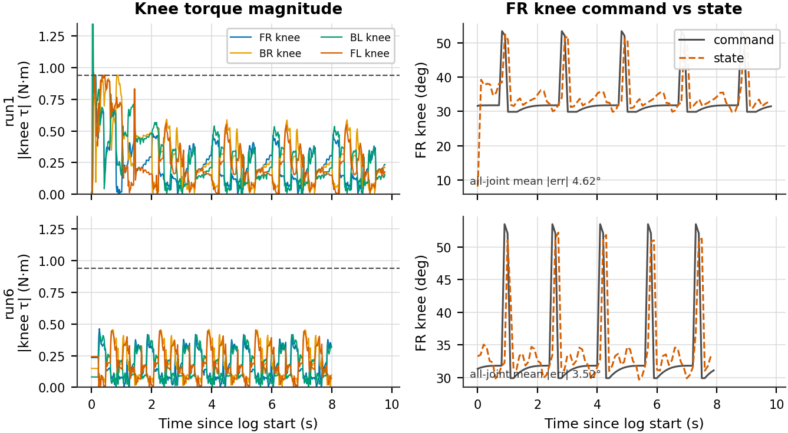

***Figure 3.*** Knee torque magnitude and FR-knee command-vs-state tracking for run1 (top) and run6 (bottom).


### 3.3 Analysis

The start-up artifact is real and large. In run1 the logger begins 7.420 s into the
simulation and the first 0.5 s still contains a 1.9558 N·m spike — **2.08×** the peak
over the remaining 9.3 s, and more than twice the actuator's own 0.9414 N·m rating. By
run6 the transient is gone: the early peak (0.4631 N·m) matches the steady-state peak
(0.4570 N·m) to within 1.3%, giving a ratio of **1.01×**, and the log starts at
$t$ = 0 because the robot is already in its gait pose.

Figure 1 shows the transient is not confined to the first half second — run1's envelope
decays over roughly four seconds, so any metric averaged over a short run was
contaminated well beyond the window usually inspected. Mean tracking error also improves
from 4.62° to 3.52°, consistent with a controller that no longer starts behind.

**What cannot be concluded.** Overall peak torque falls 4.22× and mean torque 42% from
run1 to run6, but three things changed across those runs — SDF joint damping and
friction were added (run2), the two stall phases were removed (run3), and the start pose
changed (run6). The transient removal is attributable to the start-pose change because
the early/rest ratio isolates it; the amplitude reduction is not attributable to any
single change. Run3 is also a caution against reading these as monotone progress: it has
the *highest* mean torque of the four.

The decisive limitation is what Phase 1 does not record. Without commanded effort there
is no way to separate controller demand from spring assist from gravity, which is
exactly the decomposition a spring study needs. That gap motivated the Phase 2a harness.

---

## 4 Phase 2a — Shared-angle sweep (111 runs)

### 4.1 What was done

Commanded-effort logging, effort-vs-angle logging and a settle phase were added, and the
waypoint count was fixed at 16. The spring was then swept over
$k_x \in \{0.05 … 0.50\}$ × $θ_0 \in \{0, −5, … , −50°\}$ — 110 spring cells plus
one baseline. **The same $θ_0$ was applied to all four knees.**

### 4.2 Results

***Table 3.*** Phase 2a best five configurations by mean knee effort. Baseline mean knee effort 0.2345 N·m. "Knee spread" is the best-minus-worst knee at that single cell.

| Rank | $k_x$ | $θ_0$ | Mean effort (N·m) | Reduction | RMS (N·m) | p99 (N·m) | Sat. | Track err | Knee spread (pts) |
|---|---:|---:|---:|---:|---:|---:|---:|---:|---:|
| 1 | 0.30 | 0° | 0.1548 | **33.97%** | 0.2133 | 0.8611 | 0.69% | 3.51° | 3.96 |
| 2 | 0.35 | 0° | 0.1556 | **33.63%** | 0.2153 | 0.8915 | 0.88% | 3.50° | 6.19 |
| 3 | 0.30 | -5° | 0.1571 | **33.01%** | 0.2146 | 0.8660 | 0.56% | 3.41° | 3.97 |
| 4 | 0.35 | -5° | 0.1595 | **31.98%** | 0.2180 | 0.9010 | 0.56% | 3.48° | 6.10 |
| 5 | 0.25 | 0° | 0.1599 | **31.81%** | 0.2150 | 0.8346 | 0.25% | 3.53° | 3.43 |


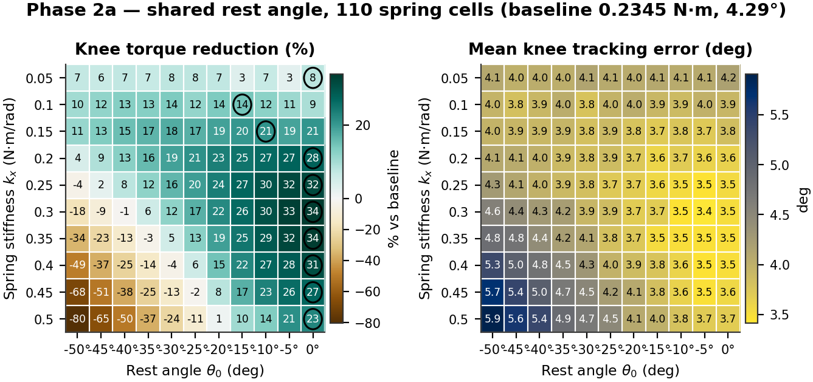

***Figure 4.*** Phase 2a torque reduction and mean tracking error over the shared-angle grid. Circles mark each row optimum.


***Table 4.*** Per-knee best achievable reduction. Each row is a *different* grid cell — these values cannot be compared as though they came from one configuration.

| Knee | Baseline effort (N·m) | Best reduction | at $k_x$ | at $θ_0$ | Stance $q_{op}$ | HOLD (N·m) |
|---|---:|---:|---:|---:|---:|---:|
| FR | 0.2387 | 33.72% | 0.35 | 0° | +37.2° | -0.246 |
| BR | 0.2359 | 35.21% | 0.30 | 0° | +42.9° | -0.248 |
| BL | 0.2423 | 37.58% | 0.50 | -15° | -40.8° | +0.264 |
| FL | 0.2210 | 31.46% | 0.30 | 0° | -38.4° | +0.258 |


### 4.3 Analysis — the symmetry conflict

Every one of the top five configurations sits at $θ_0$ = 0° or −5°, and the far corner
of the grid collapses to −80%. Both follow from one fact: **the legs are mirrored.** The
right knees stand at $q_{op}$ = +37.2° and +42.9° with holding torques of −0.246 and
−0.248 N·m; the left knees at −38.4° and −40.8° with **+0.258 and +0.264 N·m**. The
required assist has opposite sign on the two sides.

A single shared $θ_0$ can only serve both sides at $θ_0$ = 0°, where the lever arm is
$-q_{op}$ and therefore already carries each side's sign. Move away from zero and the
two sides fail in opposite ways.

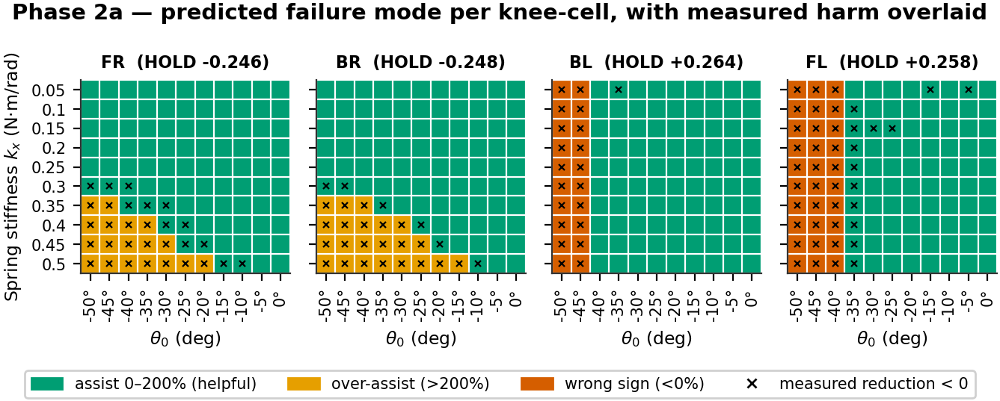

***Figure 5.*** Predicted failure mode for each of the 440 knee-cells from the assist ratio of Section 1.3, with cells whose *measured* reduction is negative overlaid as crosses.


***Table 5.*** Failure modes by knee. Wrong-sign and over-assist occur on opposite sides and in opposite corners of the grid.

| Knee | HOLD (N·m) | Wrong sign (ratio < 0) | Over-assist (ratio > 200%) | Predicted harmful | Measured reduction < 0 |
|---|---:|---:|---:|---:|---:|
| FR | -0.246 | 0 | 18 | 18 | 30 |
| BR | -0.248 | 0 | 22 | 22 | 28 |
| BL | +0.264 | 20 | 0 | 20 | 21 |
| FL | +0.258 | 30 | 0 | 30 | 43 |
| **Total** |  | **50** | **40** | **90** | **122** |


The prediction and the measurement agree on **92.7%** of the 440 knee-cells, and the
agreement is one-directional in a useful way: all 90 cells predicted harmful do measure
negative — there are no false positives — while 32 cells measure negative without being
predicted so. The static model is therefore a reliable *sufficient* condition for harm
and an optimistic one overall; dynamic effects harm cells the static model passes.

The right knees never suffer wrong-sign assist (0 cells) but are over-assisted in 40
cells at high stiffness. The left knees are never over-assisted but receive wrong-sign
assist in 50 cells — 20 for BL, 30 for FL, the difference being simply that FL's stance
angle is 2.5° shallower. **50 of 440 knee-cells (11.4%) were therefore uninterpretable
by construction**, not by mis-tuning.

### 4.4 Analysis — the ridge is predictable

Effort is minimised when the assist cancels the holding torque, which gives a predicted
optimal stiffness for every rest angle:

```
k_x* = |HOLD| / |θ₀ − q_op|
```

a hyperbola in the $(k_x, θ_0)$ plane — a ridge, not a peak.

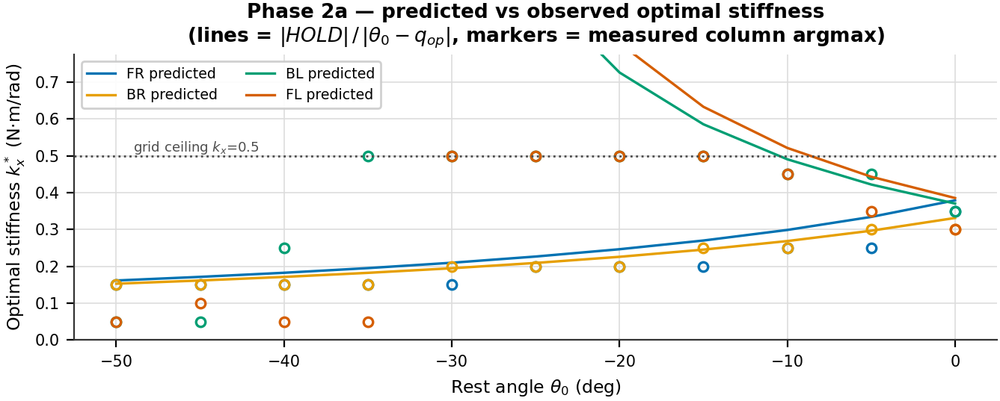

***Figure 6.*** Predicted optimal stiffness against the measured column-wise argmax, per knee. Lines are the static model; markers are measurements.


For the right knees the model is essentially exact. For the left knees the predicted
$k_x^*$ runs off the top of the grid for $θ_0 < −10°$, so the measured argmax is pinned
to the boundary or, inside the wrong-sign region, collapses to the smallest stiffness —
where a harmful spring does least damage. The apparent model failure on the left is a
grid-range and sign artifact, not a modelling error.

**Consequence.** Reporting "the optimum is $k_x$ = 0.30, $θ_0$ = 0°" overstates the
result's specificity. The defensible statement is that an assist torque of ≈0.25 N·m
removes about a third of knee effort, and that (0.30, 0°) is one convenient point on the
locus delivering it.

One further caution on Phase 2a: **109 of its 111 runs saturate the actuator at least
once**, so no claim about staying inside the torque envelope is supportable from this
sweep.

---

## 5 Phase 2b — Mirrored-angle sweep (91 runs)

### 5.1 What was done

Each knee now receives $θ_0 = \mathrm{sign}(\mathrm{HOLD}) · |θ_0|$, making the
assist direction correct on all four knees by construction. The grid became
$k_x \in \{0.05 … 0.45\}$ × $|θ_0| \in \{0 … 45°\}$ = 90 cells plus baseline.
Body pose, odometry and IMU logging were added, enabling forward displacement and
therefore cost of transport.

### 5.2 Results — the ridge

***Table 6.*** Phase 2b best five configurations by mean knee effort. Baseline 0.2352 N·m.

| Rank | $k_x$ | \|$θ_0$\| | Mean effort (N·m) | Reduction | RMS (N·m) | p99 (N·m) | Sat. | Track err | Knee spread (pts) |
|---|---:|---:|---:|---:|---:|---:|---:|---:|---:|
| 1 | 0.15 | ±35° | 0.1543 | **34.39%** | 0.2126 | 0.8745 | 0.75% | 3.40° | 2.71 |
| 2 | 0.20 | ±20° | 0.1546 | **34.28%** | 0.2125 | 0.8753 | 0.69% | 3.51° | 3.49 |
| 3 | 0.20 | ±15° | 0.1549 | **34.12%** | 0.2121 | 0.8636 | 0.31% | 3.54° | 1.15 |
| 4 | 0.15 | ±40° | 0.1550 | **34.10%** | 0.2130 | 0.8884 | 0.75% | 3.46° | 4.92 |
| 5 | 0.15 | ±30° | 0.1551 | **34.04%** | 0.2127 | 0.8695 | 0.31% | 3.47° | 1.83 |


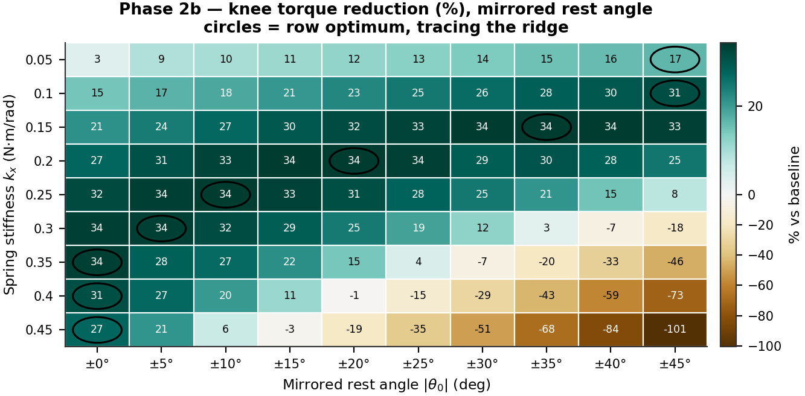

***Figure 7.*** Phase 2b torque reduction over the mirrored grid, full colour range. Circles mark row optima, which trace the ridge.


***Table 7.*** Complete Phase 2b reduction grid (%). Bold marks each row optimum; negative values are over-assist.

| $k_x$ \\ \|$θ_0$\| | ±0° | ±5° | ±10° | ±15° | ±20° | ±25° | ±30° | ±35° | ±40° | ±45° |
|---|---:|---:|---:|---:|---:|---:|---:|---:|---:|---:|
| **0.05** | 3.2 | 8.9 | 9.9 | 10.9 | 11.9 | 12.8 | 13.8 | 15.1 | 16.1 | **16.6** |
| **0.10** | 14.8 | 17.1 | 18.3 | 20.6 | 22.7 | 24.9 | 26.5 | 28.4 | 29.6 | **31.2** |
| **0.15** | 21.4 | 24.4 | 27.1 | 29.7 | 31.5 | 33.0 | 34.0 | **34.4** | 34.1 | 33.4 |
| **0.20** | 27.1 | 30.8 | 32.9 | 34.1 | **34.3** | 33.6 | 28.6 | 30.3 | 28.0 | 25.2 |
| **0.25** | 31.9 | 33.8 | **34.0** | 33.2 | 31.1 | 27.9 | 25.0 | 20.8 | 14.8 | 7.9 |
| **0.30** | 33.7 | **33.7** | 31.5 | 28.6 | 24.5 | 19.3 | 12.2 | 2.7 | -7.3 | -18.0 |
| **0.35** | **33.6** | 28.0 | 26.8 | 21.5 | 14.5 | 4.1 | -7.5 | -20.0 | -32.6 | -45.6 |
| **0.40** | **31.0** | 26.9 | 20.3 | 11.2 | -1.2 | -14.9 | -29.1 | -43.5 | -58.7 | -73.0 |
| **0.45** | **27.4** | 20.9 | 6.2 | -2.9 | -18.6 | -34.7 | -51.1 | -67.8 | -83.8 | -100.7 |


***Table 8.*** The ridge, read off row by row.

| $k_x$ (N·m/rad) | Best \|$θ_0$\| | Reduction there |
|---|---:|---:|
| 0.05 | ±45° | 16.64% |
| 0.10 | ±45° | 31.22% |
| 0.15 | ±35° | 34.39% |
| 0.20 | ±20° | 34.28% |
| 0.25 | ±10° | 34.00% |
| 0.30 | ±5° | 33.72% |
| 0.35 | ±0° | 33.64% |
| 0.40 | ±0° | 31.04% |
| 0.45 | ±0° | 27.36% |


### 5.3 Analysis — one effective degree of freedom

As stiffness rises the best rest angle falls monotonically, exactly as
$k_x·(|θ_0| + |q_{op}|)$ requires. Everything from $k_x$ = 0.15 to 0.35 delivers
33.6–34.4% — a 0.8-point band across five very different parameter pairs. **The design
has one effective degree of freedom, not two.** This is good news for manufacturing: the
spring must deliver roughly the right assist *torque*, and how that is split between
stiffness and preload is a convenience.

Only **23 of 90** cells exceed 30% reduction and **19 are actively harmful**, so the
useful region is a narrow band rather than most of the grid. The penalty is strongly
asymmetric: moving along the ridge costs almost nothing, moving across it is severe —
at $k_x$ = 0.45, going from ±0° to ±45° takes mean effort from 0.171 to 0.472 N·m,
roughly double baseline. **If the spring must be mis-sized, size it low.**

Both ends of the ridge exit the grid: below $k_x$ = 0.10 the best $|θ_0|$ is 45°, the
grid edge, and at $k_x ≥ 0.35$ the best is 0°, also an edge (mirroring forbids going
further). The interior optimum near $k_x$ 0.15–0.25 is genuine; the low-stiffness branch
is unmapped.

### 5.4 Results — per-knee symmetry

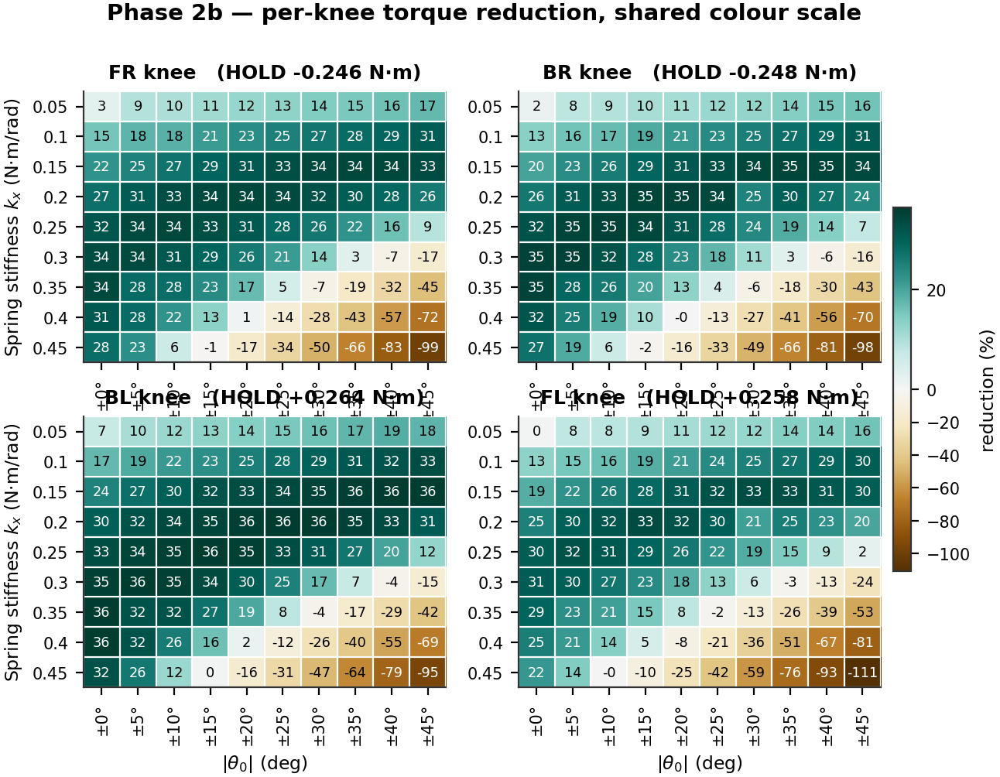

***Figure 8.*** Per-knee reduction across the mirrored grid on a shared colour scale, so the four panels are directly comparable.


Across the grid the best-minus-worst knee spread runs from **1.15** to **15.58** points,
median 8.85. The minimum occurs at $k_x$ = 0.20, $|θ_0|$ = ±15°, which happens to sit
near all four knees' individual optima simultaneously. FL is consistently the weakest
knee and BL the strongest; that ordering follows the measured holding torques
(0.246 → 0.264 N·m) and is not a mirroring defect. Only per-knee stiffness could remove
the residue.

### 5.5 Results — cost of transport

Cost of transport is a property of the whole robot, so the numerator counts all 12
joints even though only the knees carry springs:
$\mathrm{CoT} = E / (m g d)$ with $mg$ = 13.7050 N. The knees account for
55.2% of total mechanical work, so a knee-only figure would understate the true
cost by nearly half.

***Table 9.*** The three cost-of-transport definitions. They differ only in how the numerator counts energy.

| Variant | Definition | Baseline | Best value | Best cell | Change | Cells beating baseline | r vs reduction | What it measures |
|---|---|---:|---:|---:|---:|---:|---:|---|
| **Mechanical** | Σ\|τ·dθ\| / mgd | 2.7149 | 2.3012 | $k_x$=0.25, ±15° | **-15.24%** | 68 | -0.787 | total mechanical work |
| **Positive work** | Σmax(0, τ·dθ) / mgd | 2.1830 | 1.8178 | $k_x$=0.25, ±15° | **-16.73%** | 75 | -0.366 | driving work only (optimistic bound) |
| **Electrical proxy** | ∫τ²dt / mgd | 0.8779 | 0.5734 | $k_x$=0.20, ±15° | **-34.68%** | 69 | -0.986 | motor copper loss (I²R) |


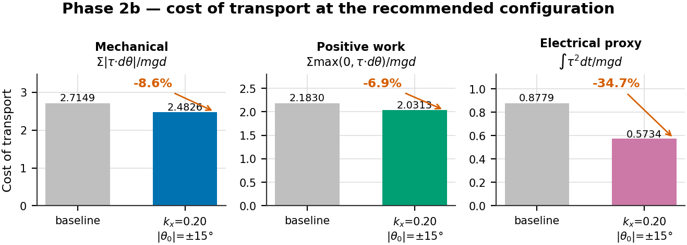

***Figure 9.*** Cost of transport at baseline and at the recommended configuration. All three bars come from that single configuration.


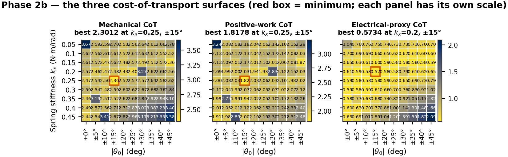

***Figure 10.*** The three CoT surfaces across the grid. Each panel is independently scaled; the red box marks its minimum.


***Table 10.*** Cost of transport at the three candidate configurations. Quoting a CoT number requires naming its cell: the three optima are three different cells.

| Configuration | Reduction | Mechanical CoT | Positive-work CoT | Electrical CoT | All-joint work |
|---|---:|---:|---:|---:|---:|
| Torque optimum<br>$k_x$=0.15, ±35° | 34.39% | 2.5147 (-7.4%) | 2.0625 (-5.5%) | 0.5796 (-34.0%) | 11.36 J (-6.2%) |
| Recommended<br>$k_x$=0.20, ±15° | 34.12% | 2.4826 (-8.6%) | 2.0313 (-6.9%) | 0.5734 (-34.7%) | 11.26 J (-7.1%) |
| Mechanical-CoT optimum<br>$k_x$=0.25, ±15° | 33.22% | 2.3012 (-15.2%) | 1.8178 (-16.7%) | 0.5808 (-33.8%) | 10.45 J (-13.8%) |


### 5.6 Analysis — why the three CoT numbers disagree

Mechanical CoT improves only **7.4%** at the torque optimum while torque falls 34.4%.
This looks like a failure and is not. Mechanical work is $τ · dθ$, so a motor holding a
static load registers *zero* work while still drawing current — and cancelling static
holding torque is precisely what a gravity-compensating spring does. Mechanical work is
blind to the very effect under test.

The electrical proxy $∫τ^2 dt$ is the copper-loss surrogate ($P = I^2R$, $I ∝ τ$), and
it falls **34.7%** — tracking the torque reduction almost exactly at $r$ = −0.986,
against −0.787 for mechanical CoT and −0.366 for the positive-work variant. If one
efficiency number is quoted, it should be the electrical one.

Two honest caveats. The proxy is **not in joules**: converting $∫τ^2dt$ to energy needs
the servo's torque constant $k_t$ and winding resistance $R$, which we do not have, so
only relative comparisons are valid. And the raw work figure (−6.2%) differs slightly
from mechanical CoT (−7.4%) at the same cell purely because forward displacement rose
1.3%; both are correct, and the distinction has been conflated in earlier drafts.

### 5.7 Analysis — the CoT denominator is outside its own validity range

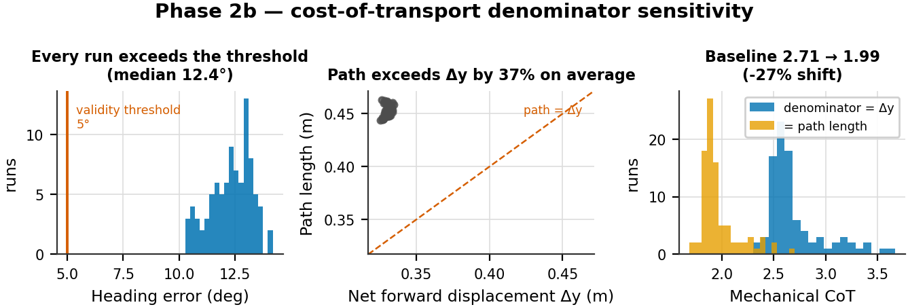

***Figure 11.*** Denominator sensitivity. Left: heading error against the 5° threshold below which net forward displacement is a defensible denominator. Centre: path length against net displacement. Right: the mechanical CoT distribution under each denominator.


This is the weakest part of the CoT analysis and is stated plainly. Net forward
displacement $Δy$ is a defensible denominator only when the robot walks roughly
straight; the working threshold adopted when this logging was designed was ≲5° of
heading error. **The measured heading error is 14.20° at baseline and exceeds 5° in all
91 runs** (median 12.41°, straightness ratio ≈0.74).

Using measured path length instead of net displacement changes baseline mechanical CoT
from 2.7149 to **1.9920 — a 26.6% shift.** Every absolute CoT number in this report
should therefore be read as carrying roughly a ±27% systematic band, and CoT should not
be compared against literature values without stating the convention.

What survives is the comparison between configurations: the two denominators rank the
90 cells almost identically ($r$ = 0.996), because path length varies little across the
grid. Configuration selection is unaffected; only the absolute level is uncertain. The
report keeps $Δy$ as the headline convention for continuity with the logged data, and
treats the path-length figure as a bound.

Displacement itself is nearly invariant — coefficient of variation **0.55%** across the
grid, against 10% variation in mechanical work — so CoT differences are genuine energy
differences, not denominator artifacts ($r$ between CoT and work = 0.9986).

### 5.8 Results — metric independence, and a conflict of objectives

***Table 11.*** Every metric at baseline, at the torque optimum and at the recommended configuration, with each metric-to-reduction correlation across the 90 spring cells.

| Metric | Baseline | Torque opt.<br>(0.15, ±35°) | Δ | Recommended<br>(0.20, ±15°) | Δ | r vs reduction |
|---|---:|---:|---:|---:|---:|---:|
| Mean applied knee effort (N·m) | 0.2352 | 0.1543 | -34.4% | 0.1549 | -34.1% | — *by construction* |
| RMS applied knee effort (N·m) | 0.2863 | 0.2126 | -25.7% | 0.2121 | -25.9% | -0.996 |
| p99 knee demand (N·m) | 0.9311 | 0.8745 | -6.1% | 0.8636 | -7.2% | -0.852 |
| Peak knee demand (N·m) | 0.9831 | 0.9502 | -3.3% | 0.9352 | -4.9% | -0.016 |
| Torque variance (N²·m²) | 0.0266 | 0.0214 | -19.7% | 0.0210 | -21.3% | -0.596 |
| Actuator saturation (%) | 0.6875 | 0.7500 | +9.1% | 0.3125 | -54.5% | -0.457 |
| Mean tracking error (deg) | 4.299 | 3.395 | -21.0% | 3.543 | -17.6% | -0.996 |
| Forward displacement (m) | 0.3256 | 0.3297 | +1.3% | 0.3309 | +1.6% | +0.192 |
| Mechanical CoT | 2.7149 | 2.5147 | -7.4% | 2.4826 | -8.6% | -0.787 |
| Electrical-proxy CoT | 0.8779 | 0.5796 | -34.0% | 0.5734 | -34.7% | -0.986 |


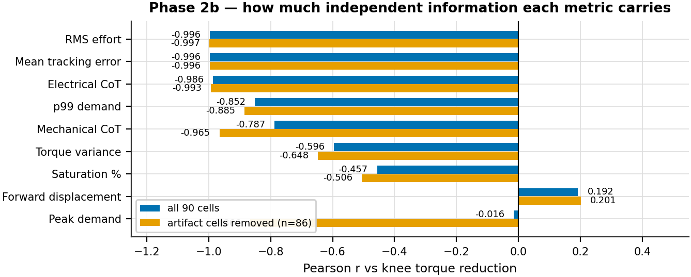

***Figure 12.*** How much independent information each metric carries, with and without the four control-artifact cells.


RMS effort falls **25.7%** where mean effort falls 34.4%. The spring cancels the DC
gravity bias but not the AC dynamic component, so the thermally relevant saving is real
but smaller than the headline. Quote 25.7%, not 34.4%, when discussing motor heating.

Mean tracking error correlates with reduction at $r$ = −0.996. It is therefore *not*
independent evidence that gait quality survived — it restates the effort result. It is
additionally confounded: the metric samples joint state on the first `/joint_states`
after each command, so most of its ~3° floor is waypoint spacing rather than controller
error. Saturation and forward displacement are the only genuinely independent checks in
the set, and both stay healthy.

Peak demand correlates at only $r$ = −0.016 — apparently pure noise. Removing the four
control-artifact cells raises this to −0.866, which is the more informative statement:
peak demand *does* follow the spring, but four discretisation artifacts dominate the
statistic entirely.

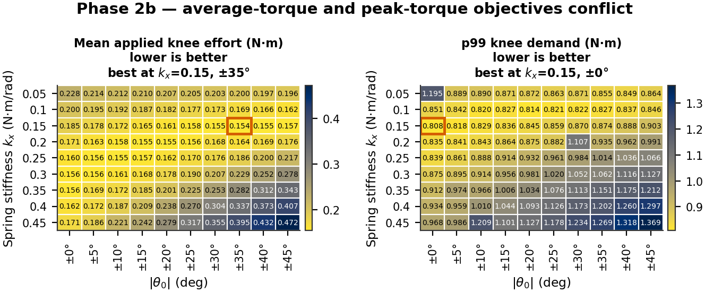

***Figure 13.*** Mean applied effort and p99 demand over the same grid. Their optima sit in opposite corners.


Average-torque and peak-torque objectives genuinely conflict. For $k_x ≥ 0.15$ the p99
minimum always lies at $|θ_0|$ = 0° and rises monotonically with rest angle. The best
p99 cell is $k_x$ = 0.15, ±0° at **0.8084 N·m** — but it delivers only **21.40%**
reduction. A configuration cannot maximise both.

### 5.9 Choosing a configuration

Ranking cells on a single metric hides this conflict, so the recommendation is made on a
joint constraint instead: **reduction > 30% AND p99 demand ≤ baseline.** Exactly **20 of
90** cells qualify.

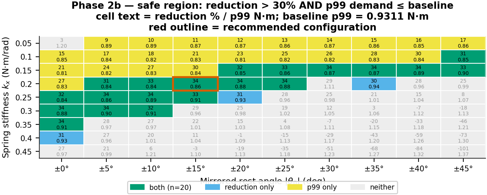

***Figure 14.*** Cells satisfying each constraint and both. Cell labels give reduction % over p99 demand.


***Table 12.*** The 20 cells meeting both constraints, ordered by reduction.

| $k_x$ | \|$θ_0$\| | Reduction | p99 (N·m) | Electrical CoT | Spread (pts) |
|---|---:|---:|---:|---:|---:|
| 0.15 | ±35° | 34.39% | 0.8745 | 0.5796 | 2.71 |
| 0.20 | ±20° | 34.28% | 0.8753 | 0.5785 | 3.49 |
| 0.20 | ±15° | 34.12% | 0.8636 | 0.5734 | 1.15 |
| 0.15 | ±40° | 34.10% | 0.8884 | 0.5830 | 4.92 |
| 0.15 | ±30° | 34.04% | 0.8695 | 0.5819 | 1.83 |
| 0.25 | ±10° | 34.00% | 0.8882 | 0.5812 | 4.33 |
| 0.25 | ±5° | 33.79% | 0.8607 | 0.5815 | 2.38 |
| 0.30 | ±5° | 33.72% | 0.8954 | 0.5833 | 6.00 |
| 0.30 | ±0° | 33.66% | 0.8755 | 0.5894 | 4.88 |
| 0.35 | ±0° | 33.64% | 0.9120 | 0.5846 | 7.31 |
| 0.20 | ±25° | 33.56% | 0.8822 | 0.5822 | 6.30 |
| 0.15 | ±45° | 33.40% | 0.9027 | 0.5859 | 5.72 |
| 0.25 | ±15° | 33.22% | 0.9139 | 0.5808 | 7.27 |
| 0.15 | ±25° | 32.97% | 0.8588 | 0.5840 | 1.64 |
| 0.20 | ±10° | 32.87% | 0.8432 | 0.5831 | 2.49 |
| 0.25 | ±0° | 31.89% | 0.8392 | 0.5890 | 2.87 |
| 0.30 | ±10° | 31.53% | 0.9141 | 0.5920 | 8.68 |
| 0.15 | ±20° | 31.51% | 0.8452 | 0.5923 | 2.38 |
| 0.10 | ±45° | 31.22% | 0.8459 | 0.5951 | 2.81 |
| 0.20 | ±5° | 30.82% | 0.8406 | 0.5877 | 2.74 |


***Table 13.*** Standing of the recommended configuration on every metric. Ranks are over the 90 spring cells, best first.

| Property | Value | Rank (best first) | Note |
|---|---:|---:|---|
| Knee torque reduction | 34.12% | 3 of 90 | 0.27 pts off best |
| Electrical-proxy CoT | 0.5734 | 1 of 90 | -34.7% vs baseline |
| RMS applied effort | 0.2121 N·m | 1 of 90 | -25.9% vs baseline |
| Bilateral spread | 1.15 pts | 1 of 90 | tightest cell in the sweep |
| p99 demand | 0.8636 N·m | 25 of 90 | 8.3% below the 0.9414 N·m rating |
| Actuator saturation | 0.3125% | 15–24 of 90 | tied with 9 other cells |
| Mechanical CoT | 2.4826 | 13 of 90 | -8.6% vs baseline |
| Mean tracking error | 3.54° | 21 of 90 | -17.6% vs baseline |
| Forward displacement | 0.3309 m | — | grid mean 0.3305 m |


$k_x$ = 0.20 N·m/rad, $|θ_0|$ = ±15° is recommended. It is inside the safe region, first
of 90 on electrical CoT, RMS effort and bilateral symmetry, third on torque reduction
(0.27 points off the best), and its p99 demand sits 8.3% below the actuator rating.

Its saturation of 0.3125% is **not** best-in-sweep, contrary to an earlier draft of this
analysis: ten cells share that exact value and 14 are strictly lower, placing it 15th to
24th of 90 depending on tie handling. The tie itself is informative — 0.3125% is exactly
5 of 1600 samples, and saturation quantises so coarsely here that it stops discriminating
between good cells.

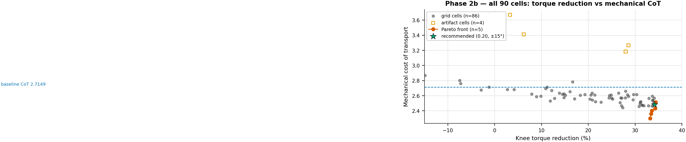

***Figure 15.*** All 90 cells in the reduction–CoT plane with the true non-dominated front.


***Table 14.*** The Pareto front for maximising reduction and minimising mechanical CoT.

| $k_x$ | \|$θ_0$\| | Reduction | Mechanical CoT | Electrical CoT | p99 (N·m) |
|---|---:|---:|---:|---:|---:|
| 0.15 | ±35° | 34.39% | 2.5147 | 0.5796 | 0.8745 |
| 0.20 | ±20° | 34.28% | 2.4336 | 0.5785 | 0.8753 |
| 0.20 | ±25° | 33.56% | 2.4020 | 0.5822 | 0.8822 |
| 0.15 | ±45° | 33.40% | 2.3612 | 0.5859 | 0.9027 |
| 0.25 | ±15° | 33.22% | 2.3012 | 0.5808 | 0.9139 |


The front contains only 5 of 90 cells and spans 1.17 points of reduction against 0.21 of
CoT, so the trade-off is mild. Note that the recommended cell is **not** on this front —
it is dominated by $k_x$ = 0.20, ±20°, which is better on both axes. It is preferred
anyway because the front ignores bilateral symmetry and p99 demand, where ±15° is
markedly better. This is a deliberate choice between objectives, not an oversight.

### 5.10 Results — control artifacts

***Table 15.*** The four cells whose peak/p99 demand ratio exceeds 5. Displacement is normal in all four, so the inflation is entirely in the energy numerator.

| $k_x$ | \|$θ_0$\| | Peak demand (N·m) | p99 (N·m) | Peak/p99 | Mechanical CoT | Displacement (m) |
|---|---:|---:|---:|---:|---:|---:|
| 0.05 | ±0° | 11.03 | 1.195 | 9.2× | 3.6708 | 0.3273 |
| 0.20 | ±30° | 11.31 | 1.107 | 10.2× | 3.2664 | 0.3290 |
| 0.35 | ±5° | 11.08 | 0.974 | 11.4× | 3.1854 | 0.3310 |
| 0.45 | ±10° | 20.90 | 1.209 | 17.3× | 3.4130 | 0.3331 |

Median all-joint work across the grid: 11.79 J; these four cells: 14.45–16.47 J.


These four cells show peak demand of 11–21 N·m against a p99 near 1.2 — the signature of
a single-sample derivative kick off the 10 Hz stepped set-point, which saturates the
actuator for a few consecutive samples while the joint is moving. That produces real
mechanical work in the simulation, but its cause is control discretisation, not the
spring. All top-10 cells by CoT are artifact-free, so the optimum is unaffected.

### 5.11 What the spring does to the effort–angle relationship

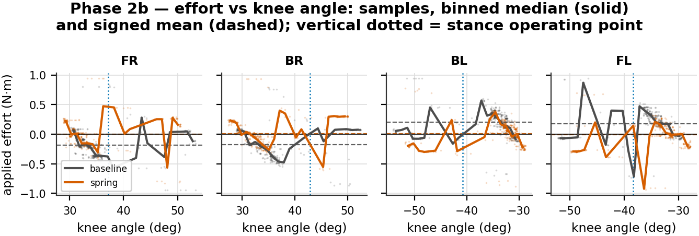

***Figure 16.*** Applied effort against knee angle for baseline and the recommended spring. Points are 50 Hz samples over five gait cycles; solid lines are binned medians; dashed lines are signed means.


The signed mean effort per knee moves toward zero under the spring — this is the DC
gravity bias being cancelled, and it is the mechanism behind the whole result. The
sample clouds show the spread is unchanged, which is the same AC/DC split that makes RMS
improve less than the mean. Note that knee angle is not monotonic within a cycle (swing
and stance revisit the same angles), so the binned median mixes phases and should be read
as a summary rather than a trajectory.

---

## 6 Phase 2a vs 2b — what mirroring bought

***Table 16.*** Cross-sweep comparison. The two grids share only the $θ_0$ = 0° column, which serves as a regression check.

| Metric | Phase 2a (shared) | Phase 2b (mirrored) | Change |
|---|---:|---:|---|
| Runs | 111 | 91 | — |
| Spring cells | 110 | 90 | — |
| Grid | $k_x$ 0.05–0.50 × $θ_0$ 0…−50° | $k_x$ 0.05–0.45 × \|$θ_0$\| 0…45° | no shared interior |
| Baseline mean effort (N·m) | 0.2345 | 0.2352 | re-simulated, +0.31% |
| Best reduction | 33.97% | **34.39%** | +0.42 pts |
| RMS at best cell | -25.33% | -25.73% | comparable method |
| Wrong-sign knee-cells | 50 / 440 (11.4%) | **0 / 360 (0%)** | eliminated |
| Bilateral spread at own optimum | 3.96 pts | **2.71 pts** | 1.46× tighter |
| Bilateral spread at recommended | — | **1.15 pts** | 3.44× tighter than 2a |
| $θ_0$ = 0° regression check ($k_x$=0.30) | 33.97% | 33.66% | within run-to-run noise |
| Saturation range | 0.00–2.56% | 0.00–2.12% | — |


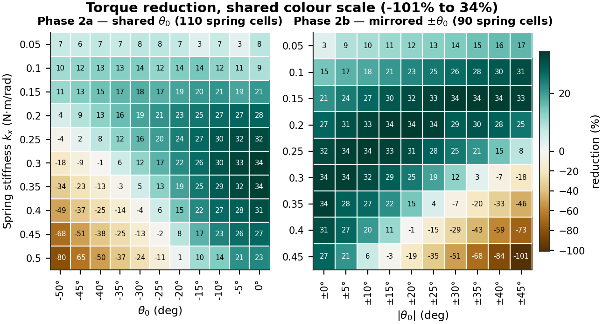

***Figure 17.*** Both sweeps on a shared colour scale, so equal reductions render as equal colours.


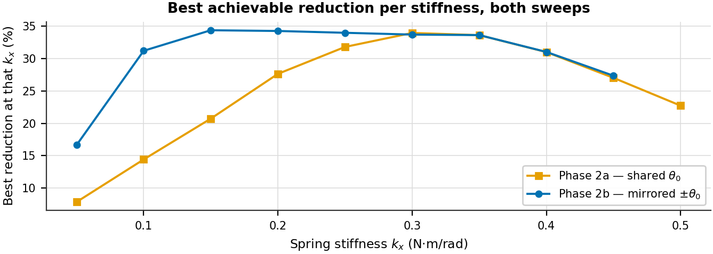

***Figure 18.*** Best achievable reduction at each stiffness.


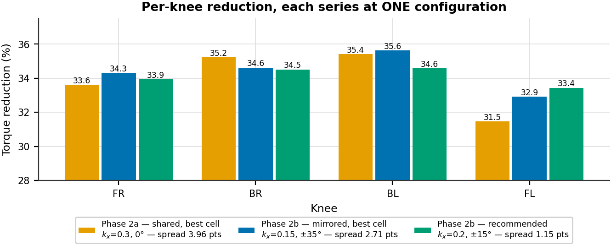

***Figure 19.*** Per-knee reduction. Each series is one single configuration — mixing cells here is what produced an inflated asymmetry figure in earlier drafts.


**The headline barely moved: 33.97% → 34.39%.** That is the honest result. Mirroring did
not buy a larger reduction; it bought a sweep in which all 90 cells are physically
interpretable instead of 11.4% of knee-cells being wrong-signed, and in which the
recommended setting helps all four knees nearly equally.

Bilateral spread at each sweep's own optimum improves from **3.96 to 2.71** points, and
at the recommended cell to **1.15** points — 3.4× tighter than Phase 2a.

A caution about that comparison, because it has been got wrong before. The spread of the
four knees' *individually best* reductions in Phase 2a is 6.12 points, but those four
values come from four *different* grid cells (BL's 37.58% is at $k_x$ = 0.50, −15°). That
number describes what separately-tuned springs could achieve; it is **not** the spread at
any single operating point, and using it as such overstates Phase 2a's asymmetry by
about 55%.

The $θ_0$ = 0° column is a genuine regression check, since mirroring by zero is a no-op:
at $k_x$ = 0.30 the two sweeps give 33.97% and 33.66%, within run-to-run variation
(the baselines themselves differ by 0.31%).

---

## 7 Phase 3a — Replay frequency (3 runs)

### 7.1 What was done

`target_freq` was set to 5, 10 and 20 Hz, replaying the *same* 16-waypoint trajectory
faster or slower. No spring was fitted. Cycle time is
`NUM_DATA_POINTS / target_freq`, so this changes speed while leaving trajectory shape
and per-step geometry untouched.

### 7.2 Results

***Table 17.*** Frequency sweep. Percentages are relative to the 10 Hz baseline. The knee step jump is identical across all three runs, confirming that only speed changed.

| Run | `target_freq` | Cycle (s) | Mean effort (N·m) | RMS (N·m) | Peak demand (N·m) | Saturation | Track err mean/RMS/peak | Knee step jump |
|---|---:|---:|---:|---:|---:|---:|---:|---:|
| run3 | **5 Hz** | 3.2 | 0.2101 (-8.3%) | 0.2535 (-9.6%) | 0.953 (-1.9%) | 0.188% (0.25×) | 3.76° / 6.58° / 21.0° | 2.989 |
| run1 | **10 Hz** (baseline) | 1.6 | 0.2292 | 0.2804 | 0.972 | 0.750% | 4.11° / 6.81° / 20.8° | 2.989 |
| run2 | **20 Hz** | 0.8 | 0.2424 (+5.8%) | 0.3265 (+16.5%) | 1.235 (+27.1%) | 4.875% (6.50×) | 4.19° / 6.92° / 21.2° | 2.989 |


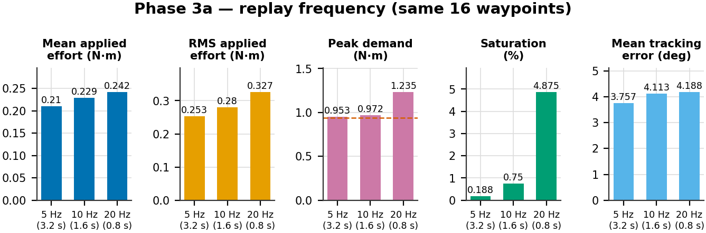

***Figure 20.*** Frequency sweep metrics. The dashed line on the peak-demand panel is the actuator rating.


### 7.3 Analysis

The isolation is verified rather than assumed: the mean per-step knee jump is **2.989°**
and the maximum **22.234°** in all three runs, identical to three decimals. Only the time
available to reach each waypoint changed.

Speeding up is expensive at the peak, not at the mean. At 20 Hz the same 2.989° jump must
be achieved in half the time, so the derivative term reacts harder: peak demand rises
**27.1%** to 1.235 N·m — well above the 0.9414 N·m rating — and saturation multiplies by
**6.5×** to 4.88%. At 5 Hz saturation falls to a quarter and peak demand is essentially
flat.

Mean and RMS effort move far more mildly (−8.3%/+5.8% and −9.6%/+16.5%) because they are
dominated by stance holding torque, which speed does not change. Tracking error moves in
the same direction but by only ±0.35°.

**Frequency is the clean lever for changing speed**, since it provably preserves
trajectory geometry. It is not a good lever for reducing peak torque.

---

## 8 Phase 3b — Trajectory resolution (3 runs)

### 8.1 What was done

`NUM_DATA_POINTS` was set to 8, 16 and 32 at a fixed 10 Hz, sampling the *same*
underlying Bézier swing arc and linear stance sweep at different resolutions. No spring
was fitted.

### 8.2 A degenerate case that must be excluded first

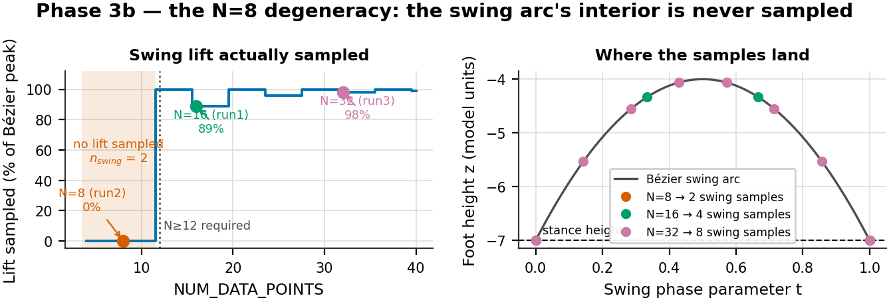

***Figure 21.*** Foot lift actually sampled from the swing arc as a function of waypoint count, and where the samples land on the curve.


***Table 18.*** Swing-lift sampling against waypoint count. The cliff is a hard one.

| `NUM_DATA_POINTS` | $n_{swing}$ | Lift (units) | % of Bézier peak | Sampled z | Verdict |
|---:|---:|---:|---:|---|---|
| 8 | 2 | 0.000 | **0.0%** | -7.00, -7.00 | **degenerate — foot drags** |
| 11 | 2 | 0.000 | **0.0%** | -7.00, -7.00 | **degenerate — foot drags** |
| 12 | 3 | 3.000 | **100.0%** | -7.00, -4.00, -7.00 | minimum viable — single peak sample |
| 16 | 4 | 2.667 | **88.9%** | -7.00, -4.33, -4.33, -7.00 | usable |
| 20 | 5 | 3.000 | **100.0%** | -7.00, -4.75, -4.00, -4.75, -7.00 | usable |
| 32 | 8 | 2.939 | **98.0%** | -7.00, -5.53, -4.55, -4.06, -4.06… | usable |


The swing foot-path is a quadratic Bézier through $P_1$=(−3,−7), $P_2$=(0,−1),
$P_3$=(3,−7), sampled at `n_swing = int(NUM_DATA_POINTS × 0.25)` points via
`np.linspace(0, 1, n_swing)`. Two facts combine badly. $P_2$ is a *control* point, not a
point on the curve, so the arc's true peak is at $t$ = 0.5 and reaches $z$ = −4.0 — three
units of lift, not the six a naive reading suggests. And `linspace` always includes
$t$ = 0 and $t$ = 1, both of which sit at stance height.

At `NUM_DATA_POINTS` = 8, `n_swing` = 2, so the only samples are the two endpoints and
**the foot never lifts — it slides from one stance position to the next.** This is not a
coarser gait; it is a qualitatively different, much lower-amplitude motion. Every
apparently favourable number in the 8-point run follows from doing less work: lower
effort, no saturation, and a tracking error of 1.00° because a near-flat trajectory is
trivial to follow. The fingerprint is the knee step jump, which *collapses* from 2.989°
to 0.483° when reducing the point count should have increased it.

Because `int()` truncates, `n_swing` stays at 2 for $N$ = 8…11 and jumps to 3 at
$N$ = 12. **Any lift at all requires $N ≥ 12.$** The 8-point run is excluded from every
conclusion below and retained only as a documented artifact.

### 8.3 A metadata contradiction, resolved from the data

***Table 19.*** Phase 3b spring labelling against measured signed effort.

| Run | Waypoints | `spring_mode` label | `spring_summary` label | Measured signed mean effort FR/BR/BL/FL (N·m) |
|---|---:|---|---|---|
| run1 | 16 | none | Baseline (no spring) | -0.176, -0.169, +0.186, +0.167 |
| run2 | 8 | unknown | Spring (native) — knee: kx=0.5 N·m/rad, θ₀=-50 | -0.192, -0.124, +0.121, +0.228 |
| run3 | 32 | none | Baseline (no spring) | -0.163, -0.151, +0.170, +0.150 |


The 8-point run's `run_info.txt` reports `spring_mode: unknown` with a summary
describing a $k_x$ = 0.5, $θ_0$ = −50° spring, while its two siblings report no spring.
This is a metadata race, not a physical difference: its measured signed per-knee efforts
(−0.192, −0.124, +0.121, +0.228 N·m) sit in the same range and the same sign pattern as
both baseline siblings, nowhere near the roughly doubled effort that configuration
produced in Phase 2a. **No spring was active; only the label is wrong.** The same
caveat applies to Phase 3a, whose runs carry a stale `spring_config` block while
reporting `spring_mode: none`.

### 8.4 Results

***Table 20.*** Resolution sweep. Percentages are relative to the 16-point baseline. The 8-point run is degenerate and excluded from conclusions.

| Run | `NUM_DATA_POINTS` | Cycle (s) | Swing samples | Lift sampled | Mean effort (N·m) | RMS (N·m) | Peak demand (N·m) | Saturation | Track err | Knee step jump |
|---|---:|---:|---:|---:|---:|---:|---:|---:|---:|---:|
| run2 | **8 pts** ⚠ | 0.8 | 2 | 0% | 0.1749 (-22.1%) | 0.2090 (-24.2%) | 0.689 (-28.7%) | 0.000% | 1.00° | 0.483 |
| run1 | **16 pts** (baseline) | 1.6 | 4 | 89% | 0.2246 | 0.2756 | 0.965 | 0.625% | 4.05° | 2.989 |
| run3 | **32 pts** | 3.2 | 8 | 98% | 0.1994 (-11.2%) | 0.2419 (-12.2%) | 0.495 (-48.7%) | 0.000% | 2.92° | 1.610 |


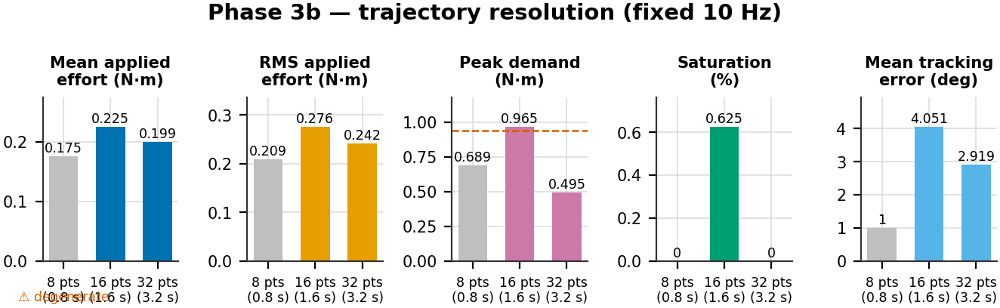

***Figure 22.*** Resolution sweep metrics. The 8-point bar is greyed as degenerate.


### 8.5 Analysis

The valid comparison is 16 vs 32 points, and it is the strongest result in this section:
**peak demand falls 48.7%** (0.965 → 0.495 N·m) and saturation goes to zero, with no
spring and no change in replay speed. Mean and RMS effort fall much more modestly
(−11.2%/−12.2%), again because stance holding torque dominates them and is
resolution-independent.

This confirms directly that peak knee demand in this system is an artifact of the
stepped set-point rather than a property of the gait: finer sampling shrinks the
step discontinuity itself.

### 8.6 The two levers at matched cycle time

***Table 21.*** Both levers at ≈3.2 s cycle time. Only these two runs are directly comparable in this way; the 8-point run reaches 0.8 s by breaking the trajectory.

| Metric | Slower replay<br>5 Hz, 16 pts | Finer sampling<br>10 Hz, 32 pts | Difference |
|---|---:|---:|---:|
| Mean effort (N·m) | 0.2101 | 0.1994 | -5.1% |
| RMS effort (N·m) | 0.2535 | 0.2419 | -4.6% |
| Peak demand (N·m) | 0.953 | 0.495 | -48.1% |
| p99 demand (N·m) | 0.747 | 0.475 | -36.4% |
| Saturation (%) | 0.188 | 0.000 | -100.0% |
| Mean tracking error (deg) | 3.76 | 2.92 | -22.3% |


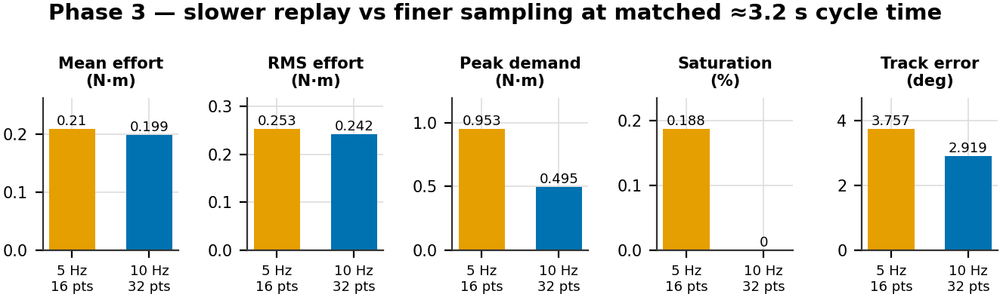

***Figure 23.*** Slower replay against finer sampling at the same cycle time.


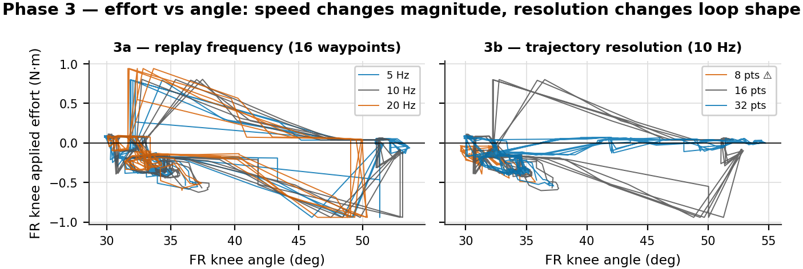

***Figure 24.*** FR-knee effort against angle under both levers. Frequency scales the magnitude; resolution changes the shape of the loop.


At matched cycle time, **finer sampling roughly halves peak demand where slower replay
does almost nothing** (0.495 vs 0.953 N·m). The mechanism is different in each case:
slowing the replay gives the controller more time to chase the same discontinuity, while
finer sampling removes the discontinuity. If the objective is peak torque, resolution is
the effective lever; if the objective is speed alone, frequency is the clean one.

This also answers the question the speed experiments were run to settle: a different
gait is not needed to change the torque–angle characteristic. Reducing speed lowers
peaks moderately, and increasing waypoint resolution lowers them substantially, both
without redesigning the gait.

---

## 9 Synthesis

### 9.1 Findings

1. A mirrored parallel knee spring removes **34.39%** of mean knee motor torque and
   **25.7%** of RMS effort, the thermally relevant figure.
2. Electrical (copper-loss) cost of transport falls **34.7%**, 0.8779 → 0.5734.
3. Mechanical CoT falls only **7.4%** — not a contradiction, but evidence that
   mechanical work is the wrong instrument for a device that cancels static torque.
4. Mirroring the rest angle eliminates wrong-sign assist entirely (**0 of 360**
   knee-cells, against 50 of 440) and tightens bilateral spread to **1.15** points.
5. The design has **one effective degree of freedom**: a ridge of $(k_x, θ_0)$ pairs all
   deliver 33.6–34.4%.
6. Average-torque and peak-torque objectives **conflict**; the best p99 cell gives only
   21.40% reduction.
7. **Finer trajectory sampling cuts peak demand 48.7%** independently of the spring, and
   is about twice as effective as slowing replay at the same cycle time.
8. The knee actuator is marginally undersized regardless of the spring: baseline peak
   demand is 0.9831 N·m against a 0.9414 N·m rating.

### 9.2 Recommended configuration

**$k_x$ = 0.20 N·m/rad, $|θ_0|$ = ±15°** (right knees −15°, left knees +15°), giving
34.12% torque reduction, 0.5734 electrical CoT, 1.15-point bilateral spread and p99
demand 8.3% below the actuator rating. It is one of the 20 cells meeting both
engineering constraints, and the ridge should be reported alongside it so the
sensitivity is visible.

### 9.3 Literature context

| Study | Joint | Spring type | Reported saving |
|---|---|---|---|
| Quadruped + RL, compliant feet | foot | compliant pad | ~17% |
| Hexapod gait + torque optimisation | multiple | passive + gait management | 22–39% |
| **This work** | **knee** | **linear torsion, parallel** | **34% torque, 35% electrical CoT** |
| Nonlinear elastic joints, design opt. | multiple | nonlinear PEA | up to 50% |
| Biped elastic coupling, trajectory opt. | knee/hip | mechanical spring | >50% |

The result sits inside the published 17–50% range using the simplest hardware in that
range — a fixed linear spring, no clutch, no adaptive mechanism. Studies exceeding 50%
use nonlinear springs or trajectory-optimised actuation. Two caveats on this comparison:
these are simulation results with no hardware validation, and the studies quoted measure
different things (whole-robot energy vs joint torque), so the row-to-row comparison is
indicative rather than like-for-like.

### 9.4 Supportable and unsupportable claims

| Supportable | Evidence |
|---|---|
| ~34% mean knee torque reduction | 90-cell sweep, combined over four knees |
| ~35% electrical-proxy CoT improvement | all 12 joints, verified baseline |
| 0 wrong-sign knee-cells under mirroring | 360 cells checked against the assist-ratio model |
| 1.15-point bilateral spread | measured at the recommended cell |
| One effective DOF | 0.8-point band across five distinct cells |
| −48.7% peak demand from resolution | Phase 3b, 16 vs 32 points, no spring |

| **Not** supportable | Why |
|---|---|
| Mechanical work drops in proportion to torque | it drops 6.2% against 34.4% |
| Any efficiency claim from mechanical CoT alone | understates this device ~4.7× |
| Electrical CoT in joules | the proxy needs $k_t$ and $R$ |
| Absolute CoT compared to literature | denominator carries a ±27% systematic band |
| Tracking error as independent quality evidence | collinear at $r$ = −0.996 |
| A smaller knee motor | peak demand is control-limited, not spring-limited |
| Saturation best-in-sweep at the recommended cell | 14 cells are strictly lower |

---

## 10 Limitations

1. **$n$ = 1 per cell.** No repeats, no error bars, no significance tests. The top five
   Phase-2b cells span 0.35 points while the two independently simulated baselines differ
   by 0.31%, so **nothing within the top five is statistically separable.** The cheap fix
   is 3 repeats at each of the 5 Pareto cells plus baseline — 18 runs.
2. **No locomotion-success gate.** Displacement is logged and nearly constant (CV 0.55%),
   which is reassuring, but there is no explicit fall or body-tilt check, so the harmful
   corner is interpreted on the assumption the robot still walked.
3. **CoT denominator outside its validity range** (Section 5.7): 14.20° heading error
   against a ≲5° threshold, giving a ±27% systematic band on absolute CoT.
4. **The ridge is truncated at both grid edges**, so the low-stiffness branch is unmapped.
5. **First-cycle bias.** Warm-up is one gait cycle and the first *recorded* cycle still
   runs measurably hot; excluding it shifts individual cells and reorders the closely
   spaced ranks 2–3.
6. **Saturation quantises too coarsely to discriminate.** Many cells report identical
   values (ten at exactly 0.3125%), so it separates good from bad but not good from good.
7. **`torque_variance` is computed on the rectified signal**, so it describes the
   magnitude envelope rather than the signed torque, and is not a smoothness measure of
   the signed waveform.
8. **$q_{op}$ and HOLD are gait-specific.** Both were measured on the 10 Hz,
   16-waypoint gait and set the mirror sign and assist sizing. Phase 3 shows both levers
   change the trajectory, so these constants must be re-measured if the gait changes —
   which also means the Phase-2b optimum is not transferable to the 32-waypoint gait
   recommended in Section 8.5 without re-running the sweep.
9. **Simulation only.** No hardware validation; spring hysteresis, friction, manufacturing
   tolerance and mounting compliance are all unmodelled.

### Next steps

1. Three repeats at each Pareto cell plus baseline (18 runs) to make sub-point
   differences separable.
2. Extend the grid to $|θ_0| > 45°$ at low stiffness to close the ridge's open branch.
3. Raise `NUM_DATA_POINTS` from 16 to 80 to remove the stepped-set-point artifact, then
   re-measure peak demand and re-derive $q_{op}$/HOLD on the new gait.
4. Add an explicit fall/tilt gate rather than inferring success from displacement.
5. Obtain $k_t$ and $R$ from the servo datasheet to convert the electrical proxy to
   joules.
6. Report per-cycle CoT to obtain a mean ± standard deviation from the existing runs at
   no simulation cost.

---

## Appendix A — Reproducing this report

```
cd ROS/report
python3 make_figures.py     # regenerate all figures + figures/figure_values.json
python3 make_tables.py      # print all tables (also importable as a dict)
python3 build_report.py     # regenerate experiment_report.md
python3 verify_claims.py    # recompute every quoted number; exit 0 = all hold
python3 build_pdf.py        # render experiment_report.pdf
```

`data.py` is the only module that touches the raw data; `verify_claims.py` recomputes
every number quoted above directly from the CSVs and additionally cross-checks the
figures against the prose, so a figure and its caption cannot disagree.

## Appendix B — Figure and table index


| Figure | File |
|---|---|
| 1 | `figures/timeline.png` |
| 2 | `figures/p1_transient.png` |
| 3 | `figures/p1_traces.png` |
| 4 | `figures/p2a_grids.png` |
| 5 | `figures/p2a_failure_map.png` |
| 6 | `figures/p2a_kx_star.png` |
| 7 | `figures/p2b_ridge.png` |
| 8 | `figures/p2b_per_knee.png` |
| 9 | `figures/p2b_cot_bars.png` |
| 10 | `figures/p2b_cot_grids.png` |
| 11 | `figures/p2b_cot_denominator.png` |
| 12 | `figures/p2b_correlations.png` |
| 13 | `figures/p2b_p99_vs_mean.png` |
| 14 | `figures/p2b_safe_region.png` |
| 15 | `figures/p2b_pareto.png` |
| 16 | `figures/p2b_effort_vs_angle.png` |
| 17 | `figures/cross_sweeps.png` |
| 18 | `figures/cross_best_per_kx.png` |
| 19 | `figures/cross_asymmetry.png` |
| 20 | `figures/p3a_bars.png` |
| 21 | `figures/p3b_swing_cliff.png` |
| 22 | `figures/p3b_bars.png` |
| 23 | `figures/p3_matched.png` |
| 24 | `figures/p3_effort_vs_angle.png` |

| Table | Generator id |
|---|---|
| 1 | `make_tables.py:T21` |
| 2 | `make_tables.py:T1` |
| 3 | `make_tables.py:T2` |
| 4 | `make_tables.py:T3` |
| 5 | `make_tables.py:T4` |
| 6 | `make_tables.py:T5` |
| 7 | `make_tables.py:T6` |
| 8 | `make_tables.py:T7` |
| 9 | `make_tables.py:T8` |
| 10 | `make_tables.py:T9` |
| 11 | `make_tables.py:T10` |
| 12 | `make_tables.py:T14` |
| 13 | `make_tables.py:T11` |
| 14 | `make_tables.py:T12` |
| 15 | `make_tables.py:T13` |
| 16 | `make_tables.py:T15` |
| 17 | `make_tables.py:T16` |
| 18 | `make_tables.py:T18` |
| 19 | `make_tables.py:T20` |
| 20 | `make_tables.py:T17` |
| 21 | `make_tables.py:T19` |
