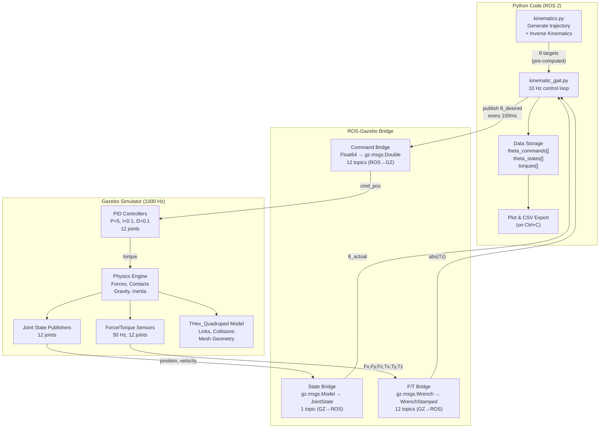

# THex Quadruped Simulation — Complete System Walkthrough

> A beginner-friendly deep dive into every component of the `sim_robot` package: what each file does, how they connect, and the physics/math behind the walking gait.

---

## Table of Contents

1. [The Big Picture](#1-the-big-picture)
2. [SDF vs URDF — Robot Description Formats](#2-sdf-vs-urdf)
3. [The THex_Quadruped Robot Model (model.sdf)](#3-the-robot-model)
4. [The Gazebo World (friction_world.sdf)](#4-the-gazebo-world)
5. [The ROS–Gazebo Bridge](#5-the-ros-gazebo-bridge)
6. [The Kinematics Module (kinematics.py)](#6-kinematics-module)
7. [The Kinematic Gait Controller (kinematic_gait.py)](#7-kinematic-gait-controller)
8. [How Joint Torques Are Measured](#8-joint-torque-measurement)
9. [Launch File — How It All Starts](#9-launch-file)
10. [Complete Data Flow Diagram](#10-data-flow)

---

## 1. The Big Picture

The system has three layers:

```
┌─────────────────────────────────────────────────────┐
│                   YOUR CODE (ROS 2)                 │
│  kinematic_gait.py ←→ kinematics.py                │
│  Computes angles, publishes commands, logs data     │
├─────────────────────────────────────────────────────┤
│              ROS–GAZEBO BRIDGE                      │
│  Translates ROS topics ↔ Gazebo topics              │
│  (ros_gz_bridge.yaml)                               │
├─────────────────────────────────────────────────────┤
│                GAZEBO SIMULATOR                     │
│  Physics engine (1000 Hz), robot model (model.sdf)  │
│  JointPositionController (PID), sensors, collision  │
└─────────────────────────────────────────────────────┘
```

**In plain English:**
1. Your Python code computes the desired joint angles for a walking gait
2. Those angles travel through the ROS–Gazebo bridge as messages
3. Gazebo's PID controllers move the simulated joints to match those angles
4. Gazebo sends back sensor data (joint positions, torques) through the bridge
5. Your Python code logs that data for analysis

---

## 2. SDF vs URDF — Robot Description Formats {#2-sdf-vs-urdf}

Both SDF and URDF are XML-based formats that describe a robot's physical structure. Think of them as the "blueprint" of the robot.

### URDF (Unified Robot Description Format)

- **Created by:** ROS project
- **Used for:** ROS tools (RViz visualization, MoveIt motion planning, tf2 transforms)
- **File:** [model.urdf](file:///home/mubashir/Documents/FYP-Legged-Robot-main/Code/ROS/src/sim_robot/models/THex_Quadruped/model.urdf)

**Key characteristics:**
- Can only describe **tree-structured** robots (no closed loops)
- Limited physics — no friction, contact parameters, or sensor definitions
- Every robot is a tree: `base_link → hip → knee → foot`

### SDF (Simulation Description Format)

- **Created by:** Open Robotics (Gazebo team)  
- **Used for:** Gazebo simulation
- **File:** [model.sdf](file:///home/mubashir/Documents/FYP-Legged-Robot-main/Code/ROS/src/sim_robot/models/THex_Quadruped/model.sdf)

**Key characteristics:**
- Can describe the **world** AND the robot
- Supports closed-loop kinematic chains, sensors, plugins, friction, and contact parameters
- Richer physics: damping, spring stiffness, effort limits, velocity limits
- Can embed Gazebo plugins directly (PID controllers, state publishers)

### Why We Have Both

| Feature | URDF | SDF |
|---------|------|-----|
| ROS tools (RViz, tf2) | ✅ | ❌ |
| Gazebo simulation | ❌ (needs conversion) | ✅ |
| Sensor definitions | ❌ | ✅ |
| Plugin support | ❌ | ✅ |
| Physics parameters | Basic | Full |

> [!NOTE]
> In this project, the **SDF** is the primary file used for simulation. The URDF exists for ROS compatibility but the simulation runs entirely from `model.sdf`.

---

## 3. The THex_Quadruped Robot Model (model.sdf) {#3-the-robot-model}

**File:** [model.sdf](file:///home/mubashir/Documents/FYP-Legged-Robot-main/Code/ROS/src/sim_robot/models/THex_Quadruped/model.sdf)

### 3.1 What's in the Model?

The robot is a **quadruped** (4-legged robot) with **3 joints per leg** = **12 joints total**.

```
                    base_link (body)
                   /    |    |    \
                 FR    FL    BR    BL        ← 4 legs
                / \   / \   / \   / \
              hip  knee  hip  knee ...       ← 3 joints each
                    |         |
                   foot      foot
```

The four legs are:
- **FR** = Front Right
- **FL** = Front Left  
- **BR** = Back Right
- **BL** = Back Left

Each leg has three joints:
- **Hip joint** — rotates the leg horizontally (yaw)
- **Knee joint** — bends the upper leg
- **Foot joint** — bends the lower leg

### 3.2 Links — The Physical Parts

A **link** is a rigid body — a physical piece of the robot. Each link has three properties:

#### Inertial (Mass & Inertia)
Tells the physics engine how heavy the part is and how it resists rotation.

```xml
<!-- Example: base_link (the body) -->
<inertial>
  <pose>-1.0171e-10 -0.008606 0.03608 0 0 0</pose>   <!-- Center of mass position -->
  <mass>0.30423</mass>                                  <!-- ~304 grams -->
  <inertia>
    <ixx>0.00232</ixx>  <!-- Resistance to rotation around X axis -->
    <iyy>0.00064</iyy>  <!-- Resistance to rotation around Y axis -->
    <izz>0.00225</izz>  <!-- Resistance to rotation around Z axis -->
    <!-- Cross-terms ixy, ixz, iyz describe asymmetric mass distribution -->
  </inertia>
</inertial>
```

**Mass breakdown of the robot:**

| Link | Mass (kg) | Count | Total (kg) |
|------|-----------|-------|------------|
| Base (body) | 0.304 | 1 | 0.304 |
| Hip | 0.148 | 4 | 0.590 |
| Knee | 0.035 | 4 | 0.139 |
| Foot | 0.091 | 4 | 0.365 |
| **Total** | | | **~1.4 kg** |

#### Collision Geometry
The shape used by the physics engine to detect when this part touches something else. Uses simplified STL mesh files for performance:

```xml
<collision name='base_link_collision'>
  <geometry>
    <mesh>
      <uri>model://THex_Quadruped/meshes/base_link_collision.STL</uri>
    </mesh>
  </geometry>
</collision>
```

#### Visual Geometry
The shape you see rendered in Gazebo. Uses higher-detail STL meshes:

```xml
<visual name='base_link_visual'>
  <geometry>
    <mesh>
      <uri>model://THex_Quadruped/meshes/base_link.STL</uri>
    </mesh>
  </geometry>
</visual>
```

> [!TIP]
> Collision meshes are usually simpler (fewer triangles) than visual meshes. The physics engine needs to check collisions thousands of times per second, so simpler shapes = faster simulation.

### 3.3 Joints — The Connections

A **joint** connects two links and defines how they can move relative to each other.

Every joint in this robot is `type='revolute'` — meaning it rotates around a single axis, like a door hinge.

```xml
<joint name='fr_hip_joint' type='revolute'>
  <!-- Where this joint is, relative to the parent link -->
  <pose relative_to='base_link'>
    0.059512 0.078854 0.000533 0 0 0.76931
  </pose>
  <!--    x        y        z     roll pitch yaw   (meters and radians) -->
  
  <parent>base_link</parent>   <!-- The fixed side -->
  <child>fr_hip</child>        <!-- The moving side -->
  
  <axis>
    <xyz>0 0 1</xyz>            <!-- Rotation axis = Z axis (pointing up from the joint) -->
    <limit>
      <lower>-0.7853</lower>    <!-- Min angle = -45° -->
      <upper>0.7853</upper>     <!-- Max angle = +45° -->
      <effort>0.9414</effort>   <!-- Max torque the motor can apply (N⋅m) -->
      <velocity>5.23</velocity> <!-- Max angular velocity (rad/s) -->
    </limit>
  </axis>
</joint>
```

**Key parameters explained:**

| Parameter | Value | Meaning |
|-----------|-------|---------|
| `<xyz>0 0 1</xyz>` | Z-axis | The joint rotates around its local Z-axis |
| `<lower>` / `<upper>` | ±0.7853 rad | Hip can rotate ±45° from center |
| `<effort>` | 0.9414 N⋅m | Maximum torque — this is the **stall torque** of the servo motor |
| `<velocity>` | 5.23 rad/s | Maximum rotation speed (~300°/s) |

**Joint limits per type:**

| Joint Type | Angular Range | In Degrees |
|------------|--------------|------------|
| Hip | ±0.7853 rad | ±45° |
| Knee | ±1.5707 rad | ±90° |
| Foot | ±1.5707 rad | ±90° |

### 3.4 Gazebo Plugins — The "Brains" Inside the Model

The SDF model embeds several Gazebo plugins that run inside the physics engine:

#### JointPositionController (PID Controller)

One per joint (12 total). This is what actually **moves** the joints.

```xml
<plugin name="gz::sim::systems::JointPositionController" 
        filename="libgz-sim-joint-position-controller-system.so">
  <joint_name>fr_hip_joint</joint_name>
  <use_velocity_commands>false</use_velocity_commands>  <!-- Position control, not velocity -->
  <p_gain>5</p_gain>     <!-- Proportional: react to current error -->
  <i_gain>0.1</i_gain>   <!-- Integral: react to accumulated past error -->
  <d_gain>0.1</d_gain>   <!-- Derivative: react to rate of change of error -->
</plugin>
```

**How PID works:**

```
                          ┌─────────────────┐
desired_angle ──→ (+) ──→ │   PID Controller │ ──→ torque ──→ Joint
                  ↑  (-)  │  P=5, I=0.1, D=0.1│              (physics)
                  │       └─────────────────┘
                  │
actual_angle ─────┘  (feedback from joint encoder)
```

1. **Error** = desired_angle − actual_angle
2. **Torque** = P × error + I × ∫error dt + D × d(error)/dt
3. The torque is clamped to the joint's `<effort>` limit (0.9414 N⋅m)
4. This runs at the physics rate: **1000 Hz** (every 1ms)

> [!IMPORTANT]
> The PID controller runs **inside Gazebo** at 1000 Hz. Your Python code only sends new target positions at 10 Hz. Between your commands, the PID is actively trying to reach the last target you sent.

#### JointStatePublisher

One per joint (12 total). Publishes the current position, velocity, and effort of each joint.

```xml
<plugin filename="gz-sim-joint-state-publisher-system"
        name="gz::sim::systems::JointStatePublisher">
  <joint_name>fr_hip_joint</joint_name>
</plugin>
```

This is how your code reads back the actual joint angles — it's like reading the servo encoder.

#### Force/Torque Sensors

One per joint (12 total). Measures the forces and torques at the joint.

```xml
<sensor name="force_torque_sensor" type="force_torque">
  <update_rate>50</update_rate>        <!-- Publishes at 50 Hz -->
  <always_on>true</always_on>
  <topic>fr_hip_force_torque</topic>   <!-- Gazebo topic name -->
  <force_torque>
    <frame>sensor</frame>
    <measure_direction>parent_to_child</measure_direction>
  </force_torque>
</sensor>
```

More details on this in [Section 8](#8-joint-torque-measurement).

---

## 4. The Gazebo World (friction_world.sdf) {#4-the-gazebo-world}

**File:** [friction_world.sdf](file:///home/mubashir/Documents/FYP-Legged-Robot-main/Code/ROS/src/sim_robot/worlds/friction_world.sdf)

The world file defines the simulation environment:

### Physics Engine Settings
```xml
<physics name="1ms" type="ignored">
  <max_step_size>0.001</max_step_size>     <!-- 1ms per physics step = 1000 Hz -->
  <real_time_factor>1.0</real_time_factor> <!-- 1x real time (not sped up/slowed down) -->
</physics>
```

- **1000 Hz physics**: The engine computes forces, collisions, and motion 1000 times per second
- **Real-time factor 1.0**: 1 second of simulation = 1 second of real time (if your computer can keep up)

### World Plugins
```xml
<plugin name="gz::sim::systems::Physics"/>          <!-- Core physics engine -->
<plugin name="gz::sim::systems::UserCommands"/>     <!-- Allows spawning models -->
<plugin name="gz::sim::systems::SceneBroadcaster"/> <!-- Sends visual data to the GUI -->
<plugin name="gz::sim::systems::ForceTorque"/>      <!-- Enables force/torque sensors -->
<plugin name="gz::sim::systems::Imu"/>              <!-- Enables IMU sensor -->
```

### Ground Plane
```xml
<model name="ground_plane">
  <static>true</static>   <!-- Doesn't move -->
  <collision name="collision">
    <geometry>
      <plane>
        <normal>0 0 1</normal>       <!-- Points up (Z-axis) -->
        <size>100 100</size>         <!-- 100m × 100m -->
      </plane>
    </geometry>
    <surface>
      <friction>
        <ode>
          <mu>0.7</mu>       <!-- Friction coefficient in primary direction -->
          <mu2>0.7</mu2>     <!-- Friction coefficient in secondary direction -->
        </ode>
      </friction>
    </surface>
  </collision>
</model>
```

> [!NOTE]
> Friction coefficient `mu=0.7` is similar to rubber on concrete. For reference: ice ≈ 0.05, wood on wood ≈ 0.4, rubber on concrete ≈ 0.8.

---

## 5. The ROS–Gazebo Bridge {#5-the-ros-gazebo-bridge}

**File:** [ros_gz_bridge.yaml](file:///home/mubashir/Documents/FYP-Legged-Robot-main/Code/ROS/src/sim_robot/config/ros_gz_bridge.yaml)

Gazebo and ROS 2 are separate systems that use different messaging formats. The **bridge** translates between them.

### What Gets Bridged

```
YOUR PYTHON CODE                    BRIDGE              GAZEBO
(ROS 2 topics)                   (translates)        (Gz topics)
                                      
/fr_hip/command          ───→       ───→    /model/THex_Quadruped/joint/fr_hip_joint/0/cmd_pos
  (Float64)                                   (gz.msgs.Double)

/joint_states            ←───       ←───    /world/friction_world/model/THex_Quadruped/joint_state
  (JointState)                                (gz.msgs.Model)

/fr_hip/force_torque     ←───       ←───    /fr_hip_force_torque
  (WrenchStamped)                             (gz.msgs.Wrench)

/clock                   ←───       ←───    /clock
  (Clock)                                     (gz.msgs.Clock)
```

### Three Types of Messages

| Direction | ROS Topic Pattern | What It Carries |
|-----------|------------------|-----------------|
| **ROS → Gazebo** | `/{leg}_{joint}/command` | Desired joint angle (radians) |
| **Gazebo → ROS** | `/joint_states` | All joint positions, velocities, efforts |
| **Gazebo → ROS** | `/{leg}_{joint}/force_torque` | Force and torque at each joint |

**Example bridge entry:**
```yaml
- ros_topic_name: "/fr_hip/command"                                    # What your code publishes to
  gz_topic_name: "/model/THex_Quadruped/joint/fr_hip_joint/0/cmd_pos"  # What Gazebo PID reads from
  ros_type_name: "std_msgs/msg/Float64"                                # ROS message type
  gz_type_name: "gz.msgs.Double"                                       # Gazebo message type
  direction: ROS_TO_GZ                                                 # One-way: ROS → Gazebo
```

---

## 6. The Kinematics Module (kinematics.py) {#6-kinematics-module}

**File:** [kinematics.py](file:///home/mubashir/Documents/FYP-Legged-Robot-main/Code/ROS/src/sim_robot/sim_robot/kinematics.py)

This module does two things:
1. **Generates foot trajectories** (the path each foot follows in space)
2. **Computes inverse kinematics** (converts foot positions to joint angles)

### 6.1 The Robot's Leg Mechanism

Each leg is a **4-bar linkage** with 4 links (L1–L4) and 3 controllable joints (θ1, θ2, θ4). The third joint angle θ3 is **fixed** at ±45° because it's mechanically constrained by the linkage geometry.

```
        θ1 (hip yaw)
        │
    ┌───┼───┐
    │ L1=2.845cm │  ← hip link (horizontal rotation)
    └───┬───┘
        │ θ2 (knee)
        │
    ┌───┼───┐
    │ L2=5.439cm │  ← upper leg
    └───┬───┘
        │ θ3 = ±45° (FIXED by linkage)
    ┌───┼───┐
    │ L3=2.637cm │  ← linkage connector
    └───┬───┘
        │ θ4 (foot)
    ┌───┼───┐
    │ L4=9.265cm │  ← lower leg (longest link)
    └───────┘
        ↓
      foot tip
```

**Link lengths** (defined in centimeters):
```python
L1 = 2.845  # Hip link
L2 = 5.439  # Upper leg (femur)
L3 = 2.637  # Linkage connector
L4 = 9.265  # Lower leg (tibia) — the longest link
```

### 6.2 Inverse Kinematics — From (x, y, z) to (θ1, θ2, θ4)

**Inverse Kinematics (IK)** answers the question: *"If I want the foot to be at position (x, y, z), what angles should the 3 joints be at?"*

The function [inv_kin(x, y, z, leg_ind)](file:///home/mubashir/Documents/FYP-Legged-Robot-main/Code/ROS/src/sim_robot/sim_robot/kinematics.py#L37-L93) computes this:

#### Step 1: θ1 — Hip Yaw Angle
```python
theta1 = math.atan2(y, x)
```
This is the simplest — it's just the horizontal angle from the hip to the foot's (x, y) position. `atan2` gives the angle in all four quadrants.

#### Step 2: θ3 — Fixed Linkage Angle
```python
# For front legs (FR, BR — index 0, 1):
theta3 = PI/4    # +45°

# For back legs (BL, FL — index 2, 3):
theta3 = -PI/4   # -45°
```
This is NOT a controlled joint — it's the fixed angle of the mechanical linkage. The sign flips for back legs due to the mirrored leg geometry.

#### Step 3: θ4 — Foot Angle (the hardest one)

This uses the **geometric approach** to solve the 4-bar linkage:

For front legs (`leg_ind < 2`):
```python
# Project foot position onto the leg plane
LHS = ((x*cos(θ1) + y*sin(θ1) - L1)² + z² - L2² - L3² - L4² - 2*L2*L3*cos(θ3)) / (2*L4)

# Helper values
A_1 = L2*cos(θ3) + L3
B_1 = L2*sin(θ3)
phi1 = atan2(A_1, B_1)    # ← Note: arguments are (A_1, B_1), not (B_1, A_1)
a1 = sqrt(A_1² + B_1²)

# Solve for θ4
theta4 = phi1 - asin(LHS / a1)
```

For back legs (`leg_ind >= 2`):
```python
# Same LHS computation but different solution branch:
phi1 = atan2(B_1, A_1)    # ← Arguments flipped!
theta4 = -1 * acos(LHS / a1) - phi1
```

> [!NOTE]
> Front and back legs use different solution branches of the IK because they have **mirrored geometry**. The `atan2` argument order and the sign of `theta4` differ.

#### Step 4: θ2 — Knee Angle

Once θ4 is known:

For front legs:
```python
A_2 = L2 + L3*cos(θ3) + L4*cos(θ3 + θ4)
B_2 = L4*sin(θ3 + θ4) + L3*sin(θ3)
phi2 = atan2(B_2, A_2)
a2 = sqrt(A_2² + B_2²)

theta2 = asin(z / a2) + phi2
```

For back legs:
```python
phi2 = atan2(A_2, B_2)    # Arguments flipped again
theta2 = acos(z / a2) - phi2
```

#### Step 5: Clamp and Validate

```python
# Wrap angles to [-180°, 180°]
theta1 = (theta1 + PI) % (2*PI) - PI
theta2 = (theta2 + PI) % (2*PI) - PI
theta4 = (theta4 + PI) % (2*PI) - PI

# Safety check — if angles are out of servo range, raise an error
if theta1 < -PI/4 or theta1 > PI/4:    # ±45° for hip
    raise Exception(...)
if theta2 < -PI/2 or theta2 > PI/2:    # ±90° for knee
    raise Exception(...)
if theta4 < -PI/2 or theta4 > PI/2:    # ±90° for foot
    raise Exception(...)
```

### 6.3 Trajectory Generation

**File:** [kinematics.py — generate_trajectory()](file:///home/mubashir/Documents/FYP-Legged-Robot-main/Code/ROS/src/sim_robot/sim_robot/kinematics.py#L110-L137)

The foot follows an **oval-shaped path**: lift up → swing forward → place down → drag backward.

#### Trajectory Parameters

```python
NUM_DATA_POINTS = 16        # Total waypoints in one gait cycle
SWING_FACTOR = 1/4          # 25% of cycle is swing (foot in air)
STANCE_FACTOR = 3/4         # 75% of cycle is stance (foot on ground)
T_STALL = 2                 # Extra "pause" points at transitions

X = 15                      # Lateral reach (how far out the foot extends)
S = -7                      # Ground level (foot height during stance)
A = 3                       # Swing height (how high the foot lifts)
T = 6                       # Stride length (how far forward/backward)
```

#### Phase 1: Swing Phase (foot in air) — Bézier Curve

The swing uses a **quadratic Bézier curve** through 3 control points:

```python
P1 = [-T/2, S]      = [-3, -7]    # Start of swing (back position, on ground)
P2 = [0, S + 2*A]   = [0, -1]     # Top of swing (middle, lifted up)
P3 = [T/2, S]       = [3, -7]     # End of swing (front position, on ground)
```

```
        P2 (0, -1)         ← Top of arc (foot is in the air)
       / ⌢ \
      /       \
P1 (-3, -7)   P3 (3, -7)  ← Start/end (foot touching ground)
──────────────────────────  Ground level
```

The Bézier formula for `t` going from 0 to 1:
```python
y = (1-t)² × P1[0] + 2(1-t)t × P2[0] + t² × P3[0]   # Forward position
z = (1-t)² × P1[1] + 2(1-t)t × P2[1] + t² × P3[1]   # Height
x = 15  # Constant lateral reach
```

This creates 4 waypoints (`NUM_DATA_POINTS × SWING_FACTOR = 16 × 0.25 = 4`).

#### Phase 2: Stall (pause at end of swing)

2 extra points repeat the last swing position — a brief pause before stance.

#### Phase 3: Stance Phase (foot on ground) — Straight Line

The foot drags backward along the ground in a straight line:

```python
y_stance = np.linspace(T/2, -T/2, 12)  # 12 points from front to back
z = S = -7                               # Constant height (on the ground)
x = 15                                   # Constant lateral reach
```

This creates 12 waypoints (`NUM_DATA_POINTS × STANCE_FACTOR = 16 × 0.75 = 12`).

#### Phase 4: Stall (pause at end of stance)

2 more pause points.

**Total waypoints per cycle:** 4 (swing) + 2 (stall) + 12 (stance) + 2 (stall) = **20 waypoints**

### 6.4 Trajectory Rotation — Pointing Each Leg Outward

**File:** [kinematics.py — rotate_trajectory()](file:///home/mubashir/Documents/FYP-Legged-Robot-main/Code/ROS/src/sim_robot/sim_robot/kinematics.py#L139-L161)

The trajectory is generated once in a "generic" coordinate frame, then rotated for each leg so it points in the correct direction:

```python
beta = [-PI/4, PI/4, -PI/4, PI/4]  # FR, BR, BL, FL rotation angles
```

```
              Front
         FL ↗     ↖ FR
           /   body   \
         BL ↙     ↘ BR
              Back
```

Each leg's trajectory is rotated by its `beta` angle, plus offset adjustments:
```python
X_OFFSET = -5   # Shift trajectory inward/outward
Y_OFFSET = 4    # Shift trajectory forward/backward

x_new = (x + X_OFFSET) × cos(β) − (y + Y_OFFSET) × sin(β)
y_new = (x + X_OFFSET) × sin(β) + (y + Y_OFFSET) × cos(β)
z_new = z  # Height unchanged
```

Left legs have their Y-direction and offset signs flipped to mirror the motion.

### 6.5 Phase Shifting — Walking Gait Pattern

**File:** [kinematics.py — shift_trajectory()](file:///home/mubashir/Documents/FYP-Legged-Robot-main/Code/ROS/src/sim_robot/sim_robot/kinematics.py#L163-L186)

In a walk, not all legs swing at the same time. The trajectory is **phase-shifted** so each leg starts its swing at a different time:

```python
schedule = [(1, 0), (2, 1), (0, 2), (3, 3)]
# Meaning:
#   BR swings first  (phase offset 0)
#   BL swings second (phase offset 1)
#   FR swings third  (phase offset 2)
#   FL swings last   (phase offset 3)
```

The shift works by **rotating the array of waypoints** — the same waypoints, just starting at a different index:

```
Original:  [swing, swing, swing, swing, STALL, stance, stance, ..., stance, STALL]
Shifted:   [stance, stance, ..., stance, STALL, swing, swing, swing, swing, STALL]
            ↑ this leg starts in stance while others swing
```

The shift amount is `swing_index × (NUM_DATA_POINTS × SWING_FACTOR)` = `swing_index × 4` waypoints.

**Walking sequence visualization (one full cycle):**

```
Time →  1   2   3   4   5   6   7   8   ...
BR:    [SWING-------] [STANCE-----------------]
BL:    [STA] [SWING-------] [STANCE-----------]
FR:    [STANCE---] [SWING-------] [STANCE-----]
FL:    [STANCE-------] [SWING-------] [STANCE-]
         ↑ only one leg in the air at a time (walking gait)
```

---

## 7. The Kinematic Gait Controller (kinematic_gait.py) {#7-kinematic-gait-controller}

**File:** [kinematic_gait.py](file:///home/mubashir/Documents/FYP-Legged-Robot-main/Code/ROS/src/sim_robot/sim_robot/kinematic_gait.py)

This is the main ROS 2 node that **orchestrates** the walking gait.

### 7.1 Initialization Flow

When the node starts:

```
1. Set control frequency to 10 Hz (dt = 100ms)
2. Create empty storage arrays for:
   - theta_states    (actual joint angles from encoders)
   - theta_commands  (desired joint angles we send)
   - torques         (measured joint torques)
3. Create 12 publishers:  /{leg}_{joint}/command (one per joint)
4. Create 1 subscriber:   /joint_states          (all joint positions)
5. Create 12 subscribers: /{leg}_{joint}/force_torque (one per joint)
6. Pre-compute the entire trajectory:
   a. generate_trajectory()     → generic foot path (20 waypoints)
   b. rotate_trajectory()       → orient for each leg
   c. shift_trajectory()        → phase-shift for gait pattern
   d. inv_kin_array()           → convert all (x,y,z) to (θ1, θ2, θ4)
7. Start timer at 10 Hz → calls timer_callback() every 100ms
```

### 7.2 The Main Control Loop — timer_callback()

**Runs at 10 Hz** — every 100 milliseconds.

```python
def timer_callback(self):
    # For each of the 4 legs:
    for leg_idx, leg_name in enumerate(self.legs):
        # Get the pre-computed target angles for this step
        t_hip  = self.theta_targets[leg_idx][0][self.current_step]
        t_knee = self.theta_targets[leg_idx][1][self.current_step]
        t_foot = self.theta_targets[leg_idx][2][self.current_step]

        # Publish commands (sends desired angle to Gazebo PID)
        self.publish_command(leg_name, 'hip',  t_hip)
        self.publish_command(leg_name, 'knee', t_knee)
        self.publish_command(leg_name, 'foot', t_foot)

        # Store for later plotting
        self.theta_commands[leg_idx]['hip'].append(t_hip)
        ...

    # Move to next step (wraps around)
    self.current_step += 1
    if self.current_step >= self.steps_len:   # steps_len = 20
        self.current_step = 0
        self.cycle_count += 1
```

### 7.3 Timing Breakdown

| Component | Rate | Period | Purpose |
|-----------|------|--------|---------|
| Physics engine | 1000 Hz | 1 ms | Compute forces, contacts, motion |
| Force/Torque sensors | 50 Hz | 20 ms | Measure joint loads |
| PID controller | 1000 Hz | 1 ms | Apply torque to reach target angle |
| **kinematic_gait** | **10 Hz** | **100 ms** | Send new target angle |
| JointState publisher | ~50 Hz | ~20 ms | Report actual joint angles |

**What happens in one 100ms step:**

```
Time:  0ms                                            100ms
       │                                               │
       │ New target angle published                    │ Next target published
       │      │                                        │
       │      ├── PID runs 100 times trying to reach   │
       │      │   the target angle                     │
       │      ├── 5 force/torque readings generated    │
       │      ├── 5 joint state readings generated     │
       │      │                                        │
       └──────┴────────────────────────────────────────┘
```

**One complete gait cycle:** 20 steps × 100ms = **2 seconds per cycle**

### 7.4 Callbacks — Receiving Sensor Data

#### Joint State Callback
```python
def joint_state_cb(self, msg):
    # msg.name = ["fr_hip_joint", "fr_knee_joint", ...]
    # msg.position = [0.123, -0.456, ...]  (actual angles in radians)
    
    for i, full_name in enumerate(msg.name):
        parts = full_name.split('_')      # "fr_hip_joint" → ["fr", "hip", "joint"]
        leg_code = parts[0].upper()        # "FR"
        joint_type = parts[1]              # "hip"
        
        # Only store if we have a corresponding command (keeps arrays aligned)
        if len(states) < len(commands):
            self.theta_states[leg_idx][joint_type].append(msg.position[i])
```

#### Torque Callback
```python
def joint_torque_cb(self, msg, leg_idx, joint_type):
    torque_mag = abs(msg.wrench.torque.z)  # Only Z-axis torque (rotation axis)
    
    if len(torques) < len(commands):       # Keep aligned with command data
        self.torques[leg_idx][joint_type].append(torque_mag)
```

### 7.5 Data Export (on Ctrl+C)

When you stop the node with `Ctrl+C`:
1. **Plots** are generated:
   - `joint_commands_vs_states.png` — Did joints reach their targets?
   - `joint_torques.png` — How much torque did each joint use?
2. **CSVs** are saved:
   - `joint_commands_vs_states.csv` — Raw angle data
   - `joint_torques.csv` — Raw torque data

The torque plot includes a **30% stall torque reference line** at `0.3 × 0.9414 = 0.2824 N⋅m` — a rule of thumb for continuous operating torque (servos can only sustain stall torque briefly).

---

## 8. How Joint Torques Are Measured {#8-joint-torque-measurement}

### 8.1 What is a Force/Torque Sensor?

A force/torque (F/T) sensor measures the **forces and moments** transmitted through a joint. In Gazebo, it's a virtual sensor attached to a joint that reports 6 values:

```
Force:   Fx, Fy, Fz    (Newtons — linear forces along 3 axes)
Torque:  Tx, Ty, Tz    (Newton-meters — rotational forces around 3 axes)
```

### 8.2 Which Axis Matters?

Every joint in the THex robot rotates around the **Z-axis**:

```xml
<axis>
  <xyz>0 0 1</xyz>   <!-- Z-axis -->
</axis>
```

Therefore, the relevant torque is **Tz (torque around Z)** — the torque that the motor must apply to rotate the joint. This is what the code extracts:

```python
torque_mag = abs(msg.wrench.torque.z)   # Only the Z component
```

The `abs()` takes the absolute value because we care about the **magnitude** of the torque, not its direction.

### 8.3 Sensor Configuration

```xml
<sensor name="force_torque_sensor" type="force_torque">
  <update_rate>50</update_rate>                            <!-- 50 readings per second -->
  <always_on>true</always_on>                              <!-- Runs continuously -->
  <topic>fr_hip_force_torque</topic>                       <!-- Gazebo topic name -->
  <force_torque>
    <frame>sensor</frame>                                  <!-- Report in sensor frame -->
    <measure_direction>parent_to_child</measure_direction> <!-- Torque from body → leg -->
  </force_torque>
</sensor>
```

| Parameter | Value | Meaning |
|-----------|-------|---------|
| `update_rate` | 50 Hz | One reading every 20ms |
| `frame` | sensor | Forces reported in the joint's local coordinate frame |
| `measure_direction` | parent_to_child | Measures force transmitted from the body (parent) to the leg link (child) |

### 8.4 The Data Flow for Torques

```
1. Gazebo physics computes contact forces, gravity, inertia
2. PID controller applies torque to the joint
3. Force/Torque sensor reads the net torque at the joint (at 50 Hz)
4. Gazebo publishes on /fr_hip_force_torque (gz.msgs.Wrench)
5. Bridge converts to /fr_hip/force_torque (geometry_msgs/msg/WrenchStamped)
6. kinematic_gait.py callback extracts abs(torque.z)
7. Value is stored in self.torques[leg_idx][joint_type]
8. On Ctrl+C, data is plotted and saved to CSV
```

### 8.5 Understanding the Torque Plot

Looking at the plot, the green dashed line at **0.2824 N⋅m** represents 30% of the stall torque (0.9414 N⋅m). This is a useful benchmark:

- **Below the line**: Joint is operating comfortably — the motor has plenty of margin
- **Above the line**: Joint is working hard — the motor may overheat if sustained
- **At 0.9414 N⋅m** (the top): Motor is at **maximum torque** (saturated) — it physically can't push harder

---

## 9. Launch File — How It All Starts {#9-launch-file}

**File:** [start_world.launch.py](file:///home/mubashir/Documents/FYP-Legged-Robot-main/Code/ROS/src/sim_robot/launch/start_world.launch.py)

When you run `ros2 launch sim_robot start_world.launch.py`, here's what happens in order:

```
Step 1: Set GZ_SIM_RESOURCE_PATH
        → Tells Gazebo where to find model meshes

Step 2: Launch Gazebo
        → Starts gz_sim with friction_world.sdf
        → Physics engine starts running at 1000 Hz
        → Ground plane is created with friction mu=0.7

Step 3: Spawn the Robot
        → ros_gz_sim 'create' node loads model.sdf
        → Robot appears at position (0, 0, 0.3) — 30cm above ground
        → It immediately starts falling under gravity!

Step 4: Spawn the Cube
        → A small 10cm static cube placed at (1.5, 0, 0.1)
        → Likely a visual reference or obstacle

Step 5: Start the Bridge
        → ros_gz_bridge reads ros_gz_bridge.yaml
        → Creates all topic translations between ROS ↔ Gazebo
```

> [!IMPORTANT]
> The robot is spawned at z=0.3m (30cm above ground) and immediately falls. The gait controller needs to be started separately with `ros2 run sim_robot kinematic_gait`. There is a brief period where the robot is falling before the gait controller can stabilize it.

---

## 10. Complete Data Flow Diagram {#10-data-flow}



### End-to-End Timeline for One Control Step

```
T=0ms:    kinematic_gait publishes θ_desired = 0.5 rad for FR hip
T=0.1ms:  Bridge translates Float64 → gz.msgs.Double
T=0.2ms:  PID reads target, computes error = 0.5 - 0.0 = 0.5
          Torque = 5×0.5 + 0.1×0 + 0.1×0 = 2.5 N⋅m
          → clamped to 0.9414 N⋅m (effort limit!)
T=1ms:    Physics step: joint accelerates under 0.9414 N⋅m
T=2ms:    PID re-reads: actual = 0.02, error = 0.48
          → still saturated at 0.9414 N⋅m
...
T=20ms:   F/T sensor publishes reading #1
T=40ms:   F/T sensor publishes reading #2
...
T=50ms:   PID has run 50 times, joint is maybe at θ=0.35
T=100ms:  kinematic_gait publishes NEXT target → PID redirects
```

---

## File Summary

| File | Purpose | Key Numbers |
|------|---------|-------------|
| [model.sdf](file:///home/mubashir/Documents/FYP-Legged-Robot-main/Code/ROS/src/sim_robot/models/THex_Quadruped/model.sdf) | Robot definition — links, joints, sensors, PID controllers | 13 links, 12 joints, 0.9414 N⋅m max torque |
| [friction_world.sdf](file:///home/mubashir/Documents/FYP-Legged-Robot-main/Code/ROS/src/sim_robot/worlds/friction_world.sdf) | Simulation world — ground, physics, lighting | 1000 Hz physics, μ=0.7 friction |
| [ros_gz_bridge.yaml](file:///home/mubashir/Documents/FYP-Legged-Robot-main/Code/ROS/src/sim_robot/config/ros_gz_bridge.yaml) | Topic translation map between ROS ↔ Gazebo | 26 bridged topics |
| [kinematics.py](file:///home/mubashir/Documents/FYP-Legged-Robot-main/Code/ROS/src/sim_robot/sim_robot/kinematics.py) | Trajectory generation + inverse kinematics | 4-bar linkage, 20 waypoints/cycle |
| [kinematic_gait.py](file:///home/mubashir/Documents/FYP-Legged-Robot-main/Code/ROS/src/sim_robot/sim_robot/kinematic_gait.py) | Main ROS 2 node — orchestrates walking | 10 Hz control, 12 publishers, 13 subscribers |
| [start_world.launch.py](file:///home/mubashir/Documents/FYP-Legged-Robot-main/Code/ROS/src/sim_robot/launch/start_world.launch.py) | Launch file — starts Gazebo + bridge + robot | Spawns at z=0.3m |
