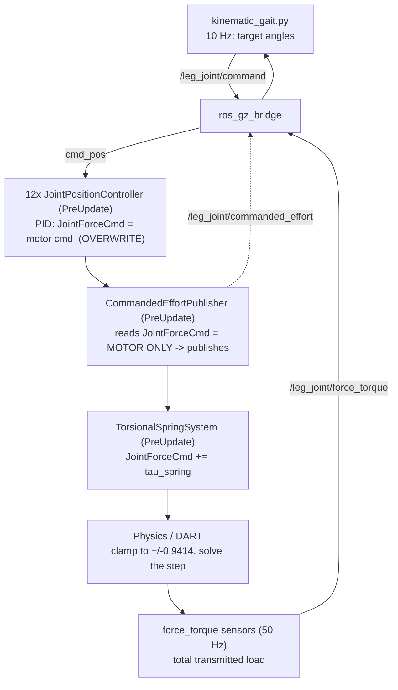

# Torsion Spring Integration for the T‑Quad `sim_robot` Simulation

**Goal:** take the parallel torsion‑spring (parallel elastic actuator) plugin in
`Code/plugin/`, make it **build and run**, integrate it into the `sim_robot`
Gazebo simulation driven by the kinematic gait, and set up the measurement so you
can **see whether the spring reduces joint torque**.

This document is written to be **read top‑to‑bottom by a beginner** (every term is
introduced before it's used) while still giving an **expert the exact mechanics**
(what component is written, in what order, by which system, and why). If you only
want to run it, jump to [§9 How to build and run](#9-how-to-build-and-run). If you
want to understand it, read [§4](#4-how-the-plugin-works-intuition-first-then-depth)
→ [§5](#5-how-the-plugin-gets-integrated-the-mechanics) →
[§8](#8-the-three-modes-in-depth-none-vs-native-vs-plugin).

Everything here has been **compiled and tested** on this machine (ROS 2 Humble +
Gazebo Harmonic / gz‑sim 8.14) — see [§11 Verification log](#11-verification-log).

---

## Table of contents

1. [TL;DR](#1-tldr)
2. [What a parallel torsion spring is](#2-what-a-parallel-torsion-spring-is)
3. [The original plugin](#3-the-original-plugin)
4. [How the plugin works — intuition first, then depth](#4-how-the-plugin-works-intuition-first-then-depth)
5. [How the plugin gets integrated — the mechanics](#5-how-the-plugin-gets-integrated-the-mechanics)
6. [What was broken, and every fix](#6-what-was-broken-and-every-fix)
7. [The `sim_robot` simulation](#7-the-sim_robot-simulation)
8. [The three modes in depth: none vs native vs plugin](#8-the-three-modes-in-depth-none-vs-native-vs-plugin) (#10-how-to-change-and-configure-the-models)
11. [Verification log](#11-verification-log)
12. [The measurement problem, experiment protocol, and tuning loop](#12-the-measurement-problem-experiment-protocol-and-tuning-loop)
13. [File manifest](#13-file-manifest)
14. [Caveats and limitations](#14-caveats-and-limitations)
15. [Changelog and how to revert](#15-changelog-and-how-to-revert)
16. [Camera recording — running with and without the camera](#16-camera-recording-timestamped-torqueoverlaid-video)

---

## 1. TL;DR

- The plugin in `Code/plugin/` was **correct code that could not build**: flat
  file layout vs. what its `CMakeLists.txt` expected, and a `package.xml` that
  depended on `gz_*_vendor` packages that **don't exist on ROS 2 Humble**. It was
  never compiled. I restructured it into a proper package
  (`ROS/src/gz_joint_torsional_spring/`), fixed the dependencies, and **it now
  builds, loads, and runs** on the full 12‑joint robot.
- The robot is driven by 12 gz **`JointPositionController`** plugins (not
  `gz_ros2_control`). Each **overwrites** the joint force command every step, so
  the spring must run **after** them. The integration guarantees that order.
- **The measurement subtlety that decides everything:** the `force_torque` sensor
  measures the **total** joint load (≈ gravity), which a *parallel* spring does
  **not** change. What a spring reduces is the **motor effort** (`JointForceCmd`).
  I added a `CommandedEffortPublisher` plugin + bridge + logging + a `compare_runs`
  tool so the reduction is actually measurable.
- **Three run modes**, selectable with one launch argument:
  `spring:=none` (baseline), `spring:=native` (linear passive spring, DART‑side),
  `spring:=plugin` (nonlinear FEA spring, via the plugin). [§8](#8-the-three-modes-in-depth-none-vs-native-vs-plugin)
  explains exactly how they differ.

---

## 2. What a parallel torsion spring is

A **torsion spring** is a spring that resists *twisting* (rotation) rather than
stretching. A **parallel torsion spring** is mounted at the *same* joint as the
motor, so its torque simply **adds** to the motor's:

```
τ_joint  = τ_motor + τ_spring
τ_spring = −k · (θ − θ₀)          (linear: k = stiffness, θ₀ = rest angle)
```

The word **parallel** is the key. Picture two people pushing a heavy door shut
side by side (parallel) — their forces add. That is a *parallel elastic actuator
(PEA)*. Contrast a *series* elastic actuator, where the spring sits **in line**
between motor and load (like a spring on the end of a rope you pull) — that needs
an extra joint in the model. A parallel spring adds **nothing** to the mechanical
structure; you only change what torque acts at an existing joint.

**Why it helps (the whole point).** If the spring is biased to push in the same
direction the motor fights gravity, the spring supplies *part* of the holding
torque for free. The motor then supplies *less*. For a legged robot holding a
stance, that is **passive gravity compensation**: less motor torque → less current
→ less heat → and, in this simulation, joints that stop slamming into their torque
limit.

**Project context.** This supports passive gravity compensation for a
sprawling‑type hexapod continuing as a quadruped after leg loss. The physical part
is a 3D‑printed ABS **spiral torsion spring** at a leg pitch joint. FEA showed its
stiffness is **nonlinear** — it roughly *doubles* (from ~50 to ~100 N·mm/rad) as
its coils close up near ~180°. A single linear `k` cannot represent that, which is
the entire reason the plugin added a nonlinear torque‑angle curve.

---

## 3. The original plugin

Repo: <https://github.com/aminsung/gazebo_joint_torsional_spring_plugin> (classic
Gazebo, ROS 1 / catkin, BSD‑3‑Clause, ~80 lines). The mechanism:

```cpp
class TorsionalSpringPlugin : public ModelPlugin {
  void Load(physics::ModelPtr m, sdf::ElementPtr sdf) {
    this->joint    = m->GetJoint(sdf->Get<std::string>("joint"));
    this->kx       = sdf->Get<double>("kx");
    this->setPoint = sdf->Get<double>("set_point");
  }
  void Init() {                       // register a per-step callback
    this->updateConnection = event::Events::ConnectWorldUpdateBegin(
      std::bind(&TorsionalSpringPlugin::OnUpdate, this));
  }
  void OnUpdate() {                   // every step:
    double angle = this->joint->GetAngle(0).Radian();
    this->joint->SetForce(0, this->kx * (this->setPoint - angle));   // Hooke's law
  }
};
GZ_REGISTER_MODEL_PLUGIN(TorsionalSpringPlugin)
```

Parameters: `kx` (N·m/rad), `set_point` (rad), `joint` (name). One joint per
plugin. Two facts about it drive the whole port:

1. It uses classic Gazebo's `ModelPlugin` API, which **does not exist** in modern
   Gazebo (gz‑sim).
2. Its `Joint::SetForce` **accumulated** into a per‑step buffer, so multiple
   callers summed. The modern equivalent does **not** — this is the bug a naïve
   port introduces (see [§4.7](#47-the--accumulation-and-why-its-the-whole-ballgame)).

---

## 4. How the plugin works — intuition first, then depth

### 4.1 The 30‑second intuition

Every simulation step, the plugin does three things: **look** at the joint's
current angle, **compute** a spring torque from that angle, and **add** that torque
to whatever the joint is already being told to do. That's it. The complexity is
entirely in *where it looks*, *where it writes*, and *when it runs* relative to the
motor controller — which is what the rest of this section explains.

If you have an Arduino background: think of the plugin as a `loop()` that runs once
per physics tick. It reads a "sensor" (the joint angle), runs `τ = k·(θ₀ − θ)`, and
writes to an "output" (the joint's force command). You never call it — the
simulator calls it for you, forever, once it's registered.

### 4.2 The mental model: entities, components, systems (the shared whiteboard)

Modern Gazebo is an **Entity‑Component‑System (ECS)**. Three words:

- **Entity** — a *thing*, represented by nothing more than an ID number. A link is
  an entity, a joint is an entity, a sensor is an entity.
- **Component** — a *piece of data stuck onto an entity*. The joint entity might
  carry a `JointPosition` component (its angle), a `JointVelocity` component (its
  speed), a `JointForceCmd` component (the torque someone wants applied to it).
- **System** — *code that runs every step and reads/writes components*. The
  physics engine is a system. The motor controller is a system. **Our plugin is a
  system.**

The **ECM (Entity‑Component‑Manager)** is the shared store holding all of this.
Picture a big **whiteboard**: every system walks up each step, reads the numbers it
cares about, and writes its own. Systems never call each other directly — they
communicate only by reading and writing on the whiteboard. The motor controller
writes "apply 0.9 N·m to the knee" on the board; later the physics system reads
that and applies it. Our spring plugin reads the knee's angle off the board and
adds its torque to that same "apply X N·m" note.

This matters because it explains **why order is everything** (§4.7, §5.2): if two
systems write the same note, whoever writes *last* wins unless they deliberately
*add* rather than *replace*.

### 4.3 The two moments in a plugin's life

A gz‑sim System plugin implements *interfaces* — promises to provide certain
methods that the framework will call:

```cpp
class TorsionalSpringSystem
  : public gz::sim::System,            // "I am a gz-sim plugin"
    public gz::sim::ISystemConfigure,  // "call my Configure() once, at load"
    public gz::sim::ISystemPreUpdate;  // "call my PreUpdate() every step, before physics"
```

- **`Configure()` runs once**, when the model loads. This is the setup: read the
  parameters out of the SDF, find the joint(s), make sure the data components exist.
- **`PreUpdate()` runs every step**, *before* the physics engine solves the step —
  which is exactly when you must have your torque ready, because physics is about
  to read it. (There are also `Update` and `PostUpdate` phases; the spring only
  needs `PreUpdate`.)

### 4.4 What `Configure()` does (the setup)

1. Wrap the model entity in a `gz::sim::Model` helper; bail out if the plugin was
   attached to something that isn't a model.
2. `sdf->Clone()` the configuration — the `sdf` handed in is read‑only (`const`),
   and walking through child elements needs a writable copy. (This is a real
   porting trap; see [§6.4](#64-the-classic-gazebo--gz-sim-porting-gotchas-the-port-already-handles-these).)
3. Read either **multiple `<spring>` blocks** (one per joint, the preferred
   layout) *or* the flat `<joint>/<kx>/<set_point>` layout (so an old ROS 1 block
   ports unchanged). For each: resolve the joint by name, read `kx`, `set_point`,
   optional `damping`, `max_torque`, and the optional nonlinear curve (validated:
   equal length, ≥2 points, strictly increasing angles).
4. **Create the `JointPosition` component** (and `JointVelocity` if damping is
   used). This is subtle and important: gz‑sim only *fills in* a joint's angle each
   step **if some system has asked for it**. If nothing creates the `JointPosition`
   component, the plugin's `PreUpdate` would find no angle to read and the spring
   would silently do nothing. Creating the component here is how you "subscribe" to
   having the angle populated.

### 4.5 What `PreUpdate()` does every step (with the force law)

```cpp
θ = JointPosition component[0];           // read the current angle off the whiteboard
ω = JointVelocity component[0];           // read the speed (only if damping is used)
τ = SpringTorque(cfg, θ, ω);              // compute the spring torque (below)
JointForceCmd[joint] += τ;                // ADD it to the joint's force note
```

The force law inside `SpringTorque`:

```cpp
if (nonlinear curve given)  τ = piecewise_linear_interp(curve_angles, curve_torques, θ);
else                        τ = kx * (set_point − θ);       // Hooke's law (linear)
if (damping != 0)           τ −= damping * ω;               // viscous term
if (max_torque ≥ 0)         τ = clamp(τ, −max_torque, +max_torque);   // saturate the SPRING
```

**Linear law, intuitively.** `τ = kx·(set_point − θ)` says: the further the joint
is from its rest angle `set_point`, the harder the spring pushes it back, and the
push is proportional to the distance (that's what a linear spring *is*). `kx` is
how stiff it is (N·m per radian of deflection).

**The nonlinear curve, intuitively.** A real spiral spring is only "linear" while
its coils are free to move. As it winds up, the coils start to touch and it gets
*much* stiffer — the torque shoots up faster than a straight line. You can't
capture "gets stiffer as it winds" with one number `kx`. So instead you give the
plugin a **table of measured (angle, torque) points** from FEA or a test rig, and
it **connects the dots with straight segments** (piecewise‑linear interpolation),
holding the end value if the joint goes past either end. Sample the curve densely
where it bends and the straight segments trace the real curve closely. When a curve
is present, it *replaces* the `kx`/`set_point` law entirely; `damping` and
`max_torque` still apply on top.

### 4.6 A worked numeric example

Linear knee spring: `kx = 0.5 N·m/rad`, `set_point = 1.15 rad`, no damping.
Joint currently at `θ = 0.65 rad` (its stance angle):

```
τ = kx · (set_point − θ) = 0.5 · (1.15 − 0.65) = 0.5 · 0.50 = +0.25 N·m
```

So the spring pushes the knee toward 1.15 rad with 0.25 N·m. If the motor was
having to supply ~0.25 N·m to hold the stance against gravity, the spring now
covers it and the motor can relax. As the knee moves to `θ = 1.15`, `τ → 0` (it's
at the rest angle); past it, the torque reverses sign (always restoring toward
`set_point`).

### 4.7 The `+=` accumulation, and why it's the whole ballgame

Look again at the last line of `PreUpdate`: `JointForceCmd[joint] += τ`. It **adds**
to whatever is already on the joint's force note. The naïve port would write
`JointForceCmd[joint] = τ` (replace). That single character is the difference
between a working plugin and a broken one.

**The sticky‑note analogy.** The joint's `JointForceCmd` is a sticky note that says
"apply this much torque." Each step, the **motor controller** writes the PID's
number on it ("apply −1.9 N·m"). If the spring plugin then **replaces** the note
with its own number ("apply +0.25 N·m"), the motor command is *gone* — the joint
now only feels the spring and the robot collapses. Or, depending on who writes
last, the spring's contribution is erased instead. Two systems replacing the same
note is a race, and the loser vanishes.

Because a *parallel* spring's entire purpose is that spring torque and motor torque
**sum**, the plugin must **read‑modify‑write**: take whatever number is on the note
and add its torque to it. Then the note reads "−1.9 + 0.25 = −1.65 N·m," which is
exactly `τ_motor + τ_spring`. (In classic Gazebo `SetForce` did this summation for
you; in gz‑sim `JointForceCmd` is a plain note you must add to yourself.)

This is *also* why **order matters**: the spring can only add to the motor's number
if the motor has already written it this step. That takes us to integration.

---

## 5. How the plugin gets integrated — the mechanics

### 5.1 How the compiled plugin is found and loaded

A gz‑sim plugin is a compiled shared library (`.so`) named in the SDF:

```xml
<plugin filename="gz_joint_torsional_spring"
        name="gz_joint_torsional_spring::TorsionalSpringSystem">
  ...
</plugin>
```

Two fields, both load‑bearing (and both different from classic Gazebo):

- **`filename`** = the **bare library name**, no `lib` prefix and no `.so` suffix.
  gz‑sim turns `gz_joint_torsional_spring` into `libgz_joint_torsional_spring.so`
  and searches for it on the environment variable **`GZ_SIM_SYSTEM_PLUGIN_PATH`**.
- **`name`** = the **fully‑qualified C++ class**, namespace included
  (`gz_joint_torsional_spring::TorsionalSpringSystem`). This is how gz‑sim picks
  the right class *inside* the `.so` (a library can hold several plugins — ours
  holds one spring plugin and one effort publisher).

**How the path gets set.** When you `colcon build` the package and
`source install/setup.bash`, an *environment hook* shipped in the package
(`hooks/gz_joint_torsional_spring.dsv.in`, one line:
`prepend-non-duplicate;GZ_SIM_SYSTEM_PLUGIN_PATH;lib`) prepends the install `lib/`
directory to `GZ_SIM_SYSTEM_PLUGIN_PATH`. So sourcing the workspace is all it takes
for gz‑sim to find the `.so`. (Verified: after sourcing, the path contains
`.../install/gz_joint_torsional_spring/lib`, which holds both `.so` files.)

### 5.2 Plugin load order = execution order

gz‑sim runs each interface phase **across all systems in the order the plugins were
loaded**, which is the order their `<plugin>` tags appear. So during the
`PreUpdate` phase of one step:

```
system #1.PreUpdate()  →  system #2.PreUpdate()  →  system #3.PreUpdate()  →  ...
```

On this robot the model lists **12 `JointPositionController` plugins first**. Each,
in its `PreUpdate`, computes the PID torque and **writes** it to `JointForceCmd`
(overwrite). Therefore, for the spring's `+=` to land on top of the motor command
rather than being erased, the spring plugin **must appear after** the controllers.
The model generator emits the plugins in this exact order:

```
JointPositionController × 12   →   CommandedEffortPublisher   →   TorsionalSpringSystem
      (writes motor cmd)               (reads motor-only cmd)          (adds spring)
```

The `CommandedEffortPublisher` (the measurement plugin, §12) sits **between** them
on purpose: it reads `JointForceCmd` *after* the controllers wrote it but *before*
the spring adds, so it always captures the **motor‑only** effort. Get this order
wrong and either the spring is clobbered or the "motor effort" you log secretly
includes the spring.

### 5.3 The full per‑step pipeline on the real robot



Read it as one heartbeat of the simulation: the gait names a target, the bridge
hands it to the controllers, the controllers decide a motor torque, the effort
publisher snapshots that motor torque, the spring adds its help, physics clamps and
applies the sum, and the sensors report the result back. Everything downstream of
"controllers" happens **inside one 1 ms physics step**.

---

## 6. What was broken, and every fix

The plugin's **C++ logic was correct** for gz‑sim 8. The problems were all
**packaging** and **integration**.

### 6.1 Build blocker — flat layout vs. what CMake expected

`CMakeLists.txt` referenced `src/…cc`, `include/`, and `hooks/…dsv.in`, and the
`.cc` did `#include "gz_joint_torsional_spring/torsional_spring_system.hh"`. But in
`Code/plugin/` every file sat flat in one folder, so `colcon build` failed
immediately ("cannot find `src/torsional_spring_system.cc`"). **Fix:** a proper
ament tree:

```
ROS/src/gz_joint_torsional_spring/
├── CMakeLists.txt        package.xml        README.md
├── hooks/gz_joint_torsional_spring.dsv.in
├── include/gz_joint_torsional_spring/
│   ├── torsional_spring_system.hh
│   └── commanded_effort_publisher.hh        (new — §12)
├── src/
│   ├── torsional_spring_system.cc           (logic unchanged from Code/plugin/)
│   └── commanded_effort_publisher.cc        (new — §12)
└── examples/urdf_snippet.xacro
```

### 6.2 Build blocker — `package.xml` vendor deps don't exist on Humble

The original depended on `gz_sim_vendor`, `gz_plugin_vendor`, `gz_common_vendor`,
`sdformat_vendor` — a **ROS 2 Jazzy+** mechanism, **absent on Humble**, so
dependency resolution failed. But the real Gazebo libraries **are** installed from
apt (the `gz-harmonic` metapackage), and CMake finds them directly. **Fix:** dropped
the vendor deps (documented in the new `package.xml`); don't run `rosdep` for this
package — just `colcon build`.

### 6.3 Build blocker — not in a colcon workspace

`Code/plugin/` was a loose folder. **Fix:** the package now lives under
`ROS/src/` (the canonical workspace is `Code/ROS/`).

### 6.4 The classic‑Gazebo → gz‑sim porting gotchas (the port already handles these)

| Classic Gazebo | gz‑sim |
|---|---|
| `filename="libfoo.so"` | `filename="foo"` — bare name |
| `name` = arbitrary label | `name` = fully‑qualified C++ class |
| `ModelPlugin` + `GZ_REGISTER_MODEL_PLUGIN` | `System` + `GZ_ADD_PLUGIN` |
| `SetForce` accumulates | `JointForceCmd` is a plain component → `+=` yourself |
| `sdf` writable | `sdf` is `const` → `Clone()` first |
| plugin found automatically | `.so` must be on `GZ_SIM_SYSTEM_PLUGIN_PATH` |

### 6.5 Result

Both plugins build, register (the `GzPluginHook` symbol is present in each `.so`),
install, and load — a headless gz‑sim run calls `Configure`/`PreUpdate` on the full
12‑joint robot with no errors (§11).

---

## 7. The `sim_robot` simulation

### 7.1 The robot

`THex_Quadruped`: 12 revolute joints — 4 legs `{fr, br, bl, fl}` × 3 types
`{hip, knee, foot}`. Each joint has an **effort (torque) limit of 0.9414 N·m**, a
`force_torque` sensor at 50 Hz, and — already present — **native spring hooks**
(`<spring_stiffness>0</spring_stiffness>`, `<spring_reference>0</spring_reference>`,
disabled by the zeros). The legs are **mirrored**: right knees sit near +40°, left
near −40°, so spring set‑points are per‑joint.

### 7.2 The controllers — not `gz_ros2_control`

The model carries **12 `JointPositionController`** plugins (PID p=5, i=0.1, d=0.1,
force mode) and 12 `JointStatePublisher` plugins. Each controller **overwrites**
`JointForceCmd` every step (`*forceComp = JointForceCmd({pid})`), which is exactly
why plugin order matters (§5.2).

### 7.3 The gait

`kinematic_gait.py` (a ROS 2 node, `use_sim_time=True`) computes a per‑leg foot
trajectory by inverse kinematics and, at **10 Hz**, publishes target angles to
`/{leg}_{joint}/command` → bridged to the controllers' `cmd_pos` topics. It homes
and settles the robot, samples the 12 FT sensors at **50 Hz**, and auto‑stops after
**5 gait cycles**, writing `experiment/runN/`.

### 7.4 Environment

ROS 2 **Humble** + Gazebo **Harmonic** (gz‑sim 8.14, gz‑plugin2, gz‑transport13,
gz‑msgs10). Physics = **DART** (default), which **honors native `spring_stiffness`**
— proven in §11. Real‑time factor is only ~0.1× (12 PID joints + 12 FT sensors +
IMU), so **experiments take real minutes**; the gait is paced off `/clock`.

---

## 8. The three modes in depth: none vs native vs plugin

This is the heart of the integration. **The same robot runs three ways**, selected
by one launch argument (`spring:=none|native|plugin`). They differ in **where the
spring torque enters the physics** — and that one difference cascades into how you
measure, tune, and interpret them. Read this section slowly; the payoff is that the
rest of the project makes sense.

First, the shared picture. Every joint's motion is decided by the physics engine
from the sum of everything acting on it:

```
what the joint feels  =  motor command (JointForceCmd, clamped to ±0.9414)
                       +  gravity / inertia / contact
                       +  any passive joint force (native spring, damping)
```

The three modes each put the spring in a **different one of those buckets**.

---

### 8.1 Mode `none` — the baseline (no spring)

**Intuition.** The plain robot. The motor does all the work of holding the legs up.
This is your control group — the "before" picture you compare everything against.

**What's in the SDF.** Nothing spring‑related. (The measurement model
`model_effort.sdf` adds only the effort publisher, which changes no physics.)

**Force path each step.**

```
JointPositionController → JointForceCmd = τ_motor(PID)
Physics/DART           → applies clamp(τ_motor, ±0.9414) + gravity/contact
```

`JointForceCmd` holds the **pure motor demand**. Because the motor must hold the
whole gravity load, that demand is large — often **beyond** the ±0.9414 N·m limit,
so the joint *saturates* (its position lags the command). Measured example from a
live run: `fr_knee` motor demand ≈ **−1.90 N·m** (past the limit → saturating).

**What you observe.** High motor effort; joints hitting the torque ceiling; the
`force_torque` sensor reads the full gravity load.

**Use it for.** The baseline run every comparison needs.

---

### 8.2 Mode `native` — linear passive spring, applied by DART

**Intuition.** You bolt a real spring into the joint. It's *passive* — no code
computes its torque each step; the physics engine itself knows the joint has a
spring and includes it in the dynamics, exactly like it already includes gravity
and joint damping. Simplest, cleanest, and — because the engine treats it as a
genuine mechanical spring — the most physically honest option for a *linear* spring.

**What's in the SDF.** Two numbers inside each joint's existing `<dynamics>` block
(no plugin, no build):

```xml
<joint name="fr_knee_joint" type="revolute">
  <axis>
    <dynamics>
      <damping>0.01</damping>
      <friction>0.005</friction>
      <spring_reference>1.1490</spring_reference>   <!-- rest angle θ₀ (rad) -->
      <spring_stiffness>0.5000</spring_stiffness>    <!-- k (N·m/rad) -->
    </dynamics>
  </axis>
  ...
</joint>
```

**Force path each step.** The spring lives in a **different bucket** from the motor:

```
JointPositionController → JointForceCmd = τ_motor(PID)        ← motor command bucket
DART (internally)       → τ_spring = −k(θ − θ₀)               ← passive-force bucket
Physics/DART            → applies clamp(τ_motor, ±0.9414) + τ_spring + gravity/contact
```

Because DART reads `spring_stiffness`/`spring_reference` and adds the spring force
**itself** during the solve, **`JointForceCmd` stays motor‑only**. This has two big
consequences:

1. **Measurement is trivially clean.** The motor effort you log (`JointForceCmd`)
   already excludes the spring, so any drop is real motor‑torque reduction. No
   ordering tricks.
2. **The spring is not capped by the motor's effort limit.** The ±0.9414 clamp
   applies to the *command* bucket (the PID output); the native spring is in the
   *passive‑force* bucket and rides on top. Physically correct: a real bolted‑in
   spring doesn't consume the motor's torque budget.

**Empirical proof it actually works (this build).** A single‑joint pendulum (arm
mass 0.5 kg, 0.3 m out → 1.47 N·m of gravity torque at horizontal), spring
reference 0, no motor at all:

| `spring_stiffness` | joint settles at | theory `k·θ = 1.47·cosθ` |
|---|---|---|
| 0 (off) | 1.571 rad (hangs at 90°) | −π/2 ✓ |
| 8 | **0.181 rad** | ~0.18 ✓ |
| 20 | **0.073 rad** | ~0.073 ✓ |

DART holds the joint near the spring reference, and a stiffer spring holds it
closer — exactly Hooke's law. This confirms the native path is honored here.

**Limitation.** **Linear only.** `spring_stiffness` is a single number; it cannot
represent the spiral spring's stiffening. For that, use the plugin.

**Use it for.** A fast, clean, physically‑honest **linear** demonstration and the
cleanest torque‑reduction measurement.

---

### 8.3 Mode `plugin` — nonlinear spring, applied via `JointForceCmd`

**Intuition.** Now *you* compute the spring torque in software each step and inject
it as an extra force command. Because you're running code, you can make the
spring's torque follow **any curve you want** — in particular the real spiral
spring's *nonlinear* stiffening measured by FEA. This is the faithful model of the
actual 3D‑printed part.

**What's in the SDF.** A `<plugin>` block (placed last, after the effort publisher),
with one `<spring>` per joint carrying the FEA‑shaped curve:

```xml
<plugin filename="gz_joint_torsional_spring"
        name="gz_joint_torsional_spring::TorsionalSpringSystem">
  <spring>
    <joint>fr_knee_joint</joint>
    <curve_angles> ... 1.049 1.149 1.249 ... </curve_angles>   <!-- θ samples (rad) -->
    <curve_torques>... 0.005 0.000 -0.005 ...</curve_torques>  <!-- τ at each θ (N·m) -->
    <damping>0.020</damping>
  </spring>
  <!-- ×12 joints -->
</plugin>
```

(A linear plugin spring is also possible — just use `<kx>`/`<set_point>` instead of
the curve. The generator uses the curve because the nonlinearity is the plugin's
reason to exist.)

**Force path each step.** The spring goes into the **same bucket** as the motor:

```
JointPositionController → JointForceCmd = τ_motor(PID)
CommandedEffortPublisher→ reads JointForceCmd (= motor only) → publishes    [measurement tap]
TorsionalSpringSystem   → JointForceCmd += τ_spring(θ)     ← same bucket as motor
Physics/DART            → applies clamp(τ_motor + τ_spring, ±0.9414) + gravity/contact
```

Two consequences, the mirror image of native:

1. **Motor effort must be tapped *before* the spring adds.** After the `+=`,
   `JointForceCmd` = motor + spring, so a naïve reading would hide the reduction.
   The effort publisher is deliberately ordered between the controller and the
   spring to read motor‑only (§5.2).
2. **The spring shares the motor's effort‑limit budget.** The ±0.9414 clamp is
   applied to the *sum* `τ_motor + τ_spring`, because both live in `JointForceCmd`.
   So unlike native, a plugin spring's torque counts against the same cap as the
   motor. (You can bound the spring separately with `<max_torque>`, but the joint's
   `<effort>` limit still clamps the combined command.)

**Strengths.** Nonlinear (any measured curve); engine‑independent (it commands
force explicitly rather than relying on the engine's own spring implementation);
plus optional `damping` and `max_torque` saturation.

**Use it for.** Modelling the **real nonlinear FEA spring** faithfully.

---

### 8.4 Side‑by‑side comparison

| Dimension | `none` (baseline) | `native` | `plugin` |
|---|---|---|---|
| Spring torque computed by | — | DART (engine) | our C++ each step |
| Torque law | — | linear only | linear **or** nonlinear curve |
| Where it's applied (bucket) | — | passive joint force | `JointForceCmd` (with motor) |
| `JointForceCmd` contains | motor only | **motor only** | **motor + spring** |
| Capped by joint `<effort>` limit? | motor: yes | spring: **no** (separate) | spring: **yes** (shares cap) |
| Build needed? | no | **no** (SDF edit only) | yes (compile the plugin) |
| Plugin ordering sensitivity | — | none | **must run after controllers** |
| Engine dependence | — | needs DART‑style joint springs | engine‑independent |
| Measuring reduction | baseline reference | **cleanest** (motor‑only cmd) | needs pre‑spring tap (provided) |
| Config location | — | each joint's `<dynamics>` | one `<plugin>` block |
| Models the real FEA spring? | — | no (linear) | **yes** (nonlinear) |

### 8.5 Which to use when

- **Prove the concept / get a clean reduction number →** `native`. Zero build,
  motor‑only `JointForceCmd`, physically honest, spring not capped by the motor
  limit.
- **Model the real 3D‑printed nonlinear spring →** `plugin`. It's the only mode
  that captures the stiffening the FEA characterised.
- **Always run `none` too** — it's the "before" you subtract to see any effect.

A good workflow: get a believable reduction with `native` first (few moving parts),
then switch to `plugin` to see how the *real* (weaker, nonlinear) spring compares.

### 8.6 The FEA torque–angle curve, in detail

The nonlinear `plugin` mode is only as good as the curve you feed it. That curve is
the spring's **torque–angle characteristic**, and for this project it comes from
**FEA (Finite Element Analysis)** of the 3D‑printed spiral spring. Here is exactly
what it is, why it bends, and how it becomes `curve_angles`/`curve_torques`.

**What FEA is (one line).** Finite Element Analysis chops a part into thousands of
small "elements," then solves the equations of elasticity across all of them to
predict how the part deforms and what internal forces it carries under load. It is
a virtual version of putting the spring on a test rig.

**What "the FEA curve" is here.** It is a graph of **reaction torque (τ) vs.
angular deflection (θ)** for the spring: you (virtually) grab one end, hold the
other fixed, wind it up by an angle θ, and record the torque it pushes back with.
Do that across a range of angles and you get a curve `τ(θ)`. That single graph *is*
the mechanical definition of the spring — its stiffness, the energy it stores, and
the gravity torque it can offset are all read off it.

**The axes and units.**
- **x‑axis:** angular deflection θ — how far the spring is wound from its free
  (unloaded) shape. FEA usually reports **degrees**; the plugin wants **radians**
  (÷ 57.3).
- **y‑axis:** reaction/restoring torque τ. FEA of a small printed spring usually
  reports **N·mm**; the plugin wants **N·m** (÷ 1000).
- **Sign:** the torque is *restoring* — it opposes the winding, always trying to
  return the spring toward its free shape.

**Why it is nonlinear (the whole reason the curve exists).** A flat spiral spring
behaves in two regimes:

```
 τ │                                   ,-'   ← STIFFENING region:
   │                               ,-''         coils touch, the active length
   │                          ,-''              shortens, slope (stiffness) rises
   │                     ,-''
   │               ,-''
   │          ,-''   ← LINEAR region: coils free,
   │     ,-''          τ ≈ k·θ  (constant slope k)
   │ ,-''
   └────────────────────────────────────────── θ
   0                    coil contact begins
```

- **Linear region (small θ):** the coils are free to move and the spring obeys
  Hooke's law `τ ≈ k·θ` — a straight line whose slope is the stiffness `k` (the
  design target, ~50 N·mm/rad here).
- **Stiffening region (large θ):** as it winds further, neighbouring coils start to
  **touch**. Contact shortens the spring's effective active length, which raises
  its stiffness, so the curve **bends upward**. The project's FEA showed the
  stiffness roughly **doubling** (to ~100 N·mm/rad) by ~180°. Large‑deflection
  geometry and ABS's own (non‑steel, mildly nonlinear) behaviour add to this.

A single `kx` is just *one slope* — the straight line — so it is correct only in
the linear region and increasingly wrong once the coils engage. The whole point of
the curve is to trace the bend.

**Stiffness is the slope.** `k(θ) = dτ/dθ`. Constant in the linear region, climbing
in the stiffening region. "The stiffness doubled at 180°" means the curve's slope
there is twice its slope near 0.

**How the FEA curve becomes `curve_angles` / `curve_torques`.** The plugin stores
the curve as two aligned lists and interpolates piecewise‑linearly between the
points (clamping past either end). To convert a raw FEA export:

1. **Sample** the FEA curve — *densely where it bends* (around coil contact),
   sparsely where it's straight. The straight segments between your points must
   track the real curve, so put points where the curvature is.
2. **Convert units:** degrees → radians, N·mm → N·m.
3. **Place it in the joint's coordinate.** FEA angle is measured from the spring's
   *free* shape; the plugin evaluates torque as a function of the *joint's* absolute
   angle θ. Shift by the rest angle θ₀ (the joint angle where the spring is
   unloaded): `curve_angle = θ₀ + deflection`.
4. **Set the sign** so it restores toward θ₀: torque **positive below** θ₀ and
   **negative above** it — `τ = −sign(θ − θ₀) · τ_FEA(|θ − θ₀|)`.
5. `curve_angles` must be **strictly increasing**; `curve_torques[i]` pairs with
   `curve_angles[i]`.

**Worked mini‑example.** Say FEA gives (deflection → torque): 0°→0, 30°→1.6 N·mm,
60°→3.4, 90°→5.4 (note the gaps grow — 1.6, 1.8, 2.0 — that *is* the stiffening).
For a joint whose unloaded rest angle is θ₀ = 0, restoring, in SI units:

```
curve_angles  (rad): -1.571 -1.047 -0.524  0.000  0.524  1.047  1.571
curve_torques (N·m): +0.0054 +0.0034 +0.0016 0.000 -0.0016 -0.0034 -0.0054
```

Feed those two lines into a `<spring>` block and the plugin reproduces the measured
spring. In practice the generator (`make_spring_models.py`, §10.5) builds these
lists from a shape formula centred on each joint's rest angle — swap in your real
FEA points there.

**Reality check for this robot.** Even at 90° the real spring is only ~0.005 N·m —
*small* next to the ~0.3 N·m mean knee load. That is why `native` mode uses a
deliberately *stronger* idealised spring to show a clear reduction, while `plugin`
mode shows the *faithful* (weaker, nonlinear) FEA spring. Both are useful; they
answer different questions (§8.5, §14).

### 8.7 Modeling *your* real spring: every parameter, and why

The FEA curve (§8.6) tells the sim *how stiff* your spring is. But a curve on its
own is like knowing a door's hinge resistance without knowing which way the door
opens or where "closed" is — you can't place it until you know how it's **mounted**.
This section lists **every** number you need to turn a real, physical spring into a
faithful sim spring: what each one means, why it matters, and how to measure it.

Think of the parameters in two groups: **"how hard it pushes"** (the stiffness) and
**"how it's installed"** (everything else). The stiffness comes from FEA or a bench
test; the installation numbers come from your CAD assembly and how you actually
mount the spring.

**Parameter 1 — Which joint(s) the spring sits on.**
- *What it is:* the name of the revolute joint the spring acts across (e.g.
  `fr_knee_joint`), one `<spring>` block per physical spring.
- *Why it matters:* a parallel spring only affects the one joint it's bolted
  across. Four springs (one per knee) → four blocks.
- *How to get it:* your mechanical design — which joints you're actually fitting a
  spring to.
- *Where it goes:* `<joint>fr_knee_joint</joint>`.

**Parameter 2 — The stiffness: `k`, or the full curve.**
- *What it is:* how much torque the spring produces per radian it's wound. Either a
  single number `k` (a straight‑line spring) or the sampled `curve_angles`/
  `curve_torques` (a real, stiffening spring).
- *Why it matters:* this is the spring's whole reason for existing — too soft and it
  does nothing, too stiff and it throws the robot. It sets how much motor torque you
  offload.
- *How to get it:* `k` is the **slope of the torque–angle curve**, `k = Δτ / Δθ`
  (N·m/rad). Read two points off the FEA curve over your joint's operating range and
  divide, or bench‑test it (hang a known mass `m` on a lever arm `r` → torque
  `m·g·r`, measure the angle, slope = `k`). For the real nonlinear spring, skip the
  single `k` and feed the whole curve (§8.6). Design target here: ~0.05 N·m/rad,
  stiffening to ~0.1.
- *Where it goes:* `<kx>0.05</kx>` (linear) **or** `<curve_angles>…</curve_angles>`
  `<curve_torques>…</curve_torques>` (nonlinear).

**Parameter 3 — The rest angle `θ₀` (the one people forget).**
- *What it is:* the joint angle at which the spring produces **zero** torque — its
  relaxed, unloaded position, expressed in the *joint's own* coordinate.
- *Why it matters:* this is the single most important installation number. The curve
  gives "torque per unit deflection *from the spring's free shape*"; `θ₀` says *where
  that free shape sits on the joint*. It decides two things at once: (a) whether, at
  the leg's stance pose, the spring is barely wound (soft) or heavily wound (stiff),
  and (b) whether the spring pushes **with** gravity (helps → motor relaxes) or
  **against** it (fights → motor works harder). Get `θ₀` wrong and a perfectly good
  spring can *increase* your motor torque.
- *Analogy:* the curve is the strength of a rubber band; `θ₀` is where you tie its
  far end. Same band, tied in a different place, either helps you or fights you.
- *How to get it:* at assembly, note the joint angle where the spring is relaxed (no
  wind‑up). If you install it already wound, note that too (Parameter 4).
- *Where it goes:* `<set_point>1.15</set_point>` (plugin) or
  `<spring_reference>1.15</spring_reference>` (native); for the curve, it's the angle
  the curve is centered on.

**Parameter 4 — The installation pre‑load (if it's pre‑wound).**
- *What it is:* how far the spring is *already* wound when you bolt it in at the
  neutral leg pose — equivalently, the torque it already exerts there.
- *Why it matters:* most gravity‑compensation springs are installed pre‑tensioned so
  they push from the very first degree. Pre‑load simply **shifts `θ₀`**: a spring
  pre‑wound by 0.3 rad has its zero‑torque point 0.3 rad from the neutral pose.
- *How to get it:* measure the wind‑up at assembly, or measure "at the neutral pose
  the spring pushes with X N·m" — that plus `k` gives the shift (`shift = X / k`).
- *Where it goes:* folded into `θ₀` (Parameter 3). In the generator this is the
  `OFFSET` knob.

**Parameter 5 — The assist direction (the sign).**
- *What it is:* which way the spring winds — which direction of joint rotation it
  pushes back on.
- *Why it matters:* a spring pushing the wrong way *adds* to the motor's load. The
  sign must line up so the spring pushes the leg toward holding the body up.
- *How to get it:* from your mounting (which way you wind it). Verify it in the sim:
  run a baseline, look at the **sign** of the measured motor effort at that joint,
  and point the spring the same way (§12.4). If `compare_runs` shows a *negative*
  reduction on a joint, the sign is backwards — flip it.
- *Where it goes:* the sign of the offset / the sign of the curve torques.

**Parameter 6 — Damping (optional, for ABS realism).**
- *What it is:* the spring's internal energy loss — it doesn't return *quite* all the
  energy you put in, and printed ABS (a viscoelastic plastic) loses more than steel.
- *Why it matters:* it damps oscillation and models hysteresis. Small, but it stops
  an ideal spring from ringing forever. Often safe to leave near zero.
- *How to get it:* from a release test (wind it, let go, watch how fast the
  oscillation dies), or just use a small 0.01–0.05 N·m·s/rad.
- *Where it goes:* `<damping>0.02</damping>`.

**Parameter 7 — Torque / travel limit (optional).**
- *What it is:* the point where the spring physically can't wind further (coils fully
  closed / bottomed out) or would yield.
- *Why it matters:* stops the sim from extrapolating a fantasy torque past the
  spring's real range.
- *How to get it:* the spring's max deflection before it binds solid or plastically
  deforms.
- *Where it goes:* `<max_torque>…</max_torque>` (plugin), or it's implied by the end
  points of your curve (values are clamped past the ends).

**What you do NOT need (already inside the curve).** You don't re‑enter the spring's
**material modulus, coil thickness/width, number of turns, or spiral geometry** —
those produced the FEA curve and don't appear again. You also don't need the
spring's **mass/inertia**: it's a parallel element mounted at the joint, so it adds
nothing to the kinematic tree (a few grams vs the 35–150 g links — negligible; add
it to the neighbouring link's inertial only if you want to be exhaustive).

**Putting it together — one fully‑specified spring.** Nonlinear (real FEA spring):

```xml
<spring>
  <joint>fr_knee_joint</joint>                              <!-- P1: which joint -->
  <curve_angles> ... 1.049 1.149 1.249 ... </curve_angles>  <!-- P2: stiffness (curve) -->
  <curve_torques>... 0.005 0.000 -0.005 ...</curve_torques> <!--     centered on θ₀ -->
  <!-- P3+P4: θ₀ (incl. pre-load) = the angle the curve is centered on = 1.149 rad -->
  <!-- P5: assist direction = the sign of the curve torques -->
  <damping>0.02</damping>                                   <!-- P6: optional -->
  <max_torque>0.15</max_torque>                             <!-- P7: optional -->
</spring>
```

Linear (single stiffness) — the same information, compressed:

```xml
<spring>
  <joint>fr_knee_joint</joint>
  <kx>0.05</kx>               <!-- P2: stiffness (slope) -->
  <set_point>1.15</set_point> <!-- P3+P4+P5: rest angle θ₀, offset & signed to assist -->
  <damping>0.02</damping>     <!-- P6 -->
</spring>
```

So for each real spring you supply exactly: **its joint, its stiffness (`k` or
curve), its rest angle `θ₀` (including any pre‑load), and the assist direction** —
plus optional damping and a limit. The FEA curve covers the stiffness; everything
else comes from how you mount it.

### 8.8 Spring parameters: the reference paper, and sizing for THIS robot

Where do the actual numbers come from? Two sources, and the difference between
them matters.

**The reference paper.** Belov et al., *"Optimizing energy consumption for legged
robot by adapting equilibrium position and stiffness of a parallel torsion
spring"* (arXiv:2411.18295, 2024) do exactly this task — a **linear** parallel
torsion spring at the knee — and, notably, with the **same `aminsung` plugin this
package ports** (their ref [15]). Their spring‑torque model is `τ = μ(α − α₀)`,
where **μ = stiffness** (→ our `kx`/`spring_stiffness`) and **α₀ = equilibrium
angle** (→ our `set_point`/`spring_reference`). Their closed‑form optimum (Eq. 4)
is just a least‑squares fit of the actuator torque `τ` against the joint angle
`α`: the slope is `μ*`, the x‑intercept is `α₀*`. Their baseline optimum
(Table I, m=4.1 kg): **μ\* = 8.54 N·m/rad, α₀\* = −2.23 rad** (across their load
cases μ\* spans 6.07–17.1, α₀\* spans −1.4 to −2.84).

**Why the paper's numbers do NOT transfer to our robot.** Their test rig is a
**4–8 kg single leg** on a vertical stand; ours is a **~1.4 kg** quadruped with a
**0.94 N·m** joint limit. Two problems:
- **Scale:** μ = 8.54 N·m/rad is ~30–40× too stiff here. At any real deflection it
  commands torques of *tens* of N·m — the native (un‑clamped) spring would fling
  the robot.
- **Frame:** α₀ = −2.23 rad is measured in *their* knee's coordinate frame and
  sits far outside our joints' ±0.79/±1.57 range, so it isn't physically
  meaningful for our joints.

They're provided in the generator as `SPRING_MODE = "paper"` for reference/
comparison only.

**Sizing for THIS robot (the recommended `SPRING_MODE = "robot"`).** We applied
the paper's *method* to *our* data. Fitting τ‑vs‑α on our measured baseline (run2)
per the paper's Eq. 4 gave **unstable** results — because our data is a *dynamic
walking gait* (swing/stance/contact), not the paper's slow quasi‑static vertical
motion, so τ‑vs‑α isn't cleanly linear and the least‑squares α₀ diverges when the
slope → 0. But one robust signal survived: the **knee's mean signed motor torque
is ≈ 0.18 N·m, cleanly mirror‑symmetric** (right knees −0.18, left +0.18), while
hips and feet average ≈ 0. That 0.18 N·m *is* the gravity‑hold torque a spring
should cancel — and it's why the paper (and general PEA design guidance) springs
the **knee**: a parallel spring is sized to the **static stance torque** and does
its work during stance.

So the robot‑sized spring is one **uniform** design on all 12 actuators:

| parameter | value | reason |
|---|---|---|
| stiffness `kx` (all joints) | **0.20 N·m/rad** | matches the knee's natural τ‑slope; low enough to stay near‑constant over the gait and not fight it |
| rest offset | **0.90 rad** from each joint's stance | `0.20 × 0.90 ≈ 0.18 N·m` → cancels the knee gravity‑hold torque |
| rest angle `α₀` (per joint) | `stance ± 0.90`, mirror‑signed, clamped to the joint limit | uses **our** stance angles; same spring, mirror‑mounted left/right |

Clamping to the joint limit means the **knee** (the joint that needs it) gets the
full ~0.18 N·m while hips/feet (which have ~0 DC load) get appropriately less —
a happy consequence of one uniform spring. *Verified headless:* the robot **stands
stably** with this spring, and its body sits ~5 mm **higher** than the no‑spring
baseline (0.039 vs 0.033 m base height) — the spring is holding part of the weight,
exactly as intended, with no instability.

**Same spring on all legs.** `kx` is identical on every joint; `α₀` has the same
magnitude with a mirror sign for left vs right legs (because the legs are
mirrored, that *is* the same physical spring, mounted mirror‑imaged). This is set
by `SPRING_MODE`/`ROBOT_KX`/`ROBOT_OFFSET` at the top of `make_spring_models.py`
(§10.3) — change those, regenerate, rebuild.

Design guidance corroborating the "size to the stance/gravity torque, engage in
stance" approach: the clutched‑PEA concept
([Plooij et al.](https://www.researchgate.net/publication/257372325_A_clutched_parallel_elastic_actuator_concept_Towards_energy_efficient_powered_legs_in_prosthetics_and_robotics)),
partial‑gravity‑compensation series‑parallel EAs
([Mathijssen et al.](https://link.springer.com/chapter/10.1007/978-3-030-95750-6_4)),
and Belov et al. ([arXiv:2411.18295](https://arxiv.org/html/2411.18295v1)).

### 8.9 What changed from the last run, and is the spring linear?

**Is the spring linear or "the torsion spring"?** Both — they describe different
things. It is **still a torsion spring** (the physical type: it resists *rotation*
about the joint). In the current default `SPRING_MODE = "robot"` it is a **linear**
torsion spring — constant stiffness, `τ = kx·(α₀ − θ)` with `kx = 0.20 N·m/rad` —
used by *both* the native and plugin variants. "Torsion" = what kind of spring;
"linear vs nonlinear" = the shape of its torque–angle law. The **nonlinear**
torsion spring (the FEA stiffening curve, §8.6) is still available via
`SPRING_MODE = "fea"`.

**What changed from the last run (`run2`, `spring:=none`).** `run2` was a
*baseline* with no spring. The next run adds the robot‑sized **linear** torsion
spring above (kx = 0.20 on all 12 joints, rest angle = each joint's stance ± 0.90
rad, mirror‑mounted). Everything else — home‑pose spawn, z = 0.08, effort logging,
clipped‑effort plot — is unchanged from `run2`.

**Empirical result so far (passive load test, no gait).** Spawning the robot and
letting the controllers hold the home pose:

| | no spring (`model_effort`) | robot spring (`model_spring_native`) |
|---|---|---|
| base height, settled | ~0.033 m | **~0.039 m** |
| stable over 4→10 s? | yes | **yes (no fling / no collapse)** |

The body sits **~5 mm higher** with the spring — it is passively holding part of
the weight (the intended gravity‑compensation effect), and the ~0.20 N·m spring
does **not** destabilise the robot (unlike the paper's 8.54 N·m/rad would). This
is only a *static* check. The actual **motor‑torque reduction during walking, and
the assist sign**, still need a gait run: record `spring:=none` and
`spring:=native`, then `compare_runs` (§9.3, §12.3). If any joint's applied‑effort
reduction comes out **negative**, the spring is fighting gravity there — flip the
sign of `ROBOT_OFFSET` for that leg side and regenerate.

### 8.9 Native vs. plugin for a LINEAR spring: both are parallel — do they match?

A common question: *I want a parallel spring acting alongside the actuator — are
both the native (Gazebo/DART) spring and the plugin actually parallel, and do they
give the same result for a linear spring?*

**Both are genuine parallel elastic actuators.** "Parallel" means the spring and the
motor act on the **same joint** and their torques **add**, with nothing inserted
into the mechanical chain (no extra link, no series compliance). Both methods
realize exactly that, at the same joint angle θ:

```
τ_joint  = τ_motor + τ_spring          (spring acts in parallel with the motor)
τ_spring = −k · (θ − θ₀)               (identical linear law in both methods)
```

They differ **only in how `τ_spring` is delivered into that sum**:

- **Native:** DART adds `τ_spring` as a *passive joint force* while it solves the
  step — in parallel with the commanded actuator force, exactly like a built‑in
  mechanical spring. It never touches `JointForceCmd`.
- **Plugin:** our code adds `τ_spring` into the same `JointForceCmd` the controller
  just wrote (`+=`), and the engine applies the sum.

Either way the joint receives `τ_motor + τ_spring`. So **yes — both are parallel**,
and for the same `k`/`θ₀` they produce the **same spring torque**.

**Is the end result the same?** For a linear spring, **yes in the normal operating
regime, with one exception at the actuator's torque limit:**

- **Away from saturation** (motor within its ±0.9414 N·m limit): the two are
  **equivalent** — same spring torque, same motor‑effort reduction, same motion.
  Pick either; native is simply less machinery.
- **At/near saturation** (motor maxed out): they **diverge**, because of *what the
  ±0.9414 limit clamps*:
  - **Native** clamps only the *motor command*; the passive spring adds on top, so
    the joint can receive `clamp(τ_motor, ±0.9414) + τ_spring` — the total can
    exceed 0.9414. This is what a real robot does: a bolted‑on spring is **not**
    limited by the motor's stall torque.
  - **Plugin** puts the spring inside `JointForceCmd`, so DART clamps the *sum*
    `τ_motor + τ_spring` to ±0.9414 — the spring competes for the motor's budget
    and the combined command can't exceed the motor limit.

  On this robot the knees do reach the limit during stance, so a native and a plugin
  run of the *same* `k`/`θ₀` will differ slightly in exactly those windows (native a
  little more reduction). That's the effort‑cap difference, **not** a modelling
  error — and it's why native is the more faithful model of a real spring + a
  torque‑limited motor.

**Recommendation (linear spring, this robot):** use **native** (`spring:=native`).
It's the physically faithful parallel arrangement (spring uncapped by the motor
limit), needs no build, and keeps `JointForceCmd` = motor‑only so the reduction
reads cleanly (§8.2, §12.1). Reach for the **plugin** only when you want the
nonlinear FEA curve, or on a physics engine that doesn't honor `spring_stiffness`.

### 8.10 Why a negative‑`k` "spring" works on paper (affine) but the sim rejects it

`torqueoffset1.jpg` plots, per knee, the recorded **actuator‑only** torque (gray)
and an **actuator‑with‑PEA** torque (red) for `k = −0.3 N·m/rad, θ₀ = 70°`. The red
sits below the gray — the spring *appears* to cut the motor torque. Yet the same
`k = −0.3` **crashes** the simulator (§8.9). Both are correct; they answer two
different questions, and the difference is worth understanding.

**What the plot is: a post‑hoc affine transform of recorded data.** It is computed
in MATLAB from a *baseline* (spring‑off) log. For every logged sample
`(θ, τ_actuator)` it works out what the motor *would* have provided with a spring:

```
τ_with_PEA(θ) = τ_actuator(θ) − τ_spring(θ),     τ_spring(θ) = k · (θ₀ − θ)
```

`τ_spring(θ)` is a straight line in θ (slope −k, intercept k·θ₀), so subtracting it
is an **affine transformation** — a shear — of the torque‑vs‑angle data. Nothing is
re‑simulated: the joint trajectory `θ(t)` stays frozen at whatever the baseline did,
and you merely *re‑attribute* torque ("this much came from the spring, so the motor
needed that much less").

**Why any `k` — even negative — is fine on paper.** It's pure arithmetic on a fixed
dataset. There is no dynamics to solve, nothing has to be stable, no energy is
accounted for; `k = −0.3` is just a number you subtract. The lone assumption is
**superposition on an unchanged trajectory**: that bolting on the spring would not
change how the leg moves, so the motor simply provides `τ_spring` less. For a stiff,
position‑controlled joint that still tracks the same path this is a fair
*first‑order* estimate — which is exactly why affine subtraction is a legitimate,
common way to *size* a PEA quickly before committing to hardware or a full sim.

**Why the simulator refuses `k < 0`.** The sim does the opposite of freezing the
trajectory: it inserts the spring as a **real force in the equations of motion and
re‑solves what the robot does**. A spring stores potential energy
`U = ½·k·(θ − θ₀)²`:

- `k ≥ 0` → `U` is an upward bowl. The spring **stores and returns** energy — it is
  *passive*: pushed away from θ₀ it pushes back, and it can only give back what you
  put in. The solver's matrices stay positive‑(semi)definite and the implicit
  spring update is stable. DART allows it.
- `k < 0` → `U` is an inverted bowl, **unbounded below**. Such a "spring" pushes you
  *harder the further you leave* θ₀ and *releases* energy without limit — it is
  *active*, an energy source, not a spring. It makes the dynamics ill‑posed
  (indefinite stiffness, diverging integration), so DART refuses to build it and
  **asserts at load time**:

  ```
  dart/dynamics/detail/GenericJoint.hpp: setSpringStiffness(...):
      Assertion `k >= 0.0' failed.        (the whole sim aborts, SIGABRT)
  ```

**Beginner picture.** A real torsion spring always tries to *return* to its rest
angle — wind it further, it pushes *back* harder. A negative‑stiffness "spring"
would push you *away* from rest, faster and faster: that isn't a spring, it's a
device that manufactures energy (a runaway). MATLAB will happily subtract its
imaginary torque from a graph; a physics engine that respects energy conservation
will not let you build one.

**A second, separate gotcha in this plot — signed angles.** All four knees are drawn
at ~30–52° (positive). In the *simulation* the joint angles are **signed** (right
knees ≈ +40°, left knees ≈ −40°). One fixed `(k, θ₀)` shears every point on this
all‑positive plot the same way, so all four *look* improved; but applied to the
*signed* sim angles the identical `k = −0.3, θ₀ = 70°` pushes the left knees the
wrong way (§8.9's mirror problem). So even setting aside the `k ≥ 0` rule, this one
uniform pair would not reduce all four knees in the sim.

**How to get the plotted reduction for real.** Use a **positive** stiffness and put
the rest angle where it produces the same downward shift. Because the knees are
symmetric about 0, `k > 0` with `θ₀ ≈ 0` gives every knee a restoring torque toward
straight (the gravity‑assist direction) — a genuine passive spring the sim accepts
(§8.9). The affine plot then becomes a *prediction* you confirm with a real
`spring:=native` / `spring:=plugin` run. In short: **affine subtraction is a quick
feed‑forward sizing tool (valid while the trajectory is unchanged and `k` is
physically realizable); the simulation is the dynamic ground truth that enforces
both.**

---

## 9. How to build and run

All commands from the workspace root `Code/ROS/`.

### 9.1 One‑time build

```bash
cd ~/Documents/FYP-Legged-Robot-main/Code/ROS
source /opt/ros/humble/setup.bash

colcon build --packages-select gz_joint_torsional_spring sim_robot
source install/setup.bash        # puts the plugin .so on GZ_SIM_SYSTEM_PLUGIN_PATH
```

### 9.2 Run an experiment (two terminals, both sourced)

Two terminals. `spring:=none|native|plugin` picks the spring; `record:=true|false`
picks camera recording (default `false`).

```bash
# Terminal 1 — WITHOUT camera (default, faster):
ros2 launch sim_robot spring_experiment.launch.py spring:=none     # baseline
ros2 launch sim_robot spring_experiment.launch.py spring:=native   # linear passive spring
ros2 launch sim_robot spring_experiment.launch.py spring:=plugin   # nonlinear FEA spring

#   ...or the SAME run WITH camera recording (just add record:=true):
ros2 launch sim_robot spring_experiment.launch.py spring:=native record:=true

# Terminal 2 — start the gait (auto-stops after 5 cycles, writes experiment/runN/):
ros2 run sim_robot kinematic_gait
```

**Run the gait from the same directory each time** so the `experiment/runN/`
folders land as siblings for comparison. Each run writes, in `experiment/runN/`:
`joint_commands_vs_states.{png,csv}`, `joint_torques.{png,csv}`,
`joint_torque_vs_angle.csv`, `{fr,br,bl,fl}_torque_vs_angle.png`, **and**
`joint_commanded_effort.{png,csv}` (the motor‑effort signal), plus `run_info.txt`.

- **`record:=false` (default):** no camera renders — the world has no camera and the
  recorder isn't started, so the run is faster. Use this for the torque numbers.
- **`record:=true`:** loads the camera world (`friction_world_cam.sdf`) and starts
  `camera_recorder`, so the run *also* drops `cam_fixed.mp4`, `cam_chase.mp4` and
  their `*_frames.csv` into the same `runN` (timestamped, torque‑overlaid). Rendering
  two cameras lowers the real‑time factor, so these runs take longer. Full details
  and the `torque_peaks` analysis tool are in §16.

### 9.3 Compare baseline vs spring

```bash
ros2 run sim_robot compare_runs experiment/run_baseline experiment/run_spring
```

Prints per‑joint mean |motor effort| in each run and the **% reduction**, then the
same for the FT sensor (expected ≈ unchanged), and saves a bar chart.

---

## 10. How to change and configure the models

You will spend most of your tuning time here. There are two ways to change the
spring: the **generator** (recommended — one source of truth) and **hand‑editing**
an SDF (quick, one‑off).

### 10.1 The four model files

| File | Spring | Effort pub | Used by |
|---|---|---|---|
| `model.sdf` | none | no | the original, untouched baseline |
| `model_effort.sdf` | none | yes | `spring:=none` (baseline that logs motor effort) |
| `model_spring_native.sdf` | native, all joints | yes | `spring:=native` |
| `model_spring_plugin.sdf` | plugin, nonlinear, all joints | yes | `spring:=plugin` |

The three "effort/spring" files are **generated** from `model.sdf` by
`models/THex_Quadruped/make_spring_models.py`, so you never hand‑maintain four
1000‑line SDFs. All spring parameters live in a `PARAMS` block at the top of that
script.

### 10.2 Switch modes — no editing at all

Just change the launch argument: `spring:=none|native|plugin` (§9.2). Nothing to
rebuild.

### 10.3 Change spring strength or rest angle (the generator way — recommended)

Edit the `PARAMS` block in `make_spring_models.py`, then regenerate and rebuild.
The default `SPRING_MODE = "robot"` puts one uniform spring on all 12 joints; its
two knobs are:

```python
ROBOT_KX     = 0.20   # N·m/rad, uniform stiffness on every joint
ROBOT_OFFSET = 0.90   # rad, rest-angle offset from stance
                      # (ROBOT_KX * ROBOT_OFFSET ~= the per-knee gravity compensation)
```

Stiffer springs → raise `ROBOT_KX`; more gravity assist → raise `ROBOT_OFFSET`.
Switch `SPRING_MODE` to `"paper"` for the reference paper's values, or `"fea"` for
the per‑joint‑type nonlinear FEA curve (§8.8).

Then:

```bash
cd ~/Documents/FYP-Legged-Robot-main/Code/ROS
python3 src/sim_robot/models/THex_Quadruped/make_spring_models.py   # rewrites the 3 variants
colcon build --packages-select sim_robot                            # reinstall the SDFs
source install/setup.bash
```

The script prints the resulting per‑joint table so you can sanity‑check it before
launching.

### 10.4 Change *which* joints get springs

In `make_spring_models.py`, the springs are applied to every revolute joint. To
spring only the knees (for example), restrict the joint loop — the simplest edit is
to guard `set_native_spring` and the plugin/`<spring>` construction with
`if jtype != "knee": continue`, or drop the unwanted joints from the `OP` table and
skip joints missing from it. Regenerate + rebuild as in §10.3.

### 10.5 Change the nonlinear (plugin) curve

The FEA curve shape is controlled by these `PARAMS`:

```python
PLUGIN_K1 = 0.05     # near-rest slope  (N·m/rad) — the "50 N·mm/rad" design target
PLUGIN_K2 = 0.05     # stiffening term  — how fast it stiffens as it winds
PLUGIN_SCALE = 1.0   # overall multiplier — raise to model a stiffer printed spring
```

If you have **real measured points** from a test rig, replace `curve_for()` with a
function that returns your `(angles, torques)` directly — that's the whole point of
the curve interface. Regenerate + rebuild.

### 10.6 Hand‑edit an SDF (quick one‑off)

You can also edit a generated SDF directly:

- **Native:** find a joint's `<axis><dynamics>` and change `<spring_stiffness>` /
  `<spring_reference>` (see §8.2). Rebuild `sim_robot` (or edit the *installed* copy
  under `install/…/models/…` for a no‑rebuild test).
- **Plugin:** edit the `<spring>` block's `<curve_angles>`/`<curve_torques>` or swap
  to `<kx>`/`<set_point>` for a linear plugin spring. **Keep the plugin ordering**
  (effort publisher before the spring plugin, both after the controllers), or
  regenerate to be safe.

> After any change to files under `src/`, run `colcon build --packages-select
> sim_robot && source install/setup.bash` so the installed copy the launch actually
> loads is updated. (Editing only `src/` without rebuilding changes nothing that
> runs.)

---

## 11. Verification log

Everything below was run on this machine during integration.

| Check | Result |
|---|---|
| `colcon build` (Humble + gz‑sim8) | **builds** after the layout + `package.xml` fixes |
| Both `.so` register (`GzPluginHook` symbol) | present in both libraries |
| Env hook | adds install `lib/` to `GZ_SIM_SYSTEM_PLUGIN_PATH` on `source` |
| Headless load, full 12‑joint robot (plugin mode) | `Loaded 12 spring(s).`, `Tracking 12 joint(s).`, no errors |
| `gz sdf -k` on all 3 model variants | **Valid.** |
| **Native spring honored by DART** (pendulum) | k=0 → hangs 1.571 rad; k=8 → 0.181; k=20 → 0.073 — matches `k·θ = 1.47·cosθ` |
| gz → bridge → ROS | all 12 `/{leg}_{joint}/commanded_effort` live; sample `fr_knee = −1.90 N·m` (saturating) |
| `kinematic_gait.py` / `compare_runs.py` | `py_compile` clean; `sim_robot` rebuilds; `compare_runs` tabulates |

**Not yet done (needs a display / long run):** the full baseline‑vs‑spring gait
comparison with numeric reduction, and parameter tuning. The harness is turnkey for
it (§9–§10, §12); it wasn't run here because the GUI sim needs a display and each
5‑cycle run takes real minutes at ~0.1× RTF.

---

## 12. The measurement problem, experiment protocol, and tuning loop

### 12.1 Why the force‑torque sensor won't show the reduction (and what does)

Your per‑joint `force_torque` sensor reports the **total wrench transmitted through
the joint** — clamped motor effort **plus** gravity/inertia/contact (documented in
`force_torque_sensor_explained.md`). Hold a joint against a gravity torque `τ_g`:

| | motor supplies | spring supplies | total actuation | FT sensor reads |
|---|---|---|---|---|
| **Baseline** | `τ_g` | 0 | `τ_g` | ≈ `τ_g` |
| **With spring** | `τ_g − τ_s` | `τ_s` | `τ_g` | ≈ `τ_g` |

The spring **shifts** load from motor to spring, but the total is still `τ_g` —
gravity didn't change — so the **FT sensor barely moves**. Look only at it and
you'll wrongly conclude "the spring did nothing." What drops is the **motor
effort** (`JointForceCmd`), which is what a real servo must actually provide.

### 12.2 The `CommandedEffortPublisher`

I added a second plugin that reads each joint's `JointForceCmd` and publishes it
(gz `Double` → `/{leg}_{joint}/commanded_effort` via the bridge). It runs
**after** the controllers and **before** the spring plugin, so it always captures
**motor‑only** effort (§5.2). Note it exposes the **raw, pre‑clamp** PID demand — in
a baseline run this routinely exceeds ±0.9414 N·m (the joint is saturating and
lagging); the applied torque is `clamp(raw, ±0.9414)`. A spring that pulls the raw
demand below the limit both **lowers required motor torque** and **restores
tracking**. `kinematic_gait.py` logs it to `joint_commanded_effort.csv`.

**Raw demand vs. applied torque (what the plot shows).** `JointForceCmd` is the raw
PID demand *before* the clamp. On contact impacts it can spike far past the limit —
observed up to **~40 N·m** from one‑sample D‑term transients on ~1–2 % of samples —
which both wrecks the plot's y‑axis and overstates the motor torque. DART actually
applies `clip(raw, ±0.9414)`. So the effort figure draws the **applied (clipped)**
torque bold (what the servo really delivers), with the raw demand faint behind it
and the view fixed to ±1.05; the CSV keeps the raw signed values so nothing is lost.
`compare_runs` likewise reports the **applied (clipped)** effort as the primary
reduction metric, with raw demand shown only as context. (Both views matter: while a
joint is still saturating, the spring's help shows first in the *raw* demand
dropping; once it pulls the demand below the limit, the *applied* torque drops too.)

### 12.3 The experiment protocol

1. **Baseline:** `spring:=none`, run the gait → e.g. `run11`.
2. **Spring:** `spring:=native` (and/or `plugin`), run the gait → e.g. `run12`.
3. **Compare:** `ros2 run sim_robot compare_runs experiment/run11 experiment/run12`.

**Success signature:** the motor‑effort table drops (especially the knee), the
FT‑torque table stays roughly flat. A **negative** reduction on a joint means the
spring is fighting gravity there → flip that joint's offset sign (§12.4).

### 12.4 The tuning loop (make the reduction real, not accidental)

A passive spring only reduces motor effort if its rest angle is offset in the
gravity‑assisting direction by about the right amount. Use the **signed** baseline
effort to set it exactly:

1. From the baseline `joint_commanded_effort.csv`, compute each joint's **mean
   signed** effort `τ̄` (the gravity holding torque the motor currently supplies,
   with sign).
2. Choose the spring reference so it supplies that torque at the stance angle
   `θ_op`:

   ```
   ref = θ_op + τ̄ / k
   ```

   Put the new `ref`/`k` into `make_spring_models.py` (§10.3). For the plugin,
   centre the curve on that `ref`.
3. Regenerate, rebuild, re‑run the spring, `compare_runs` again, iterate. Nudge `k`
   up for more compensation; keep it modest so the position controller stays stable.

This sizes the spring from the *measured* load and quantifies the result — turning
"I added a spring" into "the spring cut knee motor torque by X%."

### 12.5 The `HOLD` sign — guaranteeing the spring pushes the right way

This is the single thing that decides whether the spring *helps* or *hurts*. Read it
even if you skip the rest.

**What `HOLD` is (the basics).** Every load‑bearing joint needs a steady torque from
its motor just to hold the leg up against gravity — even standing still. `HOLD` is
that number, **measured**: the **signed mean** of the joint's motor effort
(`JointForceCmd`) over a baseline (spring‑off) run — one value per joint from
`joint_commanded_effort.csv`, `mean(signed effort)` (clipped to ±0.9414). It is the
**DC / constant** part of the motor's work, and — crucially — it carries a **`+`/`−`
sign**.

**What the sign means.** The sign of `HOLD` says **which way gravity loads that
joint** — i.e. which direction the motor is constantly pushing to keep the leg from
collapsing. `HOLD > 0` → the motor holds with a positive joint torque; `HOLD < 0` →
negative. On this robot the mirrored legs give **opposite signs** (right knees hold
≈ −0.25 N·m, left knees ≈ +0.25) — that mirror is exactly why one fixed spring
setting can't be blindly copied across legs, and why the sign must be measured *per
joint*.

**Why the sign decides everything.** A spring only *helps* if it pushes the **same
way** the motor is already pushing, so the motor can back off. Push the opposite way
and the motor must fight it → effort goes **up**. So the whole job is: make the
spring's torque at the stance pose have the **same sign as `HOLD`**.

**`k` sets magnitude; `θ₀` sets direction.** The spring torque at the stance angle
`θ_op` is

```
τ_spring(θ_op) = k · (θ₀ − θ_op)          k ≥ 0 always
```

`k` is always positive (a real spring; `k < 0` is unphysical and *crashes* DART,
§8.10), so it only scales the *size*. The **direction is set entirely by whether the
rest angle θ₀ sits above or below θ_op**:

| measured `HOLD` | put the rest angle θ₀ … | result |
|---|---|---|
| `> 0` (motor holds +) | **above** θ_op (`θ₀ > θ_op`) | `τ_spring(θ_op) > 0` → same sign → **assists** |
| `< 0` (motor holds −) | **below** θ_op (`θ₀ < θ_op`) | `τ_spring(θ_op) < 0` → same sign → **assists** |

**The formula that guarantees it** — this is §12.4's `ref = θ_op + τ̄/k` with
`τ̄ = HOLD`:

```
θ₀ = θ_op + ASSIST_FRAC · HOLD / k    ⟹    τ_spring(θ_op) = ASSIST_FRAC · HOLD
```

By construction the spring torque at the stance pose equals `ASSIST_FRAC · HOLD` —
**the same sign as `HOLD` automatically**, for every joint and every leg, with no
per‑leg sign bookkeeping. `ASSIST_FRAC = 1.0` cancels the full measured hold. This is
exactly what `spring_ref()` in `make_spring_models.py` computes.

**Worked (measured knee values, `k = 0.25`):**
- **FR_knee:** `θ_op = +0.65`, `HOLD = −0.246` → `θ₀ = 0.65 + (−0.246)/0.25 = −0.34`
  (**below** op) → `τ(op) = −0.246` = HOLD → assists.
- **BL_knee:** `θ_op = −0.71`, `HOLD = +0.264` → `θ₀ = −0.71 + 0.264/0.25 = +0.35`
  (**above** op) → `τ(op) = +0.264` → assists.

Both knee rest angles land near 0 (leg "straight") — the natural, symmetric
gravity‑assist rest angle.

**How to verify — don't just trust:**
1. *At generate time* — `make_spring_models.py` prints an `assist?` column
   (`τ(op)·HOLD > 0`). **Every joint must read `YES`.**
2. *Empirically* — run baseline vs spring, then `compare_runs`. **A negative
   reduction on a joint = the spring is fighting there** → its θ₀ is on the wrong
   side. Flip it across the stance angle: `θ₀_new = 2·θ_op − θ₀`, or just re‑measure
   `HOLD`'s sign and recompute.

**Cautions.**
- A bigger `k` **cannot** rescue a wrong direction — it just fights *harder*. Only
  θ₀'s side fixes direction, and never use `k < 0` to flip it (crashes native, §8.10).
- The guarantee is only as good as the measured `HOLD` sign. Knees (large, consistent
  ±0.25) are rock‑solid; tiny/noisy joints (hips ≈ ±0.05) can flip sign run‑to‑run,
  so verify those with `compare_runs`, not a single baseline. The per‑joint measured
  `HOLD` values currently in use are logged in `data.md`.

---

## 13. File manifest

**New package** `ROS/src/gz_joint_torsional_spring/`
- `CMakeLists.txt`, `package.xml` — fixed for Humble; builds two plugins
- `src/torsional_spring_system.cc`, `include/.../torsional_spring_system.hh` — the spring (logic unchanged)
- `src/commanded_effort_publisher.cc`, `include/.../commanded_effort_publisher.hh` — **new** motor‑effort publisher
- `hooks/…dsv.in`, `README.md`, `examples/urdf_snippet.xacro`

**`ROS/src/sim_robot/` changes**
- `models/THex_Quadruped/make_spring_models.py` — **new** generator (all spring params live here)
- `models/THex_Quadruped/model_effort.sdf`, `model_spring_native.sdf`, `model_spring_plugin.sdf` — **generated**
- `config/ros_gz_bridge_spring.yaml` — **new** (base bridge + 12 effort topics)
- `launch/spring_experiment.launch.py` — **new** (`spring:=none|native|plugin`)
- `sim_robot/kinematic_gait.py` — **modified**: additive commanded‑effort logging (guarded; baseline runs unaffected)
- `sim_robot/compare_runs.py` — **new** analysis tool
- `setup.py` — **modified**: `compare_runs` entry point

**Untouched:** `model.sdf`, the base bridge yaml, `kinematics.py`, the gait's
existing torque/command logging.

---

## 14. Caveats and limitations

- **Spring parameters are seeds, not final.** The reduction they produce is only
  meaningful after the tuning loop (§12.4). A wrong‑sign offset *increases* torque
  on that joint — `compare_runs` will flag it as a negative reduction.
- **Native vs. plugin answer different questions** (§8): native is an idealised
  *sized* linear spring (clear reduction); plugin is the faithful *weaker,
  nonlinear* FEA spring (modest, realistic effect). Don't expect equal magnitudes.
- **Plugin spring shares the motor's effort‑limit budget** (§8.3); the native
  spring does not (§8.2). This is a real physical difference, not a detail.
- **`JointForceCmd` is pre‑clamp raw PID demand.** Great for seeing saturation and
  demand reduction; if you want *applied* torque, clamp to ±0.9414 in post.
- **Plugin ordering matters** (§5.2): controllers → effort publisher → spring. The
  generator emits this order; preserve it if you hand‑edit.
- **Sim runs slow (~0.1× RTF).** Budget real minutes per 5‑cycle run.
- **The hip spring benefits least** (near‑vertical axis, little gravity torque). It's
  included per the "all three joints" choice; expect the knee (then foot) to
  dominate the measured reduction.

---

## 15. Changelog and how to revert

Every change made for this integration, newest first, with **exactly how to undo
it**. The original files that were *not* touched (`model.sdf`, the base bridge
yaml, `kinematics.py`, the gait's original torque/command logging) mean reverting
is always "remove the additions and rebuild."

### 2026‑07‑20 — Spring direction fixed (it was fighting gravity)

**Why.** The first `spring:=plugin` run *increased* motor torque on 9/12 joints —
the knees **doubled** (e.g. FR_knee 0.154 → 0.380 N·m applied). Cause: "robot" mode
placed the rest angle with a `sign(op)` offset, but the **measured** holding torque
is *opposite* to the stance‑angle sign on the knees (right knees hold −0.17, left
+0.18 N·m), so the spring pushed the wrong way and the controller had to fight it.
Diagnosed by comparing signed baseline (run2) vs spring (run3) motor effort.

**What changed (`make_spring_models.py`):** added a measured `HOLD` dict (signed
baseline motor effort per joint, from run2) and `ASSIST_FRAC = 0.80`. `spring_ref()`
in "robot" mode now uses the §12.4 data‑driven rule `ref = op + ASSIST_FRAC·HOLD/kx`,
which points *and* sizes the assist from the measured hold. Knee set‑points went
from ±1.57 (fighting) to ~0.03 (assisting); near‑zero‑hold joints (hips, feet) get a
near‑zero spring instead of being over‑sprung. Verified: spring torque at stance
matches the sign of the measured hold on all 12 joints.

**How to revert:** restore the old `spring_ref()` "robot" branch
(`ref = op + sign(op) * ROBOT_OFFSET`) or set `ASSIST_FRAC = 0`, then regenerate +
`colcon build --packages-select sim_robot`.

### 2026‑07‑20 — Robot‑sized uniform spring + `SPRING_MODE` switch

**Why.** The spring had to be sized for THIS robot (not the reference paper's
4–8 kg leg) and applied uniformly to all 12 actuators (§8.8).

**What changed (1 file):** `models/THex_Quadruped/make_spring_models.py`
- Added `SPRING_MODE` = `"robot"` | `"paper"` | `"fea"` (default `"robot"`).
- `"robot"`: uniform `ROBOT_KX = 0.20 N·m/rad` on all 12 joints; rest angle from
  each joint's own stance ± `ROBOT_OFFSET = 0.90 rad` (mirror‑aware) → ~0.18 N·m
  knee compensation. Native and plugin variants both use it (linear).
- `"paper"`: Belov et al. μ=8.54, α₀=−2.23 on all joints (reference only).
- `"fea"`: the earlier per‑joint‑type stiffness + nonlinear FEA curve.
Regenerated the three model SDFs (valid; robot stands, sits ~5 mm higher — §8.8).

**How to revert / retune:** change `SPRING_MODE` (or `ROBOT_KX`/`ROBOT_OFFSET`) at
the top of `make_spring_models.py`, then regenerate + rebuild (§10.3). Set
`SPRING_MODE = "fea"` to restore the earlier per‑type nonlinear design.

### 2026‑07‑20 — Effort plot & compare use APPLIED (clipped) torque

**Why.** The commanded‑effort plot showed the raw pre‑clip PID demand, which spikes
far past the ±0.9414 N·m limit on contact (observed up to ~40 N·m, ~1–2 % of
samples): an unreadable y‑axis, and it overstates the motor torque. DART actually
applies `clip(raw, ±0.9414)`, so the *applied* torque is the physically meaningful
signal.

**What changed (2 files):**
1. `sim_robot/kinematic_gait.py` — the effort figure now plots the **applied
   (clipped)** torque bold, the raw demand faint, and fixes the view to ±1.05. The
   CSV is unchanged (still the raw signed demand).
2. `sim_robot/compare_runs.py` — `_read_metric` gained a `clip` option; the primary
   reduction table is now the **applied** (clipped) effort, with raw demand shown as
   secondary context.

**How to revert:** undo the effort‑plot block in `kinematic_gait.py` and the
`clip`/`_summary`/table changes in `compare_runs.py` (e.g. `git checkout` those two
files), then `colcon build --packages-select sim_robot`.

### 2026‑07‑20 — Spawn in the home pose + lower spawn height (settling fix)

**Why.** Runs 12–15 produced **non‑periodic** joint torques (cycle‑to‑cycle
correlation ~0.2–0.4) while the older run10 was clean (~0.79). Diagnosis: with the
robot dropped from `z=0.35` and started with `-r`, it landed hard and was **still
drifting 3–8°** when recording began, so each gait cycle happened in a different
pose. (Commands were byte‑identical and the model physics unchanged, so it was a
*settling* problem, not a gait/plugin bug.)

**What changed (2 files):**

1. `launch/spring_experiment.launch.py` — spawn height lowered:
   `-z 0.35` → `-z 0.08` (the robot stands with its base at ~0.035 m, so this is a
   gentle drop onto already‑extended legs).
2. `models/THex_Quadruped/make_spring_models.py` — added a `HOME` dict (the gait's
   first‑waypoint joint angles, from `kinematics.inv_kin`) and a
   `set_initial_positions()` function, called inside `load_base()`. It writes each
   joint's home angle into that joint's `JointPositionController` `<initial_position>`
   in every generated variant. Result: the robot spawns **in** the home pose and the
   controllers hold it there from t=0 — no free‑fall from a splayed pose. The three
   generated models now have 12 `<initial_position>` tags each; the base `model.sdf`
   is still untouched (0 tags).

*Verified:* base height settles to ~0.035 m and is stable over 3→12 s (no sinking);
`<initial_position>` was confirmed to make a controller both start and hold at that
angle.

**How to revert:**
```bash
# 1. Launch spawn height: put it back
#    edit launch/spring_experiment.launch.py:  '-z', '0.08'  ->  '-z', '0.35'
# 2. Home-pose spawn: comment out the call in make_spring_models.py load_base():
#      # set_initial_positions(model)
#    (leaving the HOME dict + function defined is harmless), then regenerate:
cd ~/Documents/FYP-Legged-Robot-main/Code/ROS
python3 src/sim_robot/models/THex_Quadruped/make_spring_models.py
colcon build --packages-select sim_robot
source install/setup.bash
```
(Or, for a one‑off test, just delete the `<initial_position>…</initial_position>`
lines from the generated `model_effort.sdf` / `model_spring_*.sdf`.)

### 2026‑07‑20 — Torsion‑spring plugin integration (initial)

The full file list is in [§13 File manifest](#13-file-manifest). In brief: a new
`gz_joint_torsional_spring` package (spring plugin + effort publisher); generated
spring model variants; a spring bridge yaml; the `spring_experiment.launch.py`; a
`compare_runs.py` tool; and additive commanded‑effort logging in
`kinematic_gait.py`.

**How to revert the whole integration:**
```bash
cd ~/Documents/FYP-Legged-Robot-main/Code/ROS
# 1. Delete the plugin package and its build/install
rm -rf src/gz_joint_torsional_spring build/gz_joint_torsional_spring install/gz_joint_torsional_spring
# 2. Delete the generated models + generator, spring bridge, spring launch, compare tool
cd src/sim_robot
rm -f models/THex_Quadruped/model_effort.sdf models/THex_Quadruped/model_spring_native.sdf \
      models/THex_Quadruped/model_spring_plugin.sdf models/THex_Quadruped/make_spring_models.py \
      config/ros_gz_bridge_spring.yaml launch/spring_experiment.launch.py \
      sim_robot/compare_runs.py
# 3. Revert the two additive source edits (git checkout, or undo by hand):
#      sim_robot/kinematic_gait.py  (the commanded-effort logging blocks)
#      setup.py                     (the 'compare_runs = ...' entry point line)
# 4. Rebuild
cd ~/Documents/FYP-Legged-Robot-main/Code/ROS
colcon build --packages-select sim_robot
source install/setup.bash
```
The baseline (`model.sdf` + `start_world.launch.py` + original `kinematic_gait.py`
behavior) is unchanged by the integration, so this restores the original workflow.

---

## 16. Camera recording (timestamped, torque‑overlaid video)

Records the sim to video **stamped with sim‑time** and annotated with the live
**peak‑torque hotspot**, so you can scrub to any moment, see the pose, and jump to
the exact `Time_s` in the CSVs — across the none/native/plugin runs.

**How it works.** A camera world (`worlds/friction_world_cam.sdf` = base world +
`gz::sim::systems::Sensors`/ogre2 + a fixed ¾ "tripod" camera) plus a **chase
camera on `base_link`** (added to every model variant by the generator; inert
unless the camera world's render system loads it). `camera_recorder.py` subscribes
to both camera image topics + the joint torque topics + `/clock` (`use_sim_time`),
burns the sim‑time and the current peak joint (red when it saturates the ±0.9414
limit, plus a magnitude bar) onto each frame, and pipes frames to **ffmpeg (H.264,
fragmented MP4, `-flush_packets 1`)** so the file stays valid on disk even if the
run is killed. It writes into the gait's `experiment/runN` (learned from the
latched `/gait/run_dir` topic the gait now publishes at recording‑start).

**Use it** — add `record:=true`:

```bash
ros2 launch sim_robot spring_experiment.launch.py spring:=native record:=true
ros2 run  sim_robot kinematic_gait
```

Each `experiment/runN` then also gets: `cam_fixed.mp4`, `cam_chase.mp4`, and
`cam_fixed_frames.csv` / `cam_chase_frames.csv` (`frame_idx, sim_time_s,
peak_joint, peak_value`) — frame‑accurately aligned to `joint_torques.csv` by
sim‑time.

**Trace where torque spikes:**

```bash
ros2 run sim_robot torque_peaks experiment/runN            # torque, top 8
ros2 run sim_robot torque_peaks experiment/runN 10 effort  # motor effort, top 10
```

It lists each peak's joint + `sim_time_s` + the matching video **frame index** for
every camera and extracts those frames to `runN/peaks/`.

**Caveats.** Rendering two cameras lowers RTF further (runs take longer); works with
a display or headless (`--headless-rendering`/EGL). Video is sim‑time‑paced (30 fps
of sim‑time) so playback matches the data timeline. The recording changes no
physics — the camera world adds only the render system + massless camera sensors,
so torque results are unaffected. **Verified:** cameras render headless; overlay
shows sim‑time + peak `br_foot = +0.877 N·m` + bar; MP4s decode even after a hard
kill.

---

*Plugin and port: BSD‑3‑Clause, after
[`aminsung/gazebo_joint_torsional_spring_plugin`](https://github.com/aminsung/gazebo_joint_torsional_spring_plugin).
Integration, measurement instrumentation, and this document produced for the
T‑Quad FYP simulation.*
