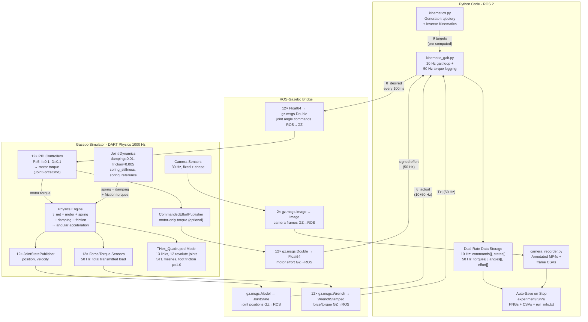

# THex Quadruped Simulation — Complete System Walkthrough (Updated)

> A beginner-friendly yet expert-detailed deep dive into the `sim_robot` package: the SDF physics and dynamics, the kinematic walking gait, the experiment harness and logging pipeline, the torsion-spring model generator, the camera recorder, and the post-run analysis tools.

---

## Table of Contents

1. [The Big Picture](#1-the-big-picture)
2. [Package Structure — Every Folder & File at a Glance](#2-package-structure)
3. [SDF vs URDF — Robot Description Formats](#3-sdf-vs-urdf)
4. [The THex_Quadruped Robot Model — Deep Dive into model.sdf](#4-the-robot-model)
5. [SDF Joint Dynamics — Springs, Damping & Friction](#5-sdf-joint-dynamics)
6. [Spring Model Variants & make_spring_models.py](#6-spring-model-variants)
7. [The Gazebo Worlds](#7-the-gazebo-worlds)
8. [The ROS–Gazebo Bridge (config/)](#8-the-ros-gazebo-bridge)
9. [The Kinematics Module (kinematics.py)](#9-kinematics-module)
10. [The Kinematic Gait Controller (kinematic_gait.py) — Deep Dive](#10-kinematic-gait-controller)
11. [The Camera Recorder (camera_recorder.py)](#11-camera-recorder)
12. [Post-Run Analysis Tools](#12-post-run-analysis-tools)
13. [Launch Files — How It All Starts](#13-launch-files)
14. [Package Build System (setup.py & package.xml)](#14-package-build-system)
15. [Complete Data Flow Diagram](#15-data-flow)
16. [Quick-Start Recipes](#16-quick-start-recipes)
17. [File Summary Table](#17-file-summary)

---

## 1. The Big Picture {#1-the-big-picture}

The `sim_robot` package is a **ROS 2 / Gazebo Harmonic** simulation of the THex quadruped robot. Its primary purpose is running **kinematic gait experiments** — open-loop walking using pre-computed joint trajectories — and measuring the resulting joint torques, with optional **torsion springs** to study motor torque reduction.

The system has three layers:

```
┌─────────────────────────────────────────────────────────────────┐
│                     YOUR CODE (ROS 2)                           │
│  kinematic_gait.py ←→ kinematics.py   (gait controller)        │
│  camera_recorder.py  (video with torque overlay)                │
│  compare_runs.py / torque_peaks.py  (post-analysis)             │
│  Computes angles, publishes commands, logs data                 │
├─────────────────────────────────────────────────────────────────┤
│                  ROS–GAZEBO BRIDGE                              │
│  Translates ROS topics ↔ Gazebo topics                          │
│  (ros_gz_bridge.yaml / ros_gz_bridge_spring.yaml)               │
├─────────────────────────────────────────────────────────────────┤
│                    GAZEBO SIMULATOR                              │
│  Physics engine (1000 Hz), robot model (model.sdf)              │
│  JointPositionController (PID), sensors, collision              │
│  Joint dynamics: damping, friction, springs (native or plugin)  │
│  Optional: cameras (friction_world_cam.sdf)                     │
└─────────────────────────────────────────────────────────────────┘
```

**In plain English:**
1. Your Python code computes the desired joint angles for a walking gait from pre-computed inverse kinematics
2. Those angles travel through the ROS–Gazebo bridge as messages
3. Gazebo's PID controllers compute motor torque and move the simulated joints — assisted (or not) by passive springs defined in the SDF `<dynamics>` block
4. Gazebo sends back sensor data (joint positions, F/T sensor torques, motor effort, camera images) through the bridge
5. Your Python code logs everything at two rates (10 Hz commands, 50 Hz torque), auto-stops after 5 gait cycles, and writes plots + CSVs + video into `experiment/runN/`

---

## 2. Package Structure — Every Folder & File at a Glance {#2-package-structure}

```
sim_robot/
├── config/                          ← Bridge configuration files
│   ├── ros_gz_bridge.yaml           ← Standard bridge (26 topics)
│   ├── ros_gz_bridge_spring.yaml    ← Spring experiment bridge (38+ topics: + effort + cameras)
│   └── ros_gz_bridge_cave.yaml      ← Cave world bridge (world name differs)
│
├── launch/                          ← Launch files
│   ├── start_world.launch.py        ← Basic: Gazebo + robot + bridge
│   ├── spring_experiment.launch.py  ← Spring experiment: baseline / native / plugin
│   ├── rl_walking.launch.py         ← (RL walking — separate pipeline, not covered here)
│   └── rl_cave.launch.py            ← (RL walking in cave — separate pipeline)
│
├── models/                          ← Gazebo model definitions
│   ├── THex_Quadruped/              ← The robot
│   │   ├── model.sdf                ← Baseline robot (dynamics: spring=0, damping=0.01)
│   │   ├── model.urdf               ← ROS-compatible description (for RViz/tf2)
│   │   ├── model.config             ← Gazebo model metadata
│   │   ├── model_effort.sdf         ← Baseline + CommandedEffortPublisher
│   │   ├── model_spring_native.sdf  ← + Native SDF spring (spring_stiffness > 0) + effort pub
│   │   ├── model_spring_plugin.sdf  ← + Nonlinear plugin spring + effort pub
│   │   ├── make_spring_models.py    ← Generator script: model.sdf → all 3 variants
│   │   └── meshes/                  ← STL mesh files (collision + visual)
│   └── Cube/                        ← Simple cube obstacle
│       └── model.sdf
│
├── worlds/                          ← Simulation environments
│   ├── friction_world.sdf           ← Standard flat ground (μ=0.7)
│   ├── friction_world_cam.sdf       ← Same + fixed camera sensor (for recording)
│   └── my_cave_model/               ← Cave terrain (for RL experiments)
│
├── sim_robot/                       ← Python source code (ROS 2 nodes)
│   ├── __init__.py                  ← Package init
│   ├── kinematics.py                ← Trajectory generation + inverse kinematics
│   ├── kinematic_gait.py            ← Main gait controller (experiment harness)
│   ├── camera_recorder.py           ← Video recording with torque overlay
│   ├── compare_runs.py              ← Compare baseline vs spring motor effort
│   ├── torque_peaks.py              ← Find top-N torque spikes + extract video frames
│   ├── flight_recorder.py           ← (RL data logger — separate pipeline)
│   ├── rl_obs.py / rl_policy.py / rl_action.py  ← (RL stack — separate pipeline)
│   └── teleop.py                    ← (Keyboard teleoperation — for RL)
│
├── package.xml                      ← ROS 2 package manifest
├── setup.py                         ← Python package build & entry points
└── setup.cfg                        ← Setuptools config
```

---

## 3. SDF vs URDF — Robot Description Formats {#3-sdf-vs-urdf}

Both SDF and URDF are XML-based formats that describe a robot's physical structure — the "blueprint" of the robot.

### URDF (Unified Robot Description Format)

- **Created by:** ROS project
- **Used for:** ROS tools (RViz visualization, MoveIt motion planning, tf2 transforms)
- **File:** [model.urdf](ROS/src/sim_robot/models/THex_Quadruped/model.urdf)
- **Limitations:** Tree-structured only (no closed loops), no friction/contact parameters, no sensor definitions, no spring dynamics

### SDF (Simulation Description Format)

- **Created by:** Open Robotics (Gazebo team)
- **Used for:** Gazebo simulation
- **File:** [model.sdf](ROS/src/sim_robot/models/THex_Quadruped/model.sdf)
- **Key advantages over URDF:** Supports sensors, plugins, friction, contact, bounce, **joint dynamics** (damping, friction, spring stiffness, spring reference), effort limits, velocity limits

| Feature | URDF | SDF |
|---------|------|-----|
| ROS tools (RViz, tf2) | ✅ | ❌ |
| Gazebo simulation | ❌ (needs conversion) | ✅ |
| Sensor definitions | ❌ | ✅ |
| Plugin support | ❌ | ✅ |
| Joint dynamics (spring, damping) | ❌ | ✅ |
| Contact surface properties | ❌ | ✅ |

> [!NOTE]
> In this project, the **SDF** is the primary file. The URDF exists for ROS compatibility but the simulation runs entirely from `model.sdf` (or one of its spring variants).

---

## 4. The THex_Quadruped Robot Model — Deep Dive into model.sdf {#4-the-robot-model}

**File:** [model.sdf](ROS/src/sim_robot/models/THex_Quadruped/model.sdf) (1068 lines)

### 4.1 What's in the Model?

The robot is a **quadruped** (4-legged robot) with **3 joints per leg** = **12 revolute joints total**, plus one `base_link` body = **13 links total**.

```
                    base_link (body)
                   /    |    |    \
                 FR    FL    BR    BL        ← 4 legs
                / \   / \   / \   / \
              hip  knee  hip  knee ...       ← 3 joints each
                    |         |
                   foot      foot
```

The four legs (and their index in the code):
- **FR** = Front Right (index 0)
- **BR** = Back Right (index 1)
- **BL** = Back Left (index 2)
- **FL** = Front Left (index 3)

Each leg has three joints:
- **Hip joint** — rotates the leg horizontally (yaw), ±45°
- **Knee joint** — bends the upper leg, ±90°
- **Foot joint** — bends the lower leg, ±90°

The model also has `<self_collide>true</self_collide>` at the top level, meaning links within the same model can collide with each other (e.g., a foot touching another leg).

### 4.2 Links — The Physical Parts

A **link** is a rigid body. Each has three properties:

#### Inertial (Mass & Inertia)

```xml
<!-- Example: base_link (the body) -->
<inertial>
  <pose>-1.0171e-10 -0.008606 0.03608 0 0 0</pose>   <!-- Center of mass offset from link origin -->
  <mass>0.30423</mass>                                  <!-- ~304 grams -->
  <inertia>
    <ixx>0.00232</ixx>  <!-- Resistance to rotation around X axis -->
    <iyy>0.00064</iyy>  <!-- Resistance to rotation around Y axis -->
    <izz>0.00225</izz>  <!-- Resistance to rotation around Z axis -->
    <ixy>0</ixy> <ixz>0</ixz> <iyz>0.00008</iyz>  <!-- Cross-terms (asymmetric mass) -->
  </inertia>
</inertial>
```

> [!TIP]
> **For beginners:** The `<pose>` inside `<inertial>` is NOT where the link sits in the world — it's where the center of mass is, relative to the link's own origin. If the mass were uniformly distributed, this would be (0,0,0). The non-zero values mean the mass is offset from the link's geometric center.

**Mass breakdown of the robot:**

| Link | Mass (kg) | Count | Total (kg) | Notes |
|------|-----------|-------|------------|-------|
| Base (body) | 0.304 | 1 | 0.304 | Heaviest single part |
| Hip | 0.148 | 4 | 0.590 | Contains the servo motor |
| Knee | 0.035 | 4 | 0.139 | Lightest link |
| Foot | 0.091 | 4 | 0.365 | Longest link (L4 = 9.265cm) |
| **Total** | | | **~1.4 kg** | |

#### Collision Geometry

```xml
<collision name='base_link_collision'>
  <geometry>
    <mesh><uri>model://THex_Quadruped/meshes/base_link_collision.STL</uri></mesh>
  </geometry>
</collision>
```

> [!TIP]
> Collision meshes use `_collision.STL` files — simplified versions of the visual mesh with fewer triangles. The physics engine checks collisions 1000 times/second, so simpler = faster.

#### Visual Geometry & Material

```xml
<visual name='base_link_visual'>
  <geometry>
    <mesh><uri>model://THex_Quadruped/meshes/base_link.STL</uri></mesh>
  </geometry>
  <material>
    <diffuse>1 1 1 1</diffuse>    <!-- White, fully opaque -->
    <ambient>1 1 1 1</ambient>
  </material>
</visual>
```

#### Foot Contact Surface Properties

The foot links have special contact properties that the other links lack:

```xml
<!-- Only on foot links (bl_foot, br_foot, fl_foot, fr_foot) -->
<collision name='bl_foot_collision'>
  <geometry><mesh>...</mesh></geometry>
  <surface>
    <friction>
      <ode><mu>1.0</mu><mu2>1.0</mu2></ode>     <!-- Higher friction than ground (1.0 vs 0.7) -->
    </friction>
    <bounce>
      <restitution_coefficient>0.0</restitution_coefficient>  <!-- No bounce — feet stick on contact -->
      <threshold>0.01</threshold>                              <!-- Min velocity for bounce check -->
    </bounce>
  </surface>
</collision>
```

> [!IMPORTANT]
> **Expert detail:** The effective friction between two surfaces in ODE is `min(mu_surface1, mu_surface2)`. The feet have `mu=1.0` and the ground has `mu=0.7`, so the effective friction is `0.7`. The `restitution_coefficient=0.0` means feet do NOT bounce when they hit the ground — they stick immediately. This is critical for stable walking; even a small bounce would cause oscillation at foot-strike.

### 4.3 Joints — The Connections

Every joint in this robot is `type='revolute'` — rotation around a single axis.

```xml
<joint name='bl_hip_joint' type='revolute'>
  <pose relative_to='base_link'>-0.053162 -0.12711 0 0 0 -2.372</pose>
  <!--    x        y        z     roll pitch  yaw   (meters and radians)      -->
  <!--    ↑ offset from base_link to joint origin                              -->

  <parent>base_link</parent>   <!-- The fixed side -->
  <child>bl_hip</child>        <!-- The moving side -->

  <axis>
    <xyz>0 0 1</xyz>            <!-- Rotation axis = Z axis (pointing up from the joint) -->
    <limit>
      <lower>-0.7853</lower>    <!-- Min angle = -45° -->
      <upper>0.7853</upper>     <!-- Max angle = +45° -->
      <effort>0.9414</effort>   <!-- Max torque the motor can apply (N⋅m) — servo stall torque -->
      <velocity>5.23</velocity> <!-- Max angular velocity (rad/s) ≈ 300°/s -->
    </limit>
    <dynamics>
      <damping>0.01</damping>             <!-- Viscous damping coefficient (N⋅m⋅s/rad) -->
      <friction>0.005</friction>          <!-- Coulomb friction at the joint (N⋅m) -->
      <spring_reference>0</spring_reference>   <!-- Angle where spring force = 0 (rad) -->
      <spring_stiffness>0</spring_stiffness>   <!-- Spring constant (N⋅m/rad), 0 = no spring -->
    </dynamics>
  </axis>

  <physics>
    <provide_feedback>true</provide_feedback>  <!-- Required for force/torque sensor to work -->
  </physics>

  <sensor name="force_torque_sensor" type="force_torque">
    <update_rate>50</update_rate>                            <!-- 50 Hz = one reading every 20ms -->
    <always_on>true</always_on>
    <topic>bl_hip_force_torque</topic>                       <!-- Gazebo topic name -->
    <force_torque>
      <frame>sensor</frame>                                  <!-- Report in joint's local frame -->
      <measure_direction>parent_to_child</measure_direction> <!-- Force from body → leg -->
    </force_torque>
  </sensor>
</joint>
```

**Joint limits per type:**

| Joint Type | Angular Range | In Degrees | Effort Limit | Velocity Limit |
|------------|--------------|------------|--------------|----------------|
| Hip | ±0.7853 rad | ±45° | 0.9414 N⋅m | 5.23 rad/s |
| Knee | ±1.5707 rad | ±90° | 0.9414 N⋅m | 5.23 rad/s |
| Foot | ±1.5707 rad | ±90° | 0.9414 N⋅m | 5.23 rad/s |

> [!NOTE]
> **`<provide_feedback>true`** on every joint — this tells Gazebo's DART physics engine to compute the internal reaction forces/moments at this joint. Without it, the `force_torque` sensor would report all zeros. This is a common pitfall when adding F/T sensors to SDF models.

### 4.4 Gazebo Plugins — The "Brains" Inside the Model

The model embeds **36 plugins** (12 PID controllers + 12 state publishers + 12 F/T sensors defined per-joint):

#### JointPositionController (PID Controller) — 12 instances

```xml
<plugin name="gz::sim::systems::JointPositionController"
        filename="libgz-sim-joint-position-controller-system.so">
  <joint_name>fr_hip_joint</joint_name>
  <use_velocity_commands>false</use_velocity_commands>  <!-- Position control, not velocity -->
  <p_gain>5</p_gain>     <!-- Proportional: react to current error -->
  <i_gain>0.1</i_gain>   <!-- Integral: react to accumulated past error -->
  <d_gain>0.1</d_gain>   <!-- Derivative: react to rate of change of error -->
</plugin>
```

**How the PID + dynamics interact at each 1ms physics step:**

```
                          ┌─────────────────┐
desired_angle ──→ (+) ──→ │   PID Controller │ ──→ motor_torque (JointForceCmd)
                  ↑  (-)  │  P=5, I=0.1, D=0.1│         │
                  │       └─────────────────┘         │
actual_angle ─────┘                                    ↓
                                              ┌──────────────────┐
                                              │ Total joint torque│
                      spring_torque ────────→ │= motor + spring   │ ──→ Joint motion
                      (from <dynamics>)        │  - damping - fric │
                                              └──────────────────┘
```

1. **Error** = desired_angle − actual_angle
2. **Motor torque** = P × error + I × ∫error dt + D × d(error)/dt
3. Motor torque is **clamped** to the joint's `<effort>` limit (±0.9414 N⋅m)
4. **Spring torque** = `spring_stiffness × (spring_reference − current_angle)` (from `<dynamics>`)
5. **Damping torque** = `−damping × angular_velocity`
6. **Friction torque** = `−friction × sign(angular_velocity)`
7. **Net torque** = clamped_motor + spring − damping − friction → accelerates the joint
8. This runs at the physics rate: **1000 Hz** (every 1ms)

> [!IMPORTANT]
> The PID controller runs **inside Gazebo** at 1000 Hz. Your Python code only sends new target positions at 10 Hz. Between your commands, the PID actively applies torque 100 times trying to reach and hold the last target. The spring (if non-zero) runs at the same 1000 Hz rate, applying its restoring force in parallel with the motor.

#### JointStatePublisher — 12 instances

```xml
<plugin filename="gz-sim-joint-state-publisher-system"
        name="gz::sim::systems::JointStatePublisher">
  <joint_name>fr_hip_joint</joint_name>
</plugin>
```

Publishes the current position, velocity, and effort of each joint. This is how your code reads back the actual joint angles — it's like reading the servo encoder.

#### IMU Sensor — 1 instance (on base_link)

```xml
<sensor name="imu_sensor" type="imu">
  <always_on>1</always_on>
  <update_rate>50</update_rate>
  <visualize>true</visualize>
  <topic>imu</topic>
</sensor>
```

Measures body angular velocity and orientation. Used by the RL stack; not used by the kinematic gait controller.

---

## 5. SDF Joint Dynamics — Springs, Damping & Friction {#5-sdf-joint-dynamics}

This section is the heart of the spring experiment — understanding what each `<dynamics>` parameter does inside the DART physics engine.

### 5.1 The `<dynamics>` Block

Every joint in `model.sdf` has this block inside `<axis>`:

```xml
<dynamics>
  <damping>0.01</damping>                   <!-- Viscous damping: τ_damp = -0.01 × ω -->
  <friction>0.005</friction>                <!-- Coulomb friction: τ_fric = -0.005 × sign(ω) -->
  <spring_reference>0</spring_reference>    <!-- Rest angle θ₀ (rad) -->
  <spring_stiffness>0</spring_stiffness>    <!-- Spring constant k (N⋅m/rad) -->
</dynamics>
```

### 5.2 What Each Parameter Does (Physics Equations)

At every 1ms physics step, DART computes the **total internal torque** applied to the joint:

```
τ_total = τ_motor + τ_spring − τ_damping − τ_friction

Where:
  τ_motor   = PID output, clamped to ±effort_limit (0.9414 N⋅m)
  τ_spring  = spring_stiffness × (spring_reference − θ)
  τ_damping = damping × ω
  τ_friction = friction × sign(ω)

  θ = current joint angle (rad)
  ω = current joint angular velocity (rad/s)
```

#### Damping (0.01 N⋅m⋅s/rad)

Acts like a shock absorber — opposes motion proportionally to velocity. Without it, the robot would oscillate wildly. The value `0.01` is very small (the real servo has internal friction that acts similarly).

**Example:** At `ω = 5.23 rad/s` (max velocity), damping torque = `0.01 × 5.23 = 0.052 N⋅m` — about 5.5% of the motor's max torque. Tiny but stabilizing.

#### Friction (0.005 N⋅m)

A constant resistive torque that opposes any motion regardless of speed. Models the dry friction in the joint bearings. At `0.005 N⋅m` it's only 0.5% of max motor torque — negligible but prevents infinitely slow drift.

#### Spring Stiffness (0 in baseline, > 0 in spring variants)

A **passive torsion spring** that applies restoring torque proportional to how far the joint is from the spring's rest angle:

```
τ_spring = k × (θ₀ − θ)
```

- `k = spring_stiffness` (N⋅m/rad)
- `θ₀ = spring_reference` (rad) — the angle where the spring applies zero torque
- When `θ < θ₀`: spring pushes the joint toward θ₀ (positive torque)
- When `θ > θ₀`: spring pushes the joint toward θ₀ (negative torque)

In the **baseline** `model.sdf`, `spring_stiffness=0` — no spring at all. The spring variants (`model_spring_native.sdf`) set it to non-zero values tuned per joint.

#### Spring Reference (0 in baseline)

The rest angle of the spring. For the spring to **assist** against gravity (reduce motor effort), the reference must be **offset** from the operating angle in the direction that helps support the robot's weight.

### 5.3 What the Spring Changes vs What It Doesn't

This is the single most important concept for the spring experiment:

```
                    ┌──────────────────────────────────────┐
                    │         WHAT CHANGES:                 │
                    │  Motor effort (JointForceCmd)         │
                    │  = what the servo actually delivers   │
                    │  Measured by: /commanded_effort topic │
                    │  CSV: joint_commanded_effort.csv      │
                    └──────────────────────────────────────┘

                    ┌──────────────────────────────────────┐
                    │        WHAT STAYS THE SAME:           │
                    │  Force/Torque sensor reading          │
                    │  = total transmitted load (gravity)   │
                    │  Measured by: /force_torque topic     │
                    │  CSV: joint_torques.csv               │
                    └──────────────────────────────────────┘
```

> [!IMPORTANT]
> The F/T sensor measures the **total reaction force** at the joint — gravity + inertia + contact forces. A parallel spring does NOT change this total. The spring merely shifts the **share** — it carries part of the gravity load so the motor doesn't have to. The quantity the spring reduces is the **motor effort** (JointForceCmd). This is why the experiment records both signals and why `compare_runs.py` reports both.

### 5.4 Baseline vs Spring — Side by Side in the SDF

**Baseline (`model.sdf`):**
```xml
<dynamics>
  <damping>0.01</damping>
  <friction>0.005</friction>
  <spring_reference>0</spring_reference>
  <spring_stiffness>0</spring_stiffness>      <!-- No spring — motor carries 100% of the load -->
</dynamics>
```

**Native spring (`model_spring_native.sdf`)** — generated by `make_spring_models.py`:
```xml
<dynamics>
  <damping>0.01</damping>
  <friction>0.005</friction>
  <spring_reference>-0.6344</spring_reference>  <!-- Data-driven rest angle for bl_knee -->
  <spring_stiffness>0.2500</spring_stiffness>   <!-- 0.25 N⋅m/rad for knee joints -->
</dynamics>
```

The spring torque at the BL knee's typical stance angle of -0.7128 rad:
```
τ_spring = 0.25 × (-0.6344 − (−0.7128)) = 0.25 × 0.0784 = 0.0196 N⋅m
```
That's a small assist — the spring is sized conservatively so it doesn't fight the PID controller.

---

## 6. Spring Model Variants & make_spring_models.py {#6-spring-model-variants}

**File:** [make_spring_models.py](ROS/src/sim_robot/models/THex_Quadruped/make_spring_models.py)

### 6.1 Why Three Variants?

| Model File | Spring Type | Effort Publisher | Purpose |
|-----------|------------|-----------------|---------|
| [model_effort.sdf](ROS/src/sim_robot/models/THex_Quadruped/model_effort.sdf) | None (`spring_stiffness=0`) | ✅ | **Baseline** — records motor effort with no spring |
| [model_spring_native.sdf](ROS/src/sim_robot/models/THex_Quadruped/model_spring_native.sdf) | Linear (SDF `<dynamics>`) | ✅ | **Native spring** — sets `spring_stiffness>0` and `spring_reference` per joint |
| [model_spring_plugin.sdf](ROS/src/sim_robot/models/THex_Quadruped/model_spring_plugin.sdf) | Nonlinear (custom plugin) | ✅ | **Plugin spring** — uses `TorsionalSpringSystem` with an FEA-shaped torque curve |

All three carry the **CommandedEffortPublisher** plugin, which publishes the raw PID-computed motor torque on `/<leg>_<joint>/commanded_effort`.

### 6.2 How the Generator Works

```
model.sdf (untouched baseline, spring_stiffness=0 everywhere)
    │
    ├─ set_initial_positions()       ← write home pose into each PID's <initial_position>
    ├─ add_chase_camera()            ← body-follow camera on base_link
    │
    ├──→ + add_effort_publisher()    ──→ model_effort.sdf
    │
    ├──→ + set_native_spring()       ← edits <dynamics> spring_stiffness + spring_reference
    │    + add_effort_publisher()    ──→ model_spring_native.sdf
    │
    └──→ + add_effort_publisher()
         + add_spring_plugin()       ── model_spring_plugin.sdf
```

### 6.3 The set_native_spring() Function — What It Edits in the SDF

This function walks every `<joint type="revolute">`, finds its `<axis><dynamics>` block, and overwrites two values:

```python
def set_native_spring(model):
    for j in model.findall("joint"):
        if j.get("type") != "revolute":
            continue
        name = j.get("name")
        dyn = j.find("axis/dynamics")
        dyn.find("spring_stiffness").text = f"{spring_kx(name):.4f}"  # e.g., "0.2500"
        dyn.find("spring_reference").text  = f"{spring_ref(name):.4f}" # e.g., "-0.6344"
```

It does NOT touch `damping` or `friction` — those stay at their baseline values (`0.01` and `0.005`).

### 6.4 Spring Tuning — Data-Driven Parameters

The script uses **`SPRING_MODE = "robot"`** — the recommended, data-driven approach:

#### Per-Joint-TYPE Stiffness

```python
ROBOT_KX = {"hip": 0.20, "knee": 0.25, "foot": 0.35}  # N⋅m/rad
```

Sized proportional to each joint type's gravity load:
- **Knee** carries the most DC load (~0.25 N⋅m average) → stiffest spring
- **Foot** has moderate load (~0.08–0.16 N⋅m) → medium spring
- **Hip** has very little DC load (~0.01 N⋅m, mostly swings) → softest spring

#### Operating Angles (OP) — Where Each Joint Sits During Walking

Mean measured stance angle from a baseline gait run (from `joint_commands_vs_states.csv`):

```python
OP = {
    "fr_hip": -0.4035, "fr_knee":  0.6489, "fr_foot":  0.9694,
    "br_hip":  0.3906, "br_knee":  0.7486, "br_foot":  1.0275,
    "bl_hip": -0.2644, "bl_knee": -0.7128, "bl_foot": -0.9024,
    "fl_hip":  0.2431, "fl_knee": -0.6695, "fl_foot": -0.9521,
}
```

> [!NOTE]
> Notice that left and right legs have **opposite signs** for knee and foot angles — this is the mirror symmetry of the robot. The spring generator is mirror-aware by construction.

#### Holding Torque (HOLD) — What the Motor Has to Fight

Mean signed motor effort per joint from a baseline run (`joint_commanded_effort.csv`):

```python
HOLD = {
    "fr_hip": -0.010, "fr_knee": -0.246, "fr_foot":  0.084,
    "br_hip":  0.011, "br_knee": -0.248, "br_foot":  0.157,
    "bl_hip": -0.076, "bl_knee":  0.264, "bl_foot": -0.164,
    "fl_hip":  0.095, "fl_knee":  0.258, "fl_foot": -0.142,
}
```

These are the numbers the spring should cancel. The **sign** tells you which direction the motor is fighting gravity. The **magnitude** tells you how hard.

#### Rest Angle Formula

```python
ASSIST_FRAC = 1.00  # Cancel the FULL measured DC hold

# For each joint:
ref = OP[joint] + ASSIST_FRAC * HOLD[joint] / ROBOT_KX[joint_type]
# Clamped to the joint's travel limits
ref = max(-limit, min(limit, ref))
```

**Why this formula works:** At the operating angle `OP`, the spring torque is:
```
τ_spring = k × (ref − OP) = k × (ASSIST_FRAC × HOLD / k) = ASSIST_FRAC × HOLD
```

So the spring supplies exactly `ASSIST_FRAC` (100%) of the measured DC holding torque at the stance angle. Joints with ~0 measured hold (hips) get `ref ≈ OP` → ~0 assist, so they aren't over-sprung.

### 6.5 Home Pose & Initial Positions

All generated variants set each `JointPositionController`'s `<initial_position>` to the gait's first waypoint:

```python
HOME = {
    "fr_hip": -0.3364, "fr_knee":  0.5469, "fr_foot":  1.2190,
    "br_hip":  0.1747, "br_knee":  0.5218, "br_foot":  1.0785,
    "bl_hip": -0.2931, "bl_knee": -0.5427, "bl_foot": -1.1889,
    "fl_hip":  0.1747, "fl_knee": -0.5218, "fl_foot": -1.0785,
}
```

This means the robot **spawns already in the home pose** — no free-fall from a splayed position. The PID controllers hold this pose from `t=0`.

### 6.6 The CommandedEffortPublisher Plugin

Added to all three variants:

```xml
<plugin filename="commanded_effort_publisher"
        name="gz_joint_torsional_spring::CommandedEffortPublisher">
  <joint_name>fr_hip_joint</joint_name>
  <joint_name>fr_knee_joint</joint_name>
  <!-- ... all 12 joints ... -->
</plugin>
```

This reads the **JointForceCmd** component (the PID's output torque BEFORE the spring and damping are added) and publishes it on `/model/THex_Quadruped/joint/<name>/commanded_effort`. This is the motor-only torque — the signal that a parallel spring reduces.

### 6.7 The Nonlinear Plugin Spring (model_spring_plugin.sdf)

For the `plugin` variant, a second plugin is added with a piecewise torque-angle curve modelling the FEA-simulated 3D-printed spiral spring:

```python
# Nonlinear restoring law: τ(d) = -(K1*d + K2*d*|d|)
# where d = θ - reference
PLUGIN_K1 = 0.05    # Linear term (N⋅m/rad)
PLUGIN_K2 = 0.05    # Stiffening term (increases with |deflection|)
PLUGIN_DAMPING = 0.02  # Viscous stability term (N⋅m⋅s/rad)
```

The curve is evaluated at 11 deflection points from -1.5 to +1.5 rad, creating a lookup table that the plugin interpolates at runtime.

### 6.8 Running the Generator

```bash
cd ROS/src/sim_robot/models/THex_Quadruped/
python3 make_spring_models.py
# Writes: model_effort.sdf, model_spring_native.sdf, model_spring_plugin.sdf

# Then rebuild the ROS package so the new SDF files are installed:
cd ~/ros2_ws
colcon build --packages-select sim_robot --symlink-install
```

---

## 7. The Gazebo Worlds {#7-the-gazebo-worlds}

### 7.1 friction_world.sdf — Standard Flat Ground

**File:** [friction_world.sdf](ROS/src/sim_robot/worlds/friction_world.sdf)

```xml
<physics name="1ms" type="ignored">
  <max_step_size>0.001</max_step_size>     <!-- 1ms per step = 1000 Hz -->
  <real_time_factor>1.0</real_time_factor> <!-- 1x real time -->
</physics>
```

**World plugins:**
```xml
<plugin name="gz::sim::systems::Physics"/>          <!-- Core physics engine (DART) -->
<plugin name="gz::sim::systems::UserCommands"/>     <!-- Allows spawning models at runtime -->
<plugin name="gz::sim::systems::SceneBroadcaster"/> <!-- Sends visual data to Gazebo GUI -->
<plugin name="gz::sim::systems::ForceTorque"/>      <!-- Enables all force/torque sensors -->
<plugin name="gz::sim::systems::Imu"/>              <!-- Enables IMU sensors -->
```

**Ground plane:** 100m × 100m, friction `mu=0.7` (similar to rubber on concrete).

> [!NOTE]
> Friction reference: ice ≈ 0.05, wood on wood ≈ 0.4, **this ground** ≈ 0.7, rubber on concrete ≈ 0.8. The foot has `mu=1.0` but effective friction is `min(1.0, 0.7) = 0.7`.

### 7.2 friction_world_cam.sdf — With Camera Sensors

**File:** [friction_world_cam.sdf](ROS/src/sim_robot/worlds/friction_world_cam.sdf)

Same physics and ground, plus:

1. **Sensors render system** (required for any camera to produce images):
   ```xml
   <plugin filename="gz-sim-sensors-system" name="gz::sim::systems::Sensors">
     <render_engine>ogre2</render_engine>
   </plugin>
   ```

2. **Fixed 3/4-view camera** (static, doesn't move):
   ```xml
   <model name="rec_cam_fixed">
     <static>true</static>
     <pose>1.0 -1.0 0.5 0 0.30 2.356</pose>  <!-- Positioned to see the robot diagonally -->
     <sensor name="cam_fixed" type="camera">
       <topic>cam_fixed</topic>
       <update_rate>30</update_rate>  <!-- 30 fps -->
       <camera>
         <image><width>960</width><height>540</height></image>
       </camera>
     </sensor>
   </model>
   ```

3. **Chase camera** — added to `base_link` by `make_spring_models.py`, moves with the robot body:
   ```xml
   <sensor name="cam_chase" type="camera">
     <topic>cam_chase</topic>
     <pose>-1.1 0 0.6 0 0.28 0</pose>  <!-- Behind and above the body -->
     <update_rate>30</update_rate>
   </sensor>
   ```

> [!TIP]
> Use `spring_experiment.launch.py record:=true` to automatically use this camera world and start `camera_recorder`. Without `record:=true`, the standard headless world is used to save GPU.

---

## 8. The ROS–Gazebo Bridge (config/) {#8-the-ros-gazebo-bridge}

Gazebo and ROS 2 use different messaging formats. The **bridge** translates between them.

### 8.1 ros_gz_bridge.yaml — Standard Bridge (26 topics)

**File:** [ros_gz_bridge.yaml](ROS/src/sim_robot/config/ros_gz_bridge.yaml)

| Direction | ROS Topic Pattern | Count | Message Types | What It Carries |
|-----------|------------------|-------|---------------|-----------------|
| **ROS → GZ** | `/{leg}_{joint}/command` | 12 | Float64 → gz.msgs.Double | Desired joint angle (rad) |
| **GZ → ROS** | `/joint_states` | 1 | gz.msgs.Model → JointState | All 12 joint positions, velocities, efforts |
| **GZ → ROS** | `/{leg}_{joint}/force_torque` | 12 | gz.msgs.Wrench → WrenchStamped | 6-DOF force+torque at each joint |
| **GZ → ROS** | `/imu/data` | 1 | gz.msgs.IMU → Imu | Body orientation and angular velocity |
| **GZ → ROS** | `/clock` | 1 | gz.msgs.Clock → Clock | Simulation time |

### 8.2 ros_gz_bridge_spring.yaml — Spring Experiment Bridge (38+ topics)

**File:** [ros_gz_bridge_spring.yaml](ROS/src/sim_robot/config/ros_gz_bridge_spring.yaml)

Everything in the standard bridge **PLUS**:

| Direction | ROS Topic Pattern | Count | What It Carries |
|-----------|------------------|-------|-----------------|
| **GZ → ROS** | `/{leg}_{joint}/commanded_effort` | 12 | Raw PID motor torque (signed, from CommandedEffortPublisher) |
| **GZ → ROS** | `/cam_fixed`, `/cam_chase` | 2 | Camera image streams (sensor_msgs/Image) |

> [!IMPORTANT]
> The `commanded_effort` topics only produce data when the loaded model has the `CommandedEffortPublisher` plugin (i.e., `model_effort.sdf` or `model_spring_*.sdf`). Plain `model.sdf` does NOT have this plugin, so loading it means no effort data is recorded.

---

## 9. The Kinematics Module (kinematics.py) {#9-kinematics-module}

**File:** [kinematics.py](ROS/src/sim_robot/sim_robot/kinematics.py)

This module does two things:
1. **Generates foot trajectories** (the path each foot follows in space)
2. **Computes inverse kinematics** (converts foot positions to joint angles)

### 9.1 The Robot's Leg Mechanism

Each leg is a **4-bar linkage** with 4 links (L1–L4) and 3 controllable joints (θ1, θ2, θ4). The third angle θ3 is **fixed** at ±45° by the mechanical linkage geometry.

```
        θ1 (hip yaw)
        │
    ┌───┼───┐
    │ L1=2.845cm │  ← hip link (horizontal rotation)
    └───┬───┘
        │ θ2 (knee)
    ┌───┼───┐
    │ L2=5.439cm │  ← upper leg (femur)
    └───┬───┘
        │ θ3 = ±45° (FIXED by linkage geometry)
    ┌───┼───┐
    │ L3=2.637cm │  ← linkage connector
    └───┬───┘
        │ θ4 (foot)
    ┌───┼───┐
    │ L4=9.265cm │  ← lower leg (tibia — longest link)
    └───────┘
        ↓
      foot tip (contacts ground)
```

**Link lengths** (in centimeters — the IK uses cm internally):
```python
L1 = 2.845  # Hip link
L2 = 5.439  # Upper leg (femur)
L3 = 2.637  # Linkage connector
L4 = 9.265  # Lower leg (tibia)
```

### 9.2 Inverse Kinematics — inv_kin(x, y, z, leg_ind)

**Function:** [inv_kin()](ROS/src/sim_robot/sim_robot/kinematics.py#L45-L101)

**Step 1: θ1 — Hip Yaw:**  `θ1 = atan2(y, x)`

**Step 2: θ3 — Fixed:** `+45°` for front/right legs (index 0, 1), `−45°` for back/left legs (index 2, 3)

**Step 3: θ4 — Foot Angle** (geometric 4-bar solution):
```python
# For front legs (leg_ind < 2):
LHS = ((x·cos(θ1) + y·sin(θ1) − L1)² + z² − L2² − L3² − L4² − 2·L2·L3·cos(θ3)) / (2·L4)
A_1 = L2·cos(θ3) + L3;  B_1 = L2·sin(θ3)
phi1 = atan2(A_1, B_1);  a1 = sqrt(A_1² + B_1²)
theta4 = phi1 − asin(LHS / a1)

# For back legs (leg_ind >= 2):
phi1 = atan2(B_1, A_1)     # Arguments flipped!
theta4 = −acos(LHS / a1) − phi1
```

**Step 4: θ2 — Knee Angle** (once θ4 is known):
```python
# For front legs:
A_2 = L2 + L3·cos(θ3) + L4·cos(θ3 + θ4);  B_2 = L4·sin(θ3 + θ4) + L3·sin(θ3)
phi2 = atan2(B_2, A_2);  a2 = sqrt(A_2² + B_2²)
theta2 = asin(z / a2) + phi2

# For back legs:
phi2 = atan2(A_2, B_2)     # Flipped again
theta2 = acos(z / a2) − phi2
```

**Step 5: Clamp & Validate** — wrap angles to [−180°, 180°], then raise an exception if any angle exceeds the joint's physical limits (±45° hip, ±90° knee/foot).

> [!NOTE]
> Front and back legs use **different solution branches** because their leg geometry is mirrored. The `atan2` argument order and the sign/function (`asin` vs `acos`) differ between the two branches.

### 9.3 Trajectory Generation — generate_trajectory()

**Function:** [generate_trajectory()](ROS/src/sim_robot/sim_robot/kinematics.py#L118-L137)

```python
NUM_DATA_POINTS = 16        # Total waypoints per gait cycle
SWING_FACTOR = 1/4          # 25% swing (foot in air)
STANCE_FACTOR = 3/4         # 75% stance (foot on ground)

X = 15   # Lateral reach (cm)     S = -7  # Ground level (cm)
A = 3    # Swing height (cm)      T = 6   # Stride length (cm)
```

**Swing phase (4 waypoints):** Quadratic Bézier curve through 3 control points:
```
        P2 (0, -1)         ← Top of arc (foot in air)
       / ⌢ \
      /       \
P1 (-3, -7)   P3 (3, -7)  ← Start/end (on ground)
──────────────────────────  Ground level (z = -7)
```

**Stance phase (12 waypoints):** Straight line dragging backward from `y=T/2` to `y=-T/2` at constant height `z=S=-7`.

> [!NOTE]
> **Changed from the original:** The stall/pause points (`T_STALL = 2`) have been **removed**. The trajectory is now a clean 16-point cycle: 4 swing + 12 stance. The `shift_trajectory()` function uses `len(xyzK)` instead of hardcoded `NUM_DATA_POINTS + 2*T_STALL`.

### 9.4 Trajectory Rotation — rotate_trajectory()

**Function:** [rotate_trajectory()](ROS/src/sim_robot/sim_robot/kinematics.py#L139-L161)

Rotates the generic trajectory for each leg so it points outward:

```python
beta = [-PI/4, PI/4, -PI/4, PI/4]  # FR, BR, BL, FL rotation angles
X_OFFSET = -5;  Y_OFFSET = 4       # Shift trajectory relative to body
```

```
              Front
         FL ↗     ↖ FR        Each leg's trajectory is rotated
           /   body   \       by its beta angle so it points
         BL ↙     ↘ BR        outward from the body
              Back
```

### 9.5 Phase Shifting — shift_trajectory()

**Function:** [shift_trajectory()](ROS/src/sim_robot/sim_robot/kinematics.py#L163-L184)

```python
SCHEDULE = [(1, 0), (2, 1), (0, 2), (3, 3)]
# BR swings 1st, BL 2nd, FR 3rd, FL 4th — one leg in air at a time
```

The shift rotates the waypoint array by `swing_index × 4` positions.

```
Time →  1   2   3   4   5   6   7   8   ...
BR:    [SWING-------] [STANCE-----------------]
BL:    [STA] [SWING-------] [STANCE-----------]
FR:    [STANCE---] [SWING-------] [STANCE-----]
FL:    [STANCE-------] [SWING-------] [STANCE-]
```

---

## 10. The Kinematic Gait Controller (kinematic_gait.py) — Deep Dive {#10-kinematic-gait-controller}

**File:** [kinematic_gait.py](ROS/src/sim_robot/sim_robot/kinematic_gait.py) (863 lines)

This is the main ROS 2 node that **orchestrates** the walking gait. It has been significantly enhanced with an **experiment harness**, **homing/settle phase**, **dual-rate sampling**, and **auto-stop with structured output**.

### 10.1 Key Design Decisions (vs. the original)

| Feature | Original | Current |
|---------|----------|---------|
| Clock | Wall clock | **Sim time** (`use_sim_time=True`) — deterministic timing |
| Stopping | Manual Ctrl+C only | **Auto-stop** after `max_cycles=5` gait cycles |
| Output location | Current directory | **experiment/runN/** auto-incrementing folders |
| Torque sampling | Same rate as gait (10 Hz) | **Independent 50 Hz** timer matching sensor rate |
| Start-up | Immediate gait start | **Homing/settle phase** — holds home pose until settled |
| Motor effort | Not recorded | **Commanded effort** recorded when plugin is present |
| Run coordination | None | **`/gait/run_dir`** latched topic for camera_recorder |
| Torque-vs-angle | Not available | **Per-leg hysteresis loops** with cycle averaging |
| Trajectory waypoints | 20 (with stall) | **16** (stall removed) |

### 10.2 Initialization Flow

When the node starts (`__init__`):

```
1.  super().__init__('kinematic_gait', use_sim_time=True)
2.  target_freq = 10 Hz,  max_cycles = 5
3.  Create data storage:
    ├── 10 Hz stream:  theta_commands[4][3][], theta_states[4][3][], command_timestamps[]
    ├── 50 Hz stream:  torques[4][3][], theta_states_hf[4][3][], torque_timestamps[]
    │                  commanded_effort[4][3][] (only if effort publisher present)
    └── Caches:        latest_torque[4][3], latest_effort[4][3], latest_state_pos[4][3]
4.  Create /gait/run_dir publisher (TRANSIENT_LOCAL = latched)
5.  Create 12 publishers:     /{leg}_{joint}/command
6.  Create 1 subscriber:      /joint_states
7.  Create 12 subscribers:    /{leg}_{joint}/force_torque
8.  Create 12 subscribers:    /{leg}_{joint}/commanded_effort  (fires only if plugin present)
9.  Pre-compute trajectory:
    a. generate_trajectory()  → 16 generic waypoints
    b. rotate_trajectory()    → orient for each leg (×4)
    c. shift_trajectory()     → phase-shift per gait schedule (×4)
    d. inv_kin_array()        → convert (x,y,z) → (θ1, θ2, θ4) (×4)
10. Compute home pose = first waypoint of each leg's trajectory
11. recording = False (start in settle phase)
12. Start 10 Hz timer  → timer_callback()
13. Start 50 Hz timer  → torque_logging_loop()
```

### 10.3 Phase 1: Homing / Settle (recording = False)

The robot spawns above the ground and falls. Starting the gait immediately would cause a large transient "slam" into the first data. The settle phase avoids this:

```python
def _settle_step(self):
    # 1. Publish home pose to all 12 joints (hold position)
    for leg in legs:
        publish_command(leg, 'hip',  home[leg]['hip'])
        publish_command(leg, 'knee', home[leg]['knee'])
        publish_command(leg, 'foot', home[leg]['foot'])

    # 2. Estimate joint speed from Δposition/Δt (not from velocity topic)
    max_speed = max(|pos_now - pos_prev| / dt  for all 12 joints)

    # 3. "Still" = all joints < 0.10 rad/s
    #    Must stay still for 0.4s continuously after t > 1.0s
    if still and elapsed > 1.0s:
        dwell += dt
    else:
        dwell = 0  # Reset on any motion

    # 4. Done when still for 0.4s OR hard timeout at 4.0s
    if dwell >= 0.4s or elapsed >= 4.0s:
        recording = True
        start_time = now()  # Reset clock so data timestamps start at 0
        create experiment/runN/ and publish on /gait/run_dir
```

**Settle diagnostics** (printed every ~0.5s):
```
[settle] t=1.2s  worst|pos-home|= 5.1deg  max_speed=0.042 rad/s  still_dwell=0.2/0.4s
[settle] t=1.7s  worst|pos-home|= 4.8deg  max_speed=0.009 rad/s  still_dwell=0.4/0.4s
=== Settled in home pose (stopped moving, 1.72s, worst|pos-home|=4.8deg) — starting gait + recording ===
```

> [!IMPORTANT]
> **Why velocity-based, not position-based?** The robot has no gravity compensation — load-bearing joints droop under gravity and never reach the exact home pose. Gating on position (all joints within tolerance of home) always hits the 4s timeout. Gating on velocity (all joints stopped moving) converges in ~1.5–2s.

### 10.4 Phase 2: Gait + Recording (recording = True)

#### The 10 Hz Gait Loop — timer_callback()

```python
def timer_callback(self):
    if not self.recording:
        self._settle_step()
        return

    self.command_timestamps.append(self._elapsed_seconds())

    for leg_idx, leg_name in enumerate(self.legs):
        t_hip  = self.theta_targets[leg_idx][0][self.current_step]
        t_knee = self.theta_targets[leg_idx][1][self.current_step]
        t_foot = self.theta_targets[leg_idx][2][self.current_step]

        self.publish_command(leg_name, 'hip',  t_hip)
        self.publish_command(leg_name, 'knee', t_knee)
        self.publish_command(leg_name, 'foot', t_foot)

        self.theta_commands[leg_idx]['hip'].append(t_hip)
        self.theta_commands[leg_idx]['knee'].append(t_knee)
        self.theta_commands[leg_idx]['foot'].append(t_foot)

    self.current_step += 1
    if self.current_step >= self.steps_len:   # 16
        self.current_step = 0
        self.cycle_count += 1
        if self.cycle_count >= self.max_cycles:   # 5
            raise KeyboardInterrupt  # → triggers finally block → save_data()
```

#### The 50 Hz Torque Logger — torque_logging_loop()

A **separate timer** that snapshots all sensor data at the F/T sensor's native rate:

```python
def torque_logging_loop(self):
    if not self.recording:
        return
    # Wait until every sensor has reported at least once (no fake leading zeros)
    if not all(torque_ready) or not all(state_ready):
        return

    self.torque_timestamps.append(self._elapsed_seconds())
    for leg in range(4):
        for joint in ["hip", "knee", "foot"]:
            # All three snapshotted at the SAME instant — no cross-rate interpolation
            self.torques[leg][joint].append(self.latest_torque[leg][joint])
            self.theta_states_hf[leg][joint].append(self.latest_state_pos[leg][joint])
            self.commanded_effort[leg][joint].append(self.latest_effort[leg][joint])
```

> [!NOTE]
> **Why two rates?** The gait publishes new commands at 10 Hz, but F/T sensors produce data at 50 Hz. Sampling torque at 10 Hz would miss 80% of the sensor data. The independent 50 Hz timer captures the full-resolution signal. The two streams have separate timestamp arrays and are never mixed.

#### Callback: joint_state_cb()

Parses the incoming `/joint_states` message (which contains ALL 12 joints in one message):

```python
def joint_state_cb(self, msg):
    for i, full_name in enumerate(msg.name):
        # "fr_hip_joint" → leg="FR", joint="hip"
        parts = full_name.split('_')
        leg_code = parts[0].upper()    # "FR"
        joint_type = parts[1]          # "hip"

        # Cache for settle check and 50Hz snapshot
        self.latest_state_pos[leg_idx][joint_type] = msg.position[i]
        self.latest_state_vel[leg_idx][joint_type] = msg.velocity[i]
        self.state_ready[leg_idx][joint_type] = True

        # 10Hz aligned recording (only when recording, matched 1:1 with commands)
        if len(states) < len(commands):
            self.theta_states[leg_idx][joint_type].append(msg.position[i])
```

#### Callback: joint_torque_cb()

Caches the latest F/T reading — the actual sampling happens in `torque_logging_loop`:

```python
def joint_torque_cb(self, msg, leg_idx, joint_type):
    self.latest_torque[leg_idx][joint_type] = abs(msg.wrench.torque.z)
    #                                         ↑ only Z-axis (the rotation axis for all joints)
    self.torque_ready[leg_idx][joint_type] = True
```

#### Callback: joint_effort_cb()

Caches the latest commanded effort — SIGNED (unlike torque, which is abs):

```python
def joint_effort_cb(self, msg, leg_idx, joint_type):
    self.latest_effort[leg_idx][joint_type] = msg.data  # Signed! Can be negative
    self.effort_available = True
```

### 10.5 The Dual-Rate Data Architecture

```
10 Hz STREAM (gait loop):                50 Hz STREAM (torque timer):
├── command_timestamps[]                 ├── torque_timestamps[]
├── theta_commands[4][3][]               ├── torques[4][3][]           (|Tz| from F/T sensor)
└── theta_states[4][3][]                 ├── theta_states_hf[4][3][]  (joint angle at same instant)
    (matched 1:1 by gait step)           └── commanded_effort[4][3][] (signed motor torque)
                                             (all matched 1:1 by torque sample)
```

### 10.6 Timing Breakdown

| Component | Rate | Period | Purpose |
|-----------|------|--------|---------|
| Physics engine | 1000 Hz | 1 ms | Compute forces, contacts, springs, motion |
| PID controller | 1000 Hz | 1 ms | Apply motor torque to reach target angle |
| Force/Torque sensors | 50 Hz | 20 ms | Measure joint loads |
| **Torque logging** | **50 Hz** | **20 ms** | Snapshot torque + angle + effort |
| **Gait loop** | **10 Hz** | **100 ms** | Send new target angle |

**One complete gait cycle:** 16 steps × 100ms = **1.6 seconds**

**One complete experiment:** 5 cycles × 1.6s = **8.0 seconds** of recorded data (+ ~2s settle)

### 10.7 Data Export — save_data()

When the node stops (auto after 5 cycles, or manual Ctrl+C), the `finally` block calls `save_data()`:

```
experiment/runN/
├── run_info.txt                       ← Self-documenting manifest
├── joint_commands_vs_states.png       ← 4×3 grid: commanded vs actual angle (10 Hz)
├── joint_commands_vs_states.csv       ← Same data, in degrees, with timestamps
├── joint_torques.png                  ← 4×3 grid: |F/T sensor torque| over time (50 Hz)
├── joint_torques.csv                  ← Same data, with timestamps
├── joint_torque_vs_angle.csv          ← 50 Hz paired (|torque|, angle°) — for hysteresis plots
├── fr_torque_vs_angle.png             ← FR leg: torque-vs-angle hysteresis loops
├── br_torque_vs_angle.png             ← BR leg
├── bl_torque_vs_angle.png             ← BL leg
├── fl_torque_vs_angle.png             ← FL leg
├── joint_commanded_effort.png         ← 4×3 grid: motor effort ±limit (50 Hz) [if available]
├── joint_commanded_effort.csv         ← Signed motor effort (50 Hz) [if available]
└── (video files if camera_recorder was running)
```

#### run_info.txt contents:
```
run_dir:          experiment/run3
timestamp:        2026-07-20T15:30:42
gait_cycles:      5 (target 5)
steps_per_cycle:  16
gait_rate_Hz:     10
torque_rate_Hz:   50
command_rows:     80   (10Hz gait/command loop)
torque_samples:   400  (50Hz torque + angle stream)

files:
  joint_commands_vs_states.png / .csv   (10Hz command vs state)
  joint_torques.png / .csv              (50Hz torque magnitude)
  joint_torque_vs_angle.csv             (50Hz paired torque+angle)
  {fr,br,bl,fl}_torque_vs_angle.png     (per-leg, 50Hz angle+torque)
  joint_commanded_effort.png / .csv     (50Hz signed motor effort)
effort_recorded:  True
```

### 10.8 The Torque-vs-Angle Plots (Hysteresis Loops)

**Method:** [plot_torque_vs_angle()](ROS/src/sim_robot/sim_robot/kinematic_gait.py#L596-L707)

Produces **one PNG per leg** showing the torque-angle relationship over the gait cycle — a "hysteresis loop" that reveals how much torque is needed at each joint position:

- Uses the first `AVG_CYCLES = 4` **full** cycles (excludes the possibly-truncated last cycle)
- **Sample-by-sample averaging**: all full cycles have the same number of 50 Hz samples (e.g., 80 at 50 Hz over a 1.6s cycle), so sample `i` across all cycles lands at the same stride phase — no interpolation, no phase grid
- Faint gray lines show raw per-cycle loops; bold colored line shows the mean
- Both axes come from the SAME 50 Hz snapshot — no cross-rate alignment issues

### 10.9 The Motor Effort Plot

**Only generated when `effort_available = True`** (i.e., the model has the CommandedEffortPublisher plugin).

Shows the raw PID demand (faint orange) and the **applied** (clipped to ±0.9414 N⋅m) motor torque (bold blue). The clip is important: DART's PID D-term can spike far past the effort limit on contact impacts, but the physics engine actually applies `clip(raw, ±limit)`. The plot shows what the servo actually delivers, with the raw demand for context.

---

## 11. The Camera Recorder (camera_recorder.py) {#11-camera-recorder}

**File:** [camera_recorder.py](ROS/src/sim_robot/sim_robot/camera_recorder.py)

Records simulation cameras to timestamped MP4 files with a **live torque overlay**.

### 11.1 What It Produces

For each camera:
- **`<cam>.mp4`** — H.264 video with per-frame annotation:
  - Sim-time timestamp (matches `Time_s` column in CSVs regardless of real-time factor)
  - Current peak joint torque (name, value, turns **red** when saturated at ±0.9414)
  - Magnitude bar along the bottom (full width = effort limit)
- **`<cam>_frames.csv`** — Frame-level index: `frame_idx, sim_time_s, peak_joint, peak_torque`

### 11.2 How It Works

1. Subscribes to `/cam_fixed` and `/cam_chase` (Image messages from Gazebo cameras)
2. Subscribes to 12 F/T or effort topics (configurable via `source` parameter)
3. Waits for `/gait/run_dir` (latched topic from `kinematic_gait`) to know where to write
4. On each image frame:
   - Convert ROS Image → OpenCV BGR via `cv_bridge`
   - Overlay: sim time + peak torque annotation + magnitude bar
   - Pipe raw BGR to **ffmpeg subprocess** (H.264 encoding)
   - Log frame index + sim time + peak torque to CSV

### 11.3 Key Design Details

- **ffmpeg pipe** (not OpenCV VideoWriter): rock-solid for any resolution; OpenCV silently produced 0-frame files for some cameras
- **Fragmented MP4** (`-movflags +frag_keyframe+empty_moov`): file stays valid on disk even if ffmpeg is killed without clean shutdown — no dependency on graceful exit
- **ffmpeg in its own session** (`start_new_session=True`): SIGTERM to the ROS node doesn't kill ffmpeg mid-stream
- **Signal handlers** for both SIGINT and SIGTERM: `ros2 launch` shutdown sends SIGTERM, which a `KeyboardInterrupt` handler alone would miss

### 11.4 Parameters

| Parameter | Default | Meaning |
|-----------|---------|---------|
| `cameras` | `["/cam_fixed", "/cam_chase"]` | Which camera topics to record |
| `source` | `"torque"` | `"torque"` (F/T sensor) or `"effort"` (motor effort) for the overlay |
| `fps` | `30.0` | Playback fps (= sim-time rate) |
| `output_dir` | `""` | Override `/gait/run_dir` if set |

---

## 12. Post-Run Analysis Tools {#12-post-run-analysis-tools}

### 12.1 compare_runs.py — Baseline vs Spring Comparison

**File:** [compare_runs.py](ROS/src/sim_robot/sim_robot/compare_runs.py)

```bash
ros2 run sim_robot compare_runs experiment/run_baseline experiment/run_spring
```

Prints **three tables** for all 12 joints:

| Table | CSV Source | Column Suffix | Expected Spring Behavior |
|-------|-----------|---------------|--------------------------|
| **Applied Motor Torque** | `joint_commanded_effort.csv` | `_effort` (clipped ±0.9414) | **Big reduction** — the spring's target |
| Raw PID Demand | Same file | `_effort` (unclipped) | Context (spikes on contact) |
| Force-Torque Sensor | `joint_torques.csv` | `_torque` | **~Unchanged** (total load stays the same) |

Outputs a grouped bar chart `spring_vs_baseline_effort.png` in the spring run's folder.

### 12.2 torque_peaks.py — Find Torque Spike Locations

**File:** [torque_peaks.py](ROS/src/sim_robot/sim_robot/torque_peaks.py)

```bash
ros2 run sim_robot torque_peaks experiment/runN [N] [torque|effort]
```

1. Reads `joint_torques.csv` or `joint_commanded_effort.csv`
2. Finds top-N samples by |value| across all 12 joints
3. De-duplicates: keeps only the strongest peak per (joint, ~0.3s window)
4. For each camera with a `<cam>_frames.csv`: maps sim-time to nearest video frame
5. If OpenCV + `<cam>.mp4` available: extracts frame PNGs to `runN/peaks/`

---

## 13. Launch Files — How It All Starts {#13-launch-files}

### 13.1 start_world.launch.py — Basic Simulation

**File:** [start_world.launch.py](ROS/src/sim_robot/launch/start_world.launch.py)

```bash
ros2 launch sim_robot start_world.launch.py
# Then in another terminal:
ros2 run sim_robot kinematic_gait
```

| Step | What It Does |
|------|-------------|
| 1 | Set `GZ_SIM_RESOURCE_PATH` → Gazebo finds model meshes |
| 2 | Launch Gazebo with `friction_world.sdf` |
| 3 | Spawn robot (`model.sdf`, at `x=1.5, y=0, z=0.1`) |
| 4 | Spawn Cube (at `x=0, y=0, z=0.1`) |
| 5 | Start bridge (`ros_gz_bridge.yaml`, 26 topics) |

### 13.2 spring_experiment.launch.py — The Recommended Launch

**File:** [spring_experiment.launch.py](ROS/src/sim_robot/launch/spring_experiment.launch.py)

```bash
ros2 launch sim_robot spring_experiment.launch.py spring:=none           # baseline
ros2 launch sim_robot spring_experiment.launch.py spring:=native         # linear spring
ros2 launch sim_robot spring_experiment.launch.py spring:=plugin         # nonlinear spring
ros2 launch sim_robot spring_experiment.launch.py spring:=none record:=true  # + video
```

| Feature | start_world | spring_experiment |
|---------|------------|------------------|
| Model | `model.sdf` (no effort pub) | `model_effort.sdf` / `model_spring_*.sdf` (has effort pub) |
| Bridge | `ros_gz_bridge.yaml` (26 topics) | `ros_gz_bridge_spring.yaml` (38+ topics) |
| Spawn | `x=1.5, z=0.1`, no initial pose | `x=0, z=0.08`, with home pose `<initial_position>` |
| Gazebo | `-v 4` (paused) | `-r -v 4` (auto-run) |
| World | `friction_world.sdf` | Standard or `_cam.sdf` (if `record:=true`) |
| Camera recorder | Not included | Included when `record:=true` |
| Cube | Spawned | Not spawned |

| Argument | Default | Options |
|----------|---------|---------|
| `spring` | `none` | `none`, `native`, `plugin` |
| `record` | `false` | `true`, `false` |

---

## 14. Package Build System (setup.py & package.xml) {#14-package-build-system}

### package.xml

**File:** [package.xml](ROS/src/sim_robot/package.xml) — Declares package `sim_robot`, build type `ament_python`, depends on `rclpy` and `ros_gz_sim`.

### setup.py

**File:** [setup.py](ROS/src/sim_robot/setup.py) — Installs launch files, config YAMLs, world files (recursive), model files (recursive with meshes), and registers **9 executables**:

```python
entry_points = {
    'console_scripts': [
        'kinematic_gait  = sim_robot.kinematic_gait:main',
        'camera_recorder = sim_robot.camera_recorder:main',
        'compare_runs    = sim_robot.compare_runs:main',
        'torque_peaks    = sim_robot.torque_peaks:main',
        'teleop          = sim_robot.teleop:main',
        'rl_obs          = sim_robot.rl_obs:main',
        'rl_policy       = sim_robot.rl_policy:main',
        'rl_action       = sim_robot.rl_action:main',
        'flight_recorder = sim_robot.flight_recorder:main',
    ],
}
```

> [!TIP]
> After any code changes, rebuild: `colcon build --packages-select sim_robot --symlink-install && source install/setup.bash`

---

## 15. Complete Data Flow Diagram {#15-data-flow}



---

## 16. Quick-Start Recipes {#16-quick-start-recipes}

### Recipe 1: Basic Kinematic Walking

```bash
# Terminal 1: Start simulation
ros2 launch sim_robot start_world.launch.py

# Terminal 2: Start gait (auto-stops after 5 cycles, ~10s total)
ros2 run sim_robot kinematic_gait
# Outputs → experiment/run1/
```

### Recipe 2: Full Spring Experiment Workflow

```bash
# Step 0: (Optional) Regenerate spring models after tuning parameters
cd ROS/src/sim_robot/models/THex_Quadruped/
python3 make_spring_models.py
cd ~/ros2_ws && colcon build --packages-select sim_robot --symlink-install

# Step 1: Baseline run
ros2 launch sim_robot spring_experiment.launch.py spring:=none     # Terminal 1
ros2 run sim_robot kinematic_gait                                   # Terminal 2
# → experiment/run1/

# Step 2: Spring run
ros2 launch sim_robot spring_experiment.launch.py spring:=native   # Terminal 1
ros2 run sim_robot kinematic_gait                                   # Terminal 2
# → experiment/run2/

# Step 3: Compare
ros2 run sim_robot compare_runs experiment/run1 experiment/run2
```

### Recipe 3: With Video Recording

```bash
ros2 launch sim_robot spring_experiment.launch.py spring:=none record:=true
ros2 run sim_robot kinematic_gait
# → experiment/run1/ (PNGs + CSVs + cam_fixed.mp4 + cam_chase.mp4)

# Find torque spikes + extract video frames
ros2 run sim_robot torque_peaks experiment/run1
# → experiment/run1/peaks/
```

---

## 17. File Summary Table {#17-file-summary}

| File | Purpose | Key Numbers |
|------|---------|-------------|
| [model.sdf](ROS/src/sim_robot/models/THex_Quadruped/model.sdf) | Baseline robot — links, joints, `<dynamics>` (spring=0), PID, sensors | 13 links, 12 joints, 0.9414 N⋅m effort, damping=0.01, friction=0.005 |
| [model_effort.sdf](ROS/src/sim_robot/models/THex_Quadruped/model_effort.sdf) | Baseline + CommandedEffortPublisher + home pose + chase camera | Same dynamics, + effort publisher on all 12 joints |
| [model_spring_native.sdf](ROS/src/sim_robot/models/THex_Quadruped/model_spring_native.sdf) | + Native SDF spring (`spring_stiffness>0`) + effort pub | Hip k=0.20, Knee k=0.25, Foot k=0.35 N⋅m/rad |
| [model_spring_plugin.sdf](ROS/src/sim_robot/models/THex_Quadruped/model_spring_plugin.sdf) | + Nonlinear plugin spring + effort pub | K1=0.05, K2=0.05, damping=0.02 |
| [make_spring_models.py](ROS/src/sim_robot/models/THex_Quadruped/make_spring_models.py) | Generator: model.sdf → 3 variants (edits `<dynamics>`, adds plugins) | Data-driven OP, HOLD, ROBOT_KX, ASSIST_FRAC=1.0 |
| [friction_world.sdf](ROS/src/sim_robot/worlds/friction_world.sdf) | Standard world — ground, physics, lighting | 1000 Hz physics, ground μ=0.7 |
| [friction_world_cam.sdf](ROS/src/sim_robot/worlds/friction_world_cam.sdf) | + Fixed camera + Sensors render system | 960×540 @ 30 fps |
| [ros_gz_bridge.yaml](ROS/src/sim_robot/config/ros_gz_bridge.yaml) | Standard bridge | 26 topics |
| [ros_gz_bridge_spring.yaml](ROS/src/sim_robot/config/ros_gz_bridge_spring.yaml) | + commanded_effort + cameras | 38+ topics |
| [kinematics.py](ROS/src/sim_robot/sim_robot/kinematics.py) | Trajectory generation + 4-bar IK | 16 waypoints/cycle, 4 links |
| [kinematic_gait.py](ROS/src/sim_robot/sim_robot/kinematic_gait.py) | Main ROS 2 gait node + experiment harness | 10 Hz gait + 50 Hz torque, auto-stop @5 cycles |
| [camera_recorder.py](ROS/src/sim_robot/sim_robot/camera_recorder.py) | Video with torque overlay | H.264 via ffmpeg, fragmented MP4 |
| [compare_runs.py](ROS/src/sim_robot/sim_robot/compare_runs.py) | Baseline vs spring comparison | 3 tables + bar chart |
| [torque_peaks.py](ROS/src/sim_robot/sim_robot/torque_peaks.py) | Top-N torque spike finder | De-dup window 0.3s, video frame extraction |
| [start_world.launch.py](ROS/src/sim_robot/launch/start_world.launch.py) | Basic launch | model.sdf, z=0.1 |
| [spring_experiment.launch.py](ROS/src/sim_robot/launch/spring_experiment.launch.py) | Spring experiment launch | spring:=none/native/plugin, record:=true/false |
| [setup.py](ROS/src/sim_robot/setup.py) | Package build + 9 executables | ament_python build |
| [package.xml](ROS/src/sim_robot/package.xml) | ROS 2 manifest | Depends: rclpy, ros_gz_sim |
